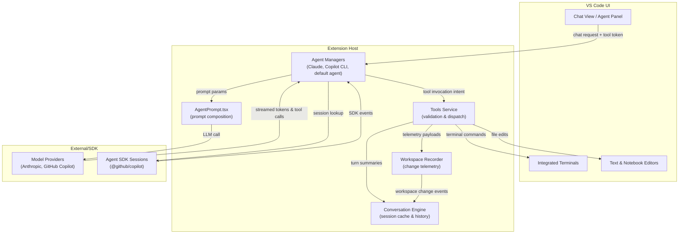
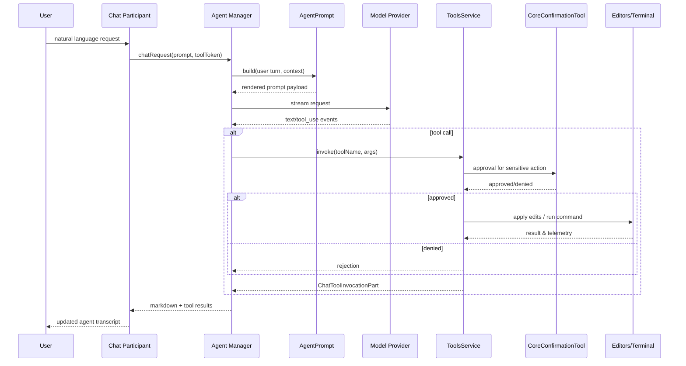

# GitHub Copilot Agent Mode Deep Dive

This guide explains how agent mode in `vscode-copilot-chat` orchestrates long-running tasks, tool automation, and workspace mutations. Use it when extending autonomous behaviors, onboarding new LLM providers, or debugging executions end-to-end.

## Feature Goals
- **Autonomous task execution**: Agents decompose user intents into multi-step plans, reuse previous context, and iterate on failures without manual prompts.
- **Tool-centric reasoning**: Language models can call high-trust tools (file edits, terminal, tests, MCP servers) while the extension mediates validation, confirmation, and telemetry.
- **Safe workspace mutation**: Every write path funnels through permission checks, diff previews, and the `CoreConfirmationTool` gate, minimizing accidental or malicious edits.
- **Replayable traces**: Sessions, terminal output, and edit history are captured so runs can be audited (`../src/extension/workspaceRecorder/`) and replayed in simulations.

## High-Level Architecture


## Request Lifecycle
1. **Chat request dispatch** – User input reaches the active agent participant. The participant forwards the request, tool token, and context to an agent manager (`CopilotCLIAgentManager`, `ClaudeAgentManager`, or the default chat agent).
2. **Session resolution** – Managers lookup or create a session via [`CopilotCLISessionService.getSessionManager`](../src/extension/agents/copilotcli/node/copilotcliSessionService.ts#L72-L78), which installs the node-pty shim before the Copilot SDK loads:

```typescript
public async getSessionManager(): Promise<SessionManager> {
    if (!this._sessionManager) {
        try {
            // Ensure node-pty shim exists before importing SDK
            // @github/copilot has hardcoded: import{spawn}from"node-pty"
            await ensureNodePtyShim(this.extensionContext.extensionPath, this.envService.appRoot);
```

Session metadata gives access to persisted turns, pending authorization prompts, and queue state.

3. **Prompt construction** – [`AgentPrompt`](../src/extension/prompts/node/agent/agentPrompt.tsx#L68-L73) composes the TSX prompt tree with shared system instructions:

```tsx
/** Proportion of the prompt token budget any singular textual tool result is allowed to use. */
const MAX_TOOL_RESPONSE_PCT = 0.5;

/**
 * The agent mode prompt, rendered on each request
 */
export class AgentPrompt extends PromptElement<AgentPromptProps> {
```

Token budgeting caps tool output at 50 % of the prompt budget in [`AgentPrompt.render`](../src/extension/prompts/node/agent/agentPrompt.tsx#L115-L119):

```tsx
const maxToolResultLength = Math.floor(this.promptEndpoint.modelMaxPromptTokens * MAX_TOOL_RESPONSE_PCT);

if (this.props.enableCacheBreakpoints) {
    return <>
        {baseInstructions}
```

4. **Model streaming** – Claude sessions call into [`LanguageModelServer`](../src/extension/agents/node/langModelServer.ts#L44-L51), which maps HTTP routes to Anthropic adapters and spins up the local bridge:

```typescript
this.config = {
    port: 0, // Will be set to random available port
    nonce: 'vscode-lm-' + generateUuid()
};
this.adapterFactories = new Map();
this.adapterFactories.set('/v1/messages', new AnthropicAdapterFactory());
```

Request handling verifies the nonce before dispatching to an adapter in [`LanguageModelServer.createServer`](../src/extension/agents/node/langModelServer.ts#L64-L70):

```typescript
if (req.method === 'POST') {
    const adapterFactory = this.getAdapterFactoryForPath(req.url || '');
    if (adapterFactory) {
        try {
            // Create new adapter instance for this request
            const adapter = adapterFactory.createAdapter();
```

Copilot CLI sessions reuse the GitHub Agent SDK and rely on [`ensureNodePtyShim`](../src/extension/agents/copilotcli/node/nodePtyShim.ts#L22-L27) to surface VS Code’s bundled `node-pty`:

```typescript
export async function ensureNodePtyShim(extensionPath: string, vscodeAppRoot: string): Promise<void> {
    if (shimCreated) {
        return;
    }

    const nodePtyDir = path.join(extensionPath, 'node_modules', 'node-pty');
```

5. **Tool orchestration** – Tool calls surfaced in streamed responses are routed through [`IToolsService`](../src/extension/tools/common/toolsService.ts#L51-L60), which validates schemas and maintains the tool registry:

```typescript
copilotTools: ReadonlyMap<ToolName, ICopilotTool<any>>;
getCopilotTool(name: string): ICopilotTool<any> | undefined;

invokeTool(name: string, options: vscode.LanguageModelToolInvocationOptions<unknown>, token: vscode.CancellationToken): Thenable<vscode.LanguageModelToolResult2>;
getTool(name: string): vscode.LanguageModelToolInformation | undefined;
getToolByToolReferenceName(name: string): vscode.LanguageModelToolInformation | undefined;
```

6. **Permission & confirmations** – Sensitive operations route through [`ToolName.CoreConfirmationTool`](../src/extension/tools/common/toolNames.ts#L46-L52), ensuring user approval before continuing:

```typescript
CoreRunInTerminal = 'run_in_terminal',
CoreGetTerminalOutput = 'get_terminal_output',
CoreTerminalSelection = 'terminal_selection',
CoreTerminalLastCommand = 'terminal_last_command',
CoreCreateAndRunTask = 'create_and_run_task',
CoreRunTask = 'run_task',
CoreConfirmationTool = 'vscode_get_confirmation'
```

7. **Execution & feedback** – Approved tool calls apply edits (`apply_patch`, string replace), spawn VS Code tasks, run terminal commands, or query external services. Outputs are streamed back as `ChatToolInvocationPart`s, allowing the LLM to observe success/failure and iterate.

8. **State capture** – [`WorkspaceRecorder`](../src/extension/workspaceRecorder/common/workspaceListenerService.ts#L13-L19) listens for editor mutations and change reasons:

```typescript
export interface IWorkspaceListenerService {
    readonly _serviceBrand: undefined;

    onStructuredData: Event<IRecordableLogEntry | IRecordableEditorLogEntry>;

    // If it fires, it is guaranteed to fire 10 seconds after the corresponding model version.
    onHandleChangeReason: Event<{ documentUri: string; documentVersion: number; reason: string; metadata: ITextModelEditReasonMetadata }>;
```

Session history is updated so subsequent turns can be summarized or replayed.

9. **Response completion** – The agent manager flushes remaining Markdown/text to the UI, updates session caches, and exposes the new session identifier so the next request resumes the plan.



## Session & Prompt Management
- **Queue-based execution**: [`ClaudeCodeSession`](../src/extension/agents/claude/node/claudeCodeAgent.ts#L201-L207) enqueues each prompt so overlapping requests finish sequentially:

```typescript
const deferred = new DeferredPromise<void>();
const request: QueuedRequest = {
    prompt,
    stream,
    toolInvocationToken,
    token,
    deferred
};
```

Cancellation tokens abort in-flight requests when users stop the run.
- **History strategy**: `AgentConversationHistory` and `SummarizedConversationHistory` switch between verbatim replay and summarized turns depending on cache breakpoints. Tool results exceeding the configured budget are truncated to avoid starving new instructions.
- **Frozen user messages**: Once rendered, user turns embed `RenderedUserMessageMetadata`, preventing later tool actions from mutating the text that the LLM saw, which keeps prompt caching coherent.
- **Variable interpolation**: `AgentUserMessage` resolves chat variables and tool references via `IPromptVariablesService`, so attached context (files, search results) is surfaced consistently each turn.

## Tooling & Execution Surface
- **Tool catalog**: [`ToolName`](../src/extension/tools/common/toolNames.ts#L8-L14) enumerates shipped capabilities—workspace search, file edits, terminal automation, todo management, etc. Contributed tool names map to internal ones for BYOK scenarios:

```typescript
ApplyPatch = 'apply_patch',
Codebase = 'semantic_search',
VSCodeAPI = 'get_vscode_api',
TestFailure = 'test_failure',
RunTests = 'run_tests',
FindFiles = 'file_search'
```
- **Validation and error paths**: `BaseToolsService` validates input against JSON schema, retries parsing stringified JSON, and returns actionable error messages. `ToolCallCancelledError` surfaces cancellations cleanly to the agent loop.
- **Terminal integration**: Core terminal tools (`CoreRunInTerminal`, `CoreGetTerminalOutput`, `CoreTerminalSelection`) track command IDs, exit codes, and interactive prompts. Shell integration hints are embedded in agent instructions to maximize observability.
- **Permission UX**: `CopilotCLISession`’s `requestPermission` formats confirmation payloads differently for shell, filesystem, and MCP requests, ensuring the chat view presents targeted prompts before execution. The bridge forwards permission requests through [`CopilotCLIAgentManager`](../src/extension/agents/copilotcli/node/copilotcliAgentManager.ts#L120-L127):

```typescript
requestPermission: async (permissionRequest) => {
    return await this.requestPermission(permissionRequest, toolInvocationToken);
},
logger: {
    isDebug: () => false,
```

## Language Model Integration
- **Claude Code agent**: Wraps the official `@anthropic-ai/claude-code` SDK, but hosts a local `LanguageModelServer` that mimics Anthropic’s REST endpoints so the SDK can speak HTTP while VS Code mediates auth and batching. The server adapts streaming responses to VS Code `ChatResponseStream` blocks.
- **Copilot CLI agent**: Uses GitHub’s federated `Agent` SDK. Sessions persist server-side, allowing reconnects and resumable plans. The node-pty shim makes the SDK compatible with the VS Code extension host’s module system. Tool invocations mirror CLI behaviors (e.g., `str_replace_editor`, `bash`).
- **Default agent mode**: Executes inside the extension using the standard prompt renderer and model endpoints configured by `IEndpointProvider`. Model selection honors family-specific prompts (`DefaultAgentPrompt`, `SweBenchAgentPrompt`, etc.) and custom instructions.
- **Cache breakpoints**: When enabled, the prompt injects `<cacheBreakpoint>` markers and summarized history to align with provider-side caching semantics.

## State, Telemetry, and Recovery
- **WorkspaceRecorder**: Emits structured JSONL logs capturing edit reasons, terminal IO, and file versions, enabling deterministic replay in simulation tests.
- **SessionManager metadata**: Copilot CLI sessions store labels derived from the first user prompt, trimmed of reminder tags, as shown in [`CopilotCLISessionService._generateSessionLabel`](../src/extension/agents/copilotcli/node/copilotcliSessionService.ts#L220-L244):

```typescript
const firstUserMessage = chatMessages.find(msg => msg.role === 'user');
if (firstUserMessage && firstUserMessage.content) {
    const content = typeof firstUserMessage.content === 'string'
        ? firstUserMessage.content
        : Array.isArray(firstUserMessage.content)
            ? firstUserMessage.content
                .filter((block): block is { type: 'text'; text: string } => typeof block === 'object' && block !== null && 'type' in block && block.type === 'text')
```

Status transitions fire `onDidChangeSessions` so the UI can update progress indicators.
- **Error handling**: Managers convert SDK exceptions into chat-friendly Markdown, as shown in [`CopilotCLIAgentManager`](../src/extension/agents/copilotcli/node/copilotcliAgentManager.ts#L150-L154):

```typescript
} catch (error) {
    this.logService.error(`CopilotCLI session error: ${error}`);
    stream.markdown(`\n\n❌ Error: ${error instanceof Error ? error.message : String(error)}`);
}
```

This keeps users informed instead of failing silently.
- **Telemetry hooks**: Tool invocations, permission prompts, and terminal events pipe through `ILogService` and telemetry shims so product teams can measure tool effectiveness and risky patterns.

## Testing & Simulation Strategy
- **Unit tests**: [`claudeCodeAgent.spec.ts`](../src/extension/agents/claude/node/test/claudeCodeAgent.spec.ts#L92-L104) exercises session reuse and error paths, proving queued requests run sequentially with deterministic mocks:

```typescript
const promise1 = session.invoke('First', {} as vscode.ChatParticipantToolToken, stream1, CancellationToken.None);
const promise2 = session.invoke('Second', {} as vscode.ChatParticipantToolToken, stream2, CancellationToken.None);

await Promise.all([promise1, promise2]);

expect(stream1.output.join('\n')).toContain('Hello from mock!');
expect(stream2.output.join('\n')).toContain('Hello from mock!');
```
- **Simulation suites**: `test/simulation/` includes `.stest.ts` scenarios that execute agent mode end-to-end against recorded fixtures. Use `npm run simulate-ci` for gated regressions and `npm run simulate-update-baseline` when behavior changes intentionally.
- **Tool contract tests**: [`toolService.spec.ts`](../src/extension/tools/common/test/toolService.spec.ts#L60-L66) validates schema normalization and confirms tools resolve correctly when mapped between contributed and internal names:

```typescript
const invalidResult = toolsService.validateToolInput('testTool', '{"count": 42}');
expect(invalidResult).toMatchObject({
    error: expect.stringContaining('ERROR: Your input to the tool was invalid')
});

const malformedResult = toolsService.validateToolInput('testTool', '{"message": "hello"');
```
- **Workflows**: The `script/simulation` utilities spin up reproducible environments, while `workspaceRecorder` logs feed into regression analyses for agent flows.

## Extensibility Tips
- Inject new tools by registering them with `toolsRegistry` and referencing the resulting `ToolName` in `AgentPrompt` instructions or custom prompt components.
- Augment session metadata via `CopilotCLISessionService.trackSessionWrapper` if you need to associate additional disposables or UI state.
- When onboarding providers, implement an `IProtocolAdapterFactory` so the `LanguageModelServer` can mediate streaming semantics without leaking provider-specific details into the agent pipeline.
- Keep prompt fragments small and reusable; locate new instructions under `../src/extension/prompts/node/agent/` to benefit from existing experiment toggles and cache policies.

## Agent SDK References
- The `@github/copilot/sdk` package bundled with this extension is a closed-source dependency distributed as part of GitHub Copilot; its TypeScript sources ship inside the installed VS Code extension (`extensions/github.copilot-chat/node_modules/@github/copilot`). There is no public npm entry or standalone repository.
- High-level descriptions of Copilot agents live in the [GitHub Copilot documentation hub](https://docs.github.com/copilot) and the [VS Code Copilot agent overview](https://code.visualstudio.com/docs/copilot/copilot-agent). These describe capabilities but do not expose the SDK surface area.
