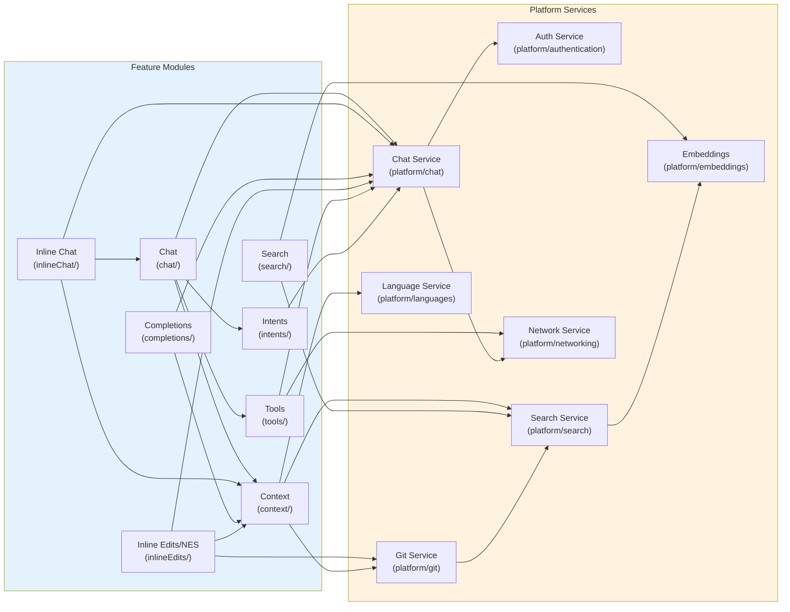
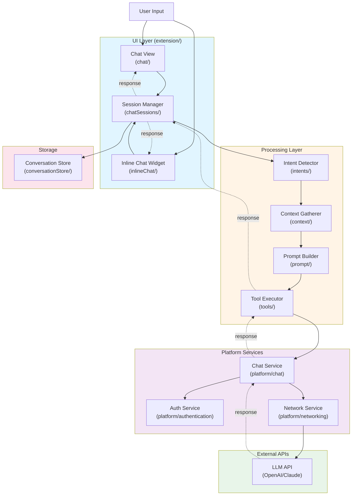
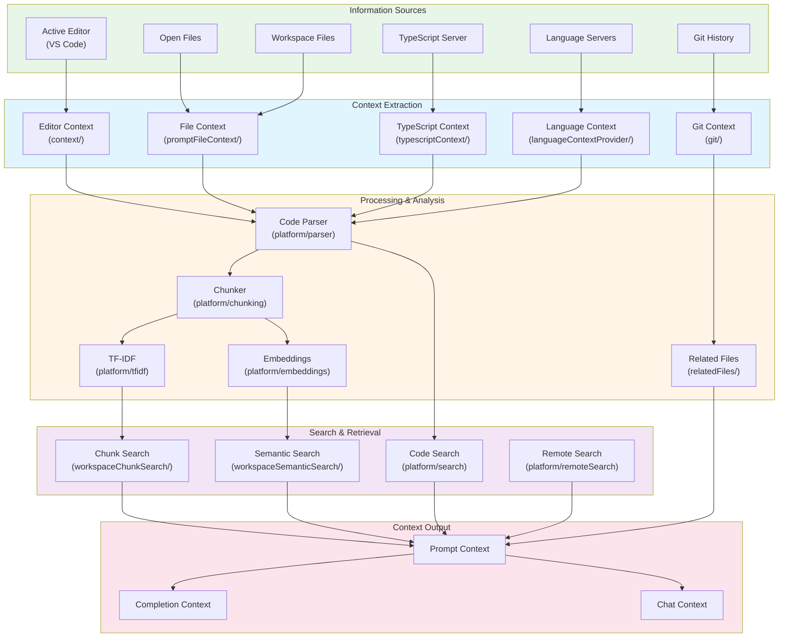
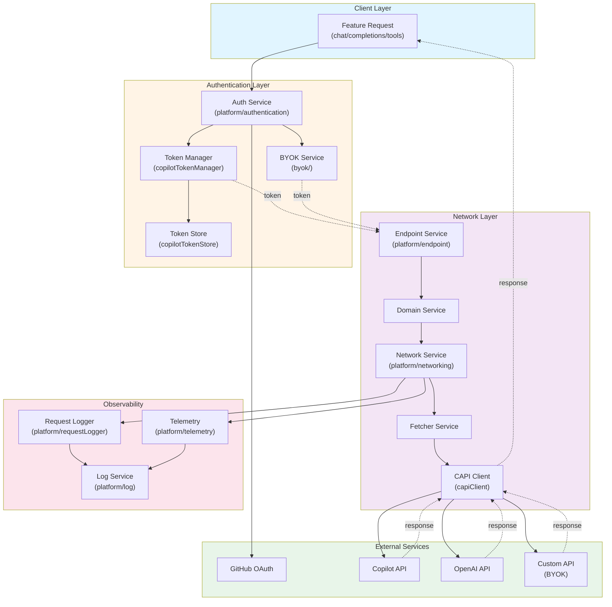
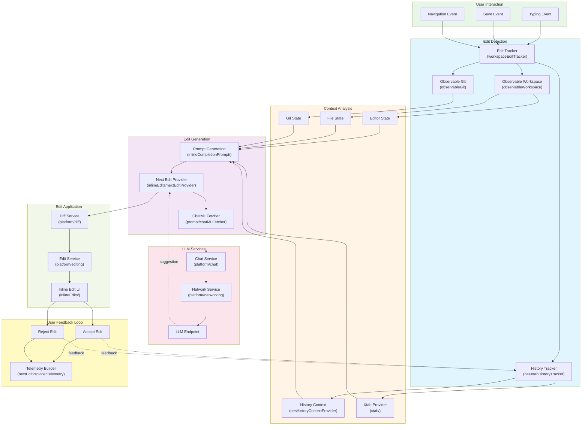

# Architecture Diagrams

This document contains architectural diagrams showing the dependency structure and cross-usage patterns of the GitHub Copilot Chat extension codebase.

## Table of Contents

- [Layer Dependency Architecture](#layer-dependency-architecture)
- [Feature Module Dependencies](#feature-module-dependencies)
- [Chat System Architecture](#chat-system-architecture)
- [Code Intelligence Pipeline](#code-intelligence-pipeline)
- [Authentication and API Flow](#authentication-and-api-flow)
- [Inline Editing System](#inline-editing-system)

---

## Layer Dependency Architecture

This diagram shows the high-level layering of the codebase and how different layers depend on each other.

```mermaid
flowchart TB
    subgraph Extension["Extension Layer (src/extension/)"]
        direction TB
        ExtChat["Chat UI & Sessions"]
        ExtCompletion["Completions & Inline Edits"]
        ExtTools["Tools & MCP"]
        ExtContext["Context Providers"]
        ExtCommands["Commands & Intents"]
    end

    subgraph Platform["Platform Layer (src/platform/)"]
        direction TB
        PlatAuth["Authentication"]
        PlatChat["Chat Services"]
        PlatSearch["Search & Indexing"]
        PlatGit["Git & GitHub"]
        PlatLang["Language Services"]
        PlatNet["Networking"]
    end

    subgraph Util["Utility Layer (src/util/)"]
        direction TB
        UtilCommon["Common Utilities"]
        UtilNode["Node.js Utilities"]
        UtilVS["VS Code Utilities"]
    end

    subgraph External["External Dependencies"]
        direction TB
        VSCode["VS Code API"]
        OpenAI["OpenAI/LLM APIs"]
        GitHub["GitHub APIs"]
        TreeSitter["Tree-sitter"]
    end

    Extension --> Platform
    Platform --> Util

    Extension --> VSCode
    Platform --> OpenAI
    Platform --> GitHub
    Platform --> TreeSitter

    ExtChat -.-> PlatChat
    ExtCompletion -.-> PlatChat
    ExtTools -.-> PlatNet
    ExtContext -.-> PlatSearch
    ExtContext -.-> PlatLang
    ExtCommands -.-> PlatChat

    PlatAuth -.-> PlatNet
    PlatSearch -.-> PlatGit
    PlatLang -.-> UtilCommon

    style Extension fill:#e1f5ff
    style Platform fill:#fff4e6
    style Util fill:#f3e5f5
    style External fill:#e8f5e9
```

---

## Feature Module Dependencies

This diagram shows how major feature modules depend on each other and platform services.

---

## Chat System Architecture

This diagram shows the architecture of the chat system and how messages flow through the system.

---

## Code Intelligence Pipeline

This diagram shows how code intelligence features gather and process information.

---

## Authentication and API Flow

This diagram shows how authentication and API requests flow through the system.

---

## Inline Editing System

This diagram shows the architecture of the inline editing and Next Edit Suggestions (NES) system.

---

## Cross-Module Usage Patterns

This diagram shows common usage patterns across different modules.

```mermaid
flowchart TB
    subgraph Consumers["Feature Consumers"]
        Chat["Chat"]
        InlineChat["Inline Chat"]
        Completions["Completions"]
        InlineEdits["Inline Edits"]
        Tools["Tools"]
        Commands["Commands"]
    end

    subgraph SharedServices["Shared Platform Services"]
        Auth["Authentication"]
        Config["Configuration"]
        Log["Logging"]
        Telemetry["Telemetry"]
        Network["Networking"]
        FileSystem["File System"]
    end

    subgraph ContextProviders["Context Providers"]
        Editor["Editor Context"]
        Workspace["Workspace Context"]
        Git["Git Context"]
        Language["Language Context"]
        TypeScript["TypeScript Context"]
    end

    subgraph SearchIndexing["Search & Indexing"]
        ChunkSearch["Chunk Search"]
        SemanticSearch["Semantic Search"]
        Embeddings["Embeddings"]
        Parser["Parser"]
    end

    Chat --> Auth
    InlineChat --> Auth
    Completions --> Auth
    InlineEdits --> Auth
    Tools --> Auth
    Commands --> Auth

    Chat --> Network
    Completions --> Network
    InlineEdits --> Network
    Tools --> Network

    Chat --> Log
    InlineChat --> Log
    Completions --> Log
    InlineEdits --> Log

    Chat --> Telemetry
    Completions --> Telemetry
    InlineEdits --> Telemetry

    Chat --> Editor
    InlineChat --> Editor
    Completions --> Editor
    InlineEdits --> Editor

    Chat --> Workspace
    InlineChat --> Workspace
    Tools --> Workspace
    Commands --> Workspace

    Chat --> Language
    Completions --> Language
    InlineEdits --> Language

    InlineEdits --> Git
    Commands --> Git

    Completions --> TypeScript
    InlineEdits --> TypeScript

    Chat --> ChunkSearch
    Chat --> SemanticSearch

    ChunkSearch --> Embeddings
    SemanticSearch --> Embeddings
    ChunkSearch --> Parser
    SemanticSearch --> Parser

    style Consumers fill:#e1f5ff
    style SharedServices fill:#fff4e6
    style ContextProviders fill:#f3e5f5
    style SearchIndexing fill:#e8f5e9
```

---

## Notes

- **Solid arrows** (→) indicate direct dependencies
- **Dotted arrows** (-.→) indicate optional or conditional dependencies
- **Bidirectional arrows** indicate two-way communication
- Color coding groups related components by architectural layer

---

## Related Documentation

- [SOURCE-CODE-ORGANIZATION.md](./SOURCE-CODE-ORGANIZATION.md) - Detailed source code structure
- [TECHNICAL-OVERVIEW.md](./TECHNICAL-OVERVIEW.md) - High-level technical overview
- [AGENT-MODE.md](./AGENT-MODE.md) - Agent mode documentation
- [tools.md](./tools.md) - Tool system documentation
