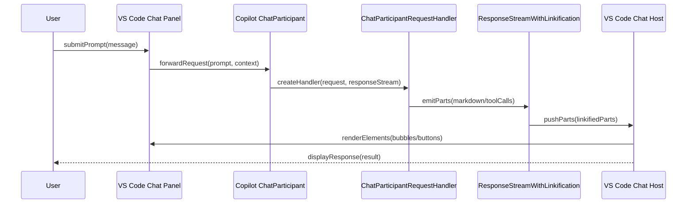
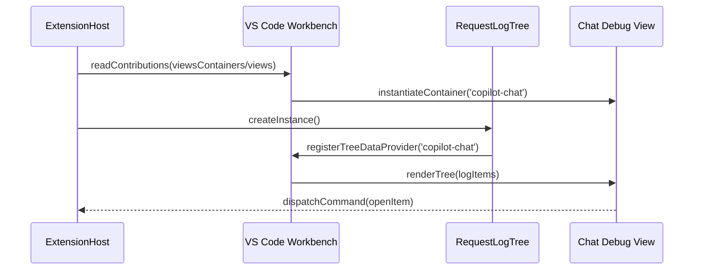

# Chat UI Extension Notes

## Rendering Pipeline
- Chat is surfaced through VS Code's native chat host; agents register via `vscode.chat.createChatParticipant` ([`src/extension/conversation/vscode-node/chatParticipants.ts:112`](../src/extension/conversation/vscode-node/chatParticipants.ts#L112)).
- Each request is processed by `ChatParticipantRequestHandler`, which streams `ChatResponsePart` objects ([`src/extension/prompt/node/chatParticipantRequestHandler.ts:53`](../src/extension/prompt/node/chatParticipantRequestHandler.ts#L53)). The host turns these parts into bubbles, buttons, and references.
- `ResponseStreamWithLinkification` intercepts outgoing parts to inject anchors, linkified markdown, and other rich payloads ([`src/extension/linkify/common/responseStreamWithLinkification.ts:18`](../src/extension/linkify/common/responseStreamWithLinkification.ts#L18)). This is the place to hook custom blocks before they hit the UI.
- Saved sessions use `ChatSessionContentProvider` implementations to rebuild visible history by alternating request/response turns ([`src/extension/chatSessions/vscode-node/claudeChatSessionContentProvider.ts:47`](../src/extension/chatSessions/vscode-node/claudeChatSessionContentProvider.ts#L47)).

## Adding Chat Elements
- Emit extra UI pieces by pushing new response parts where the stream is built—for example `progress.push(new ChatResponseCommandButtonPart(...))` alongside existing parts in `ResponseStreamWithLinkification.push`.
- Customize participant chrome (icon, welcome copy, intent routing) when you create the participant in `ChatParticipants.register*` helpers ([`src/extension/conversation/vscode-node/chatParticipants.ts:95`](../src/extension/conversation/vscode-node/chatParticipants.ts#L95)).
- When augmenting prompts or attachments, extend the prompt components under `src/extension/prompts/node/panel/**`, such as `chatVariables.tsx`, to keep the request payload aligned with the UI.
- Persist additional history items by returning them from your session content provider so they're replayed in side panels ([`src/extension/chatSessions/vscode-node/chatSessions.ts:27`](../src/extension/chatSessions/vscode-node/chatSessions.ts#L27)).

## Emitting ChatResponseStream Parts
### Stable helpers
- `ChatResponseStream` exposes helpers like `markdown`, `button`, `filetree`, and `progress` in [`ResponseStreamWithLinkification`](../src/extension/linkify/common/responseStreamWithLinkification.ts#L45-L67), which queue the actual `push` call:

```typescript
markdown(value: string | MarkdownString): ChatResponseStream {
	this.appendMarkdown(typeof value === 'string' ? new MarkdownString(value) : value);
	return this;
}

anchor(value: Uri | Location, title?: string | undefined): ChatResponseStream {
	this.enqueue(() => this._progress.anchor(value, title), false);
```

- Participants typically call these helpers directly; the Claude session banner illustrates simultaneous markdown and button emission ([`src/extension/chatSessions/vscode-node/claudeChatSessionParticipant.ts:49-L52`](../src/extension/chatSessions/vscode-node/claudeChatSessionParticipant.ts#L49-L52)):

```typescript
/* Via @claude */
stream.markdown(localize('claude.viaAtClaude', "Start a new Claude Code session"));
stream.button({ command: `workbench.action.chat.openNewSessionEditor.${this.sessionType}`, title: localize('claude.startNewSession', "Start Session") });
```

### Proposed helpers
- When the `chatParticipantAdditions` proposal is available, you can stream notebook edits, text edits, and codeblock URIs in a single tool response. The `applyPatch` tool shows the recommended ordering ([`src/extension/tools/node/applyPatchTool.tsx:330-L351`](../src/extension/tools/node/applyPatchTool.tsx#L330-L351)):

```typescript
for (const edit of edits) {
	if (Array.isArray(edit)) {
		responseStream.textEdit(edit[0], edit[1]);
	} else {
		responseStream.notebookEdit(notebookUri, edit);
	}
}
responseStream.notebookEdit(notebookUri, true);
```

- Streaming thinking output works the same way: guard encrypted deltas, then forward them with `thinkingProgress` ([`src/extension/prompt/node/pseudoStartStopConversationCallback.ts:63-L67`](../src/extension/prompt/node/pseudoStartStopConversationCallback.ts#L63-L67)):

```typescript
if (delta.thinking) {
	if (!isEncryptedThinkingDelta(delta.thinking) || delta.thinking.text) {
		progress.thinkingProgress(delta.thinking);
	}
}
```

- Always feature-detect the proposal before calling these helpers; `ResponseStreamWithLinkification` falls back to the base helpers when extensions are disabled.

## Testing the Response Stream
- Launch the extension in the VS Code debugger using the **Launch Copilot Extension** configuration ([`.vscode/launch.json:4-L26`](../.vscode/launch.json#L4-L26)). This spins up an Extension Host where streamed parts render immediately in the chat view.
- For iterative development, start the watcher task (`watch`) before debugging so `dist/` stays fresh ([`.vscode/launch.json:20-L36`](../.vscode/launch.json#L20-L36)).
- Trigger the participant you modified (e.g., run the `@claude` quick pick) and observe the emitted bubbles, buttons, file trees, or diff editors. The chat inspector panels recorded in `ResponseStreamWithLinkification` will surface anchors, references, and progress entries for validation.

## Adding Panels & Views
- Declare the panel in `package.json` under `contributes.viewsContainers` and `contributes.views` (see `context-inspector` and `copilot-chat` definitions starting at [`package.json:3896`](../package.json#L3896)).
- Register the backing provider during activation using the matching view ID. `RequestLogTree` shows a tree view binding that feeds the “Chat Debug” panel ([`src/extension/log/vscode-node/requestLogTree.ts:34`](../src/extension/log/vscode-node/requestLogTree.ts#L34)).
- Gate visibility with context keys to avoid clutter ([`src/extension/contextKeys/vscode-node/contextKeys.contribution.ts:36`](../src/extension/contextKeys/vscode-node/contextKeys.contribution.ts#L36)). Toggle them with `setContext` when prerequisites are met.
- To drive chat from a panel, trigger commands or call `vscode.chat.requestChatAccess`/`createChatParticipant` handlers. Reuse the participant plumbing in `chatParticipants.ts` so new panels route through the same pipeline.

## Worked Example: Panel Chat Bubble
1. **Agent registration** – `ChatParticipants.register()` wires every Copilot agent by calling `createAgent` and `vscode.chat.createChatParticipant` ([`src/extension/conversation/vscode-node/chatParticipants.ts:95`](../src/extension/conversation/vscode-node/chatParticipants.ts#L95)).
2. **Participant customization** – `createAgent` assigns icons, welcome text, and feedback listeners before returning the participant instance ([`src/extension/conversation/vscode-node/chatParticipants.ts:112`](../src/extension/conversation/vscode-node/chatParticipants.ts#L112)).
3. **Request entry point** – VS Code invokes the handler created in `getChatParticipantHandler`; it normalizes privacy/model state and instantiates `ChatParticipantRequestHandler` with the live `ChatResponseStream` ([`src/extension/conversation/vscode-node/chatParticipants.ts:279`](../src/extension/conversation/vscode-node/chatParticipants.ts#L279)).
4. **Intent orchestration** – `ChatParticipantRequestHandler.getResult()` sanitizes references, selects an intent, and dispatches to either a custom handler or `DefaultIntentRequestHandler`, preserving conversation metadata ([`src/extension/prompt/node/chatParticipantRequestHandler.ts:203`](../src/extension/prompt/node/chatParticipantRequestHandler.ts#L203)).
5. **Stream decoration** – `DefaultIntentRequestHandler.makeResponseStreamParticipants()` layers telemetry, edit tracking, and linkification decorators around the raw stream so every `ChatResponsePart` can be inspected or transformed ([`src/extension/prompt/node/defaultIntentRequestHandler.ts:202`](../src/extension/prompt/node/defaultIntentRequestHandler.ts#L202)).
6. **Emission** – As the model responds, the linkifier intercepts `push` calls, rewrites markdown, and forwards non-markdown parts unchanged ([`src/extension/linkify/common/responseStreamWithLinkification.ts:96`](../src/extension/linkify/common/responseStreamWithLinkification.ts#L96)).
7. **Host rendering** – `appendMarkdown` and `outputMarkdown` hand polished `MarkdownString` instances or anchor/button parts back to VS Code, which finally renders the bubble in the chat view ([`src/extension/linkify/common/responseStreamWithLinkification.ts:169`](../src/extension/linkify/common/responseStreamWithLinkification.ts#L169), [`src/extension/linkify/common/responseStreamWithLinkification.ts:199`](../src/extension/linkify/common/responseStreamWithLinkification.ts#L199)).

## Architectural Notes
- **Host-rendered view** – The extension never manipulates DOM; VS Code’s chat host converts emitted `ChatResponsePart` objects into UI. Think of the stream as a declarative view-model.
- **Service-oriented model** – Conversation state, intents, and telemetry live in injectable services orchestrated by handlers (`ChatParticipantRequestHandler`, `DefaultIntentRequestHandler`), resembling the “Model” portion of MVVM.
- **Controller role** – Handlers act like controllers, reacting to prompts, invoking intents, and streaming structured responses. The actual “View” is external, so the pattern is closer to a headless ViewModel feeding a host-controlled UI surface than classic MVC.

## Sequence Diagrams
### Chat Request Flow


### Chat Debug Panel Wiring

