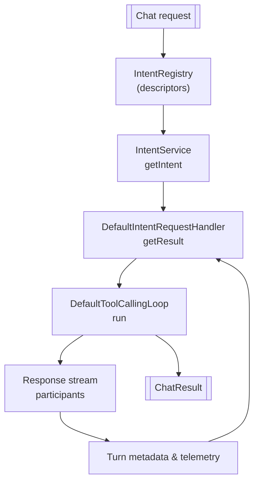
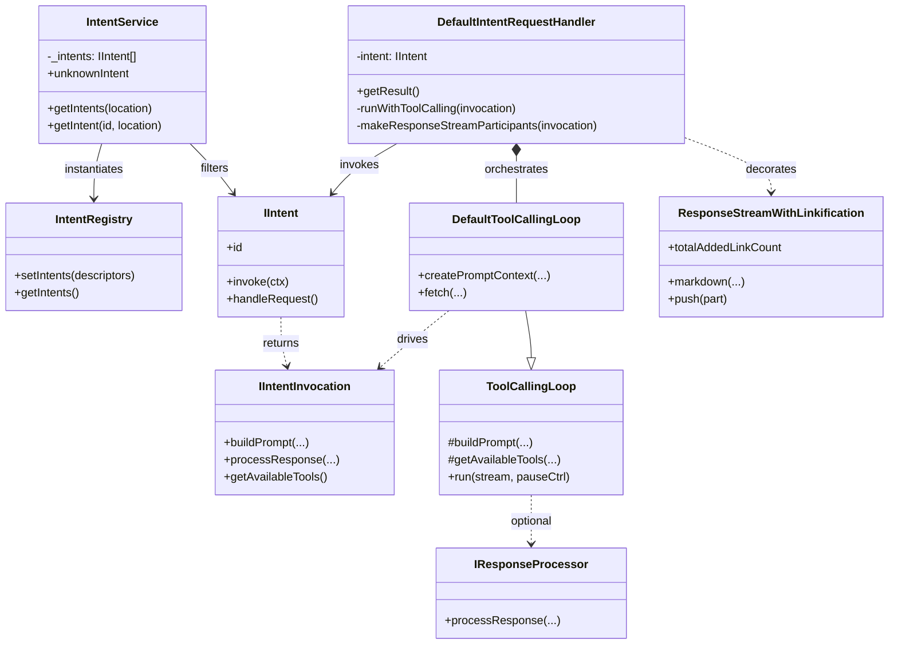

# Intent Architecture

## Implementation Snapshot
- `IIntent` describes the contract every handler must implement, including optional streaming hooks and prompt builders ([../src/extension/prompt/node/intents.ts#L83-L104](../src/extension/prompt/node/intents.ts#L83-L104)).
- Intent descriptors are registered once and materialized on demand by `IntentService`, enabling location-aware intent discovery ([../src/extension/prompt/node/intentRegistry.ts#L14-L29](../src/extension/prompt/node/intentRegistry.ts#L14-L29), [../src/extension/intents/node/intentService.ts#L33-L55](../src/extension/intents/node/intentService.ts#L33-L55)).
- `DefaultIntentRequestHandler` orchestrates invocation, tool-calling, telemetry, and response hydration for each request ([../src/extension/prompt/node/defaultIntentRequestHandler.ts#L107-L164](../src/extension/prompt/node/defaultIntentRequestHandler.ts#L107-L164)).

### Core Types

#### `IIntent` contract
[../src/extension/prompt/node/intents.ts#L83-L104](../src/extension/prompt/node/intents.ts#L83-L104):
```typescript
	/**
	 * This intent is invoked, return an invocation object that will be used to craft the prompt and to process the
	 * response. The passed context must be used to the entire invocation
	 */
	invoke(invocationContext: IIntentInvocationContext): Promise<IIntentInvocation>;
	/**
	 * Handle a request. Note that when defined `invoke` isn't called anymore...
	 */
	handleRequest?(
```
The invocation object drives prompt construction, tool availability, and optional response processing. Implementations may shortcut the pipeline by providing `handleRequest` for one-shot responses.

#### Central registry
[../src/extension/prompt/node/intentRegistry.ts#L14-L24](../src/extension/prompt/node/intentRegistry.ts#L14-L24):
```typescript
	public setIntents(intentDescriptors: SyncDescriptor<IIntent>[]) {
		this._descriptors = this._descriptors.concat(intentDescriptors);
	}

	public getIntents(): readonly SyncDescriptor<IIntent>[] {
```
Contributors register `SyncDescriptor<IIntent>` instances during activation. The registry retains descriptors to preserve lazy construction and shared singleton semantics.

#### Intent resolution service
[../src/extension/intents/node/intentService.ts#L33-L55](../src/extension/intents/node/intentService.ts#L33-L55):
```typescript
	private _getOrCreateIntents(): IIntent[] {
		if (!this._intents) {
			this._intents = IntentRegistry.getIntents().map(d => this._instantiationService.createInstance(d));
		}
		return this._intents;
	}

	public getIntents(location: ChatLocation): IIntent[] {
```
`IntentService` instantiates each descriptor once, caches the results, then filters by `ChatLocation`. The same service exposes `unknownIntent`, ensuring graceful fallbacks for unmapped slash commands.

### Request Lifecycle

1. A chat request arrives with a resolved `ChatLocation`. `IntentService.getIntent` returns the location-appropriate implementation ([../src/extension/intents/node/intentService.ts#L49-L55](../src/extension/intents/node/intentService.ts#L49-L55)).
2. `DefaultIntentRequestHandler.getResult` invokes the intent to produce an `IIntentInvocation`, persists metadata on the active `Turn`, and captures confirmations ([../src/extension/prompt/node/defaultIntentRequestHandler.ts#L112-L146](../src/extension/prompt/node/defaultIntentRequestHandler.ts#L112-L146)).
3. The handler delegates execution to a tool-calling loop that streams results back to the UI while collecting telemetry ([../src/extension/prompt/node/defaultIntentRequestHandler.ts#L287-L345](../src/extension/prompt/node/defaultIntentRequestHandler.ts#L287-L345)).

[../src/extension/prompt/node/defaultIntentRequestHandler.ts#L112-L139](../src/extension/prompt/node/defaultIntentRequestHandler.ts#L112-L139):
```typescript
	this._logService.trace('Processing intent');
	const intentInvocation = await this.intent.invoke({ location: this.location, documentContext: this.documentContext, request: this.request });
	this.turn.setMetadata(new IntentInvocationMetadata(intentInvocation));
	const confirmationResult = await this.handleConfirmationsIfNeeded();
	const resultDetails = await this._requestLogger.captureInvocation(this.request, () => this.runWithToolCalling(intentInvocation));
	let chatResult = resultDetails.chatResult || {};
```
`DefaultIntentRequestHandler` always stores the invocation for downstream processors and relies on `captureInvocation` to scope telemetry and logging for the request.

### Tool-Calling Integration

[../src/extension/prompt/node/defaultIntentRequestHandler.ts#L289-L309](../src/extension/prompt/node/defaultIntentRequestHandler.ts#L289-L309):
```typescript
	const loop = this._loop = store.add(this._instantiationService.createInstance(
		DefaultToolCallingLoop,
		{
			conversation: this.conversation,
			intent: this.intent,
			invocation: intentInvocation,
```
The handler wires the invocation into `DefaultToolCallingLoop`, supplying the response stream participants, temperature overrides, and document context. The loop replays the prompt builder, issues tool calls, and aggregates telemetry before returning control to the handler.

### Response Stream & Telemetry

[../src/extension/prompt/node/defaultIntentRequestHandler.ts#L202-L257](../src/extension/prompt/node/defaultIntentRequestHandler.ts#L202-L257):
```typescript
	if (!intentInvocation.linkification?.disable) {
		participants.push(stream => {
			const linkStream = this._instantiationService.createInstance(ResponseStreamWithLinkification, { requestId: this.turn.id, references: this.turn.references }, stream, intentInvocation.linkification?.additionaLinkifiers ?? [], this.token);
			return ChatResponseStreamImpl.spy(linkStream, p => p, () => {
				this._loop.telemetry.markAddedLinks(linkStream.totalAddedLinkCount);
			});
		});
	}
```
Each streaming participant enriches the outgoing response: code-block tracking, edit survival analysis, linkification, and telemetry emission. Downstream telemetry attaches tool-call results, turn metadata, and model output before the request resolves ([../src/extension/prompt/node/defaultIntentRequestHandler.ts#L261-L337](../src/extension/prompt/node/defaultIntentRequestHandler.ts#L261-L337)).

### Flow of Control



### UML Relationships

`IntentService` instantiates descriptors from the registry and filters them for each `ChatLocation` before handing control to the request handler ([../src/extension/intents/node/intentService.ts#L33-L55](../src/extension/intents/node/intentService.ts#L33-L55)). The handler records the active invocation, composes response-stream decorators, and delegates iterative tool calling to a `DefaultToolCallingLoop` instance ([../src/extension/prompt/node/defaultIntentRequestHandler.ts#L112-L337](../src/extension/prompt/node/defaultIntentRequestHandler.ts#L112-L337)). That loop subclasses the generic `ToolCallingLoop` backbone to inherit prompt construction, telemetry signaling, and tool orchestration ([../src/extension/prompt/node/defaultIntentRequestHandler.ts#L510-L565](../src/extension/prompt/node/defaultIntentRequestHandler.ts#L510-L565), [../src/extension/intents/node/toolCallingLoop.ts#L92-L157](../src/extension/intents/node/toolCallingLoop.ts#L92-L157)). The stream participant wiring wraps VS Code's progress channel with `ResponseStreamWithLinkification` so emitted markdown gains anchors and metadata ([../src/extension/linkify/common/responseStreamWithLinkification.ts#L16-L149](../src/extension/linkify/common/responseStreamWithLinkification.ts#L16-L149)).



### Operational Notes
- Tool-calling retries, off-topic handling, and quota failures are normalized through `processResult`, ensuring a consistent `ChatResult` surface ([../src/extension/prompt/node/defaultIntentRequestHandler.ts#L416-L488](../src/extension/prompt/node/defaultIntentRequestHandler.ts#L416-L488)).
- Telemetry stores serialized prompt metadata and applied edits, enabling post-run diagnostics and simulation parity ([../src/extension/prompt/node/defaultIntentRequestHandler.ts#L329-L345](../src/extension/prompt/node/defaultIntentRequestHandler.ts#L329-L345)).
- Intent implementers can opt-in to additional variables via `IIntentInvocation.getAdditionalVariables`, which merge with the prompt context before execution ([../src/extension/prompt/node/defaultIntentRequestHandler.ts#L552-L560](../src/extension/prompt/node/defaultIntentRequestHandler.ts#L552-L560)).

### Validation & Debugging
- To confirm intent wiring, run the extension in the VS Code desktop host and trigger a slash command; attach a debugger to inspect `IntentInvocationMetadata` on the active turn ([../src/extension/prompt/node/conversation.ts#L9-L12](../src/extension/prompt/node/conversation.ts#L9-L12)).
- Simulation tests exercise tool-calling telemetry paths; re-run `npm run simulate` when adjusting streaming participants for regression coverage ([../test/simulationTests.ts#L34-L62](../test/simulationTests.ts#L34-L62)).
