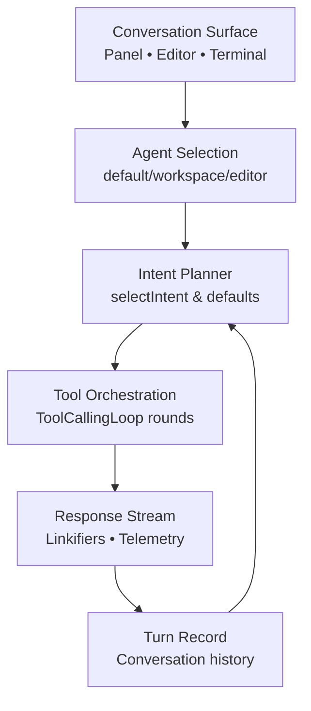
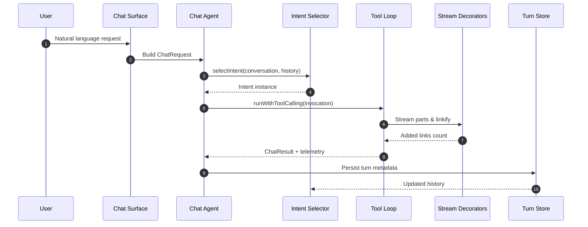

# Intent Orchestration Layer

## Orchestration Pipeline
The request handler ties command detection, intent selection, and handler instantiation into a single hand-off so every turn flows through the same gateway. The selector derives conversation history, chooses the intent, and either calls the intent directly or falls back to the default handler.

[../src/extension/prompt/node/chatParticipantRequestHandler.ts#L233-L239](../src/extension/prompt/node/chatParticipantRequestHandler.ts#L233-L239):
```typescript
			const history = this.conversation.turns.slice(0, -1);
			const intent = await this.selectIntent(command, history);

			let chatResult: Promise<ChatResult>;
			if (typeof intent.handleRequest === 'function') {
				chatResult = intent.handleRequest(this.conversation, this.request, this.stream, this.token, this.documentContext, this.chatAgentArgs.agentName, this.location, this.chatTelemetry, this.onPaused);
```

[../src/extension/prompt/node/chatParticipantRequestHandler.ts#L236-L241](../src/extension/prompt/node/chatParticipantRequestHandler.ts#L236-L241):
```typescript
			let chatResult: Promise<ChatResult>;
			if (typeof intent.handleRequest === 'function') {
				chatResult = intent.handleRequest(this.conversation, this.request, this.stream, this.token, this.documentContext, this.chatAgentArgs.agentName, this.location, this.chatTelemetry, this.onPaused);
			} else {
				const intentHandler = this._instantiationService.createInstance(DefaultIntentRequestHandler, intent, this.conversation, this.request, this.stream, this.token, this.documentContext, this.location, this.chatTelemetry, undefined, this.onPaused);
				chatResult = intentHandler.getResult();
```

## Structural Vocabulary
### Agents & Participants
Agent names act as personas that determine which capability bundle should serve a request. The shared constants also provide a reversible mapping between human-readable names and chat participant IDs.

[../src/platform/chat/common/chatAgents.ts#L16-L21](../src/platform/chat/common/chatAgents.ts#L16-L21):
```typescript
export const defaultAgentName = 'default';
export const editorAgentName = 'editor';
export const workspaceAgentName = 'workspace';
export const vscodeAgentName = 'vscode';
export const terminalAgentName = 'terminal';
export const editingSessionAgentName = 'editingSession';
```

### Tool Call Rounds
Each intent invocation tracks the granular tool calls it emits. The primary structure captures the tool identifier, raw arguments, and stable ID so retry logic and summarisation can reason about the exchange.

[../src/extension/prompt/common/intents.ts#L18-L22](../src/extension/prompt/common/intents.ts#L18-L22):
```typescript
export interface IToolCall {
	name: string;
	arguments: string;
	id: string;
}
```

### Conversation State
Turns preserve the user prompt, variable set, and tool selections. This state feeds back into intent detection for subsequent requests and seeds prompt construction.

[../src/extension/prompt/common/conversation.ts#L71-L77](../src/extension/prompt/common/conversation.ts#L71-L77):
```typescript
	return new Turn(
		id,
		{ message: request.prompt, type: 'user' },
		new ChatVariablesCollection(request.references),
		request.toolReferences.map(InternalToolReference.from),
		request.editedFileEvents,
		request.acceptedConfirmationData
	);
```

### Surface Context
`ChatLocation` enumerates the UI surfaces and modes that affect capability selection, authentication prompts, and prompt shaping.

[../src/platform/chat/common/commonTypes.ts#L19-L23](../src/platform/chat/common/commonTypes.ts#L19-L23):
```typescript
	Panel = 1,
	/**
	 * Terminal inline chat
	 */
	Terminal = 2,
```

### Stream Decorators
The linkification decorator exposes telemetry back to the tool-calling loop so the orchestrator can measure how often streaming enrichments were applied.

[../src/extension/linkify/common/responseStreamWithLinkification.ts#L35-L37](../src/extension/linkify/common/responseStreamWithLinkification.ts#L35-L37):
```typescript
	get totalAddedLinkCount() {
		return this._linkifier.totalAddedLinkCount;
	}
```

## Layered Control Diagram


## Sequence of Operations

