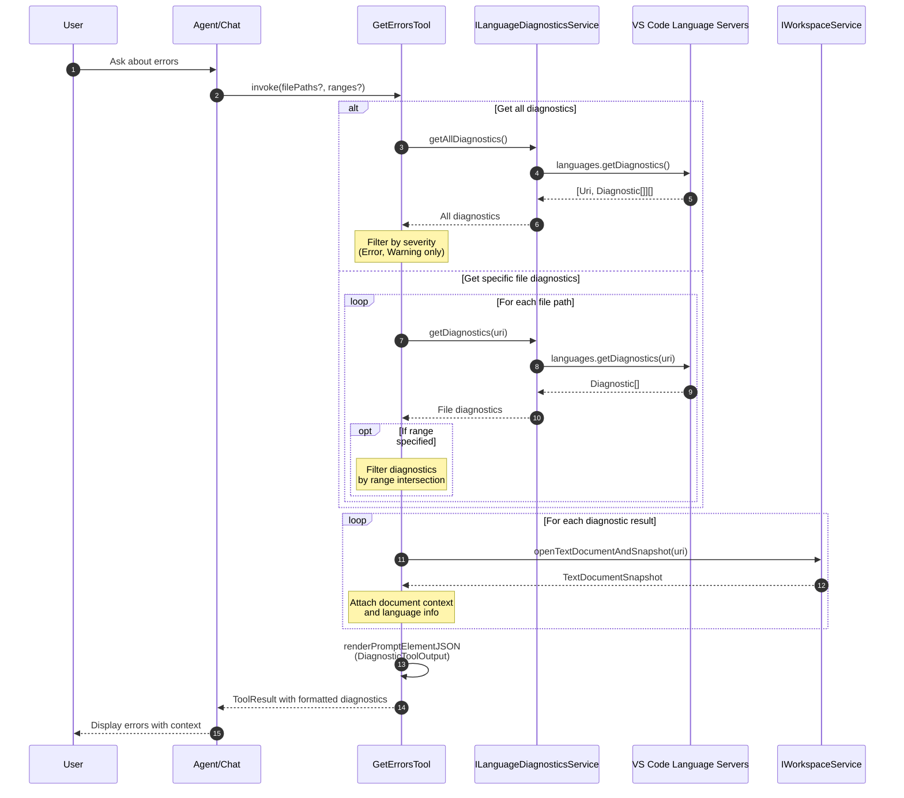
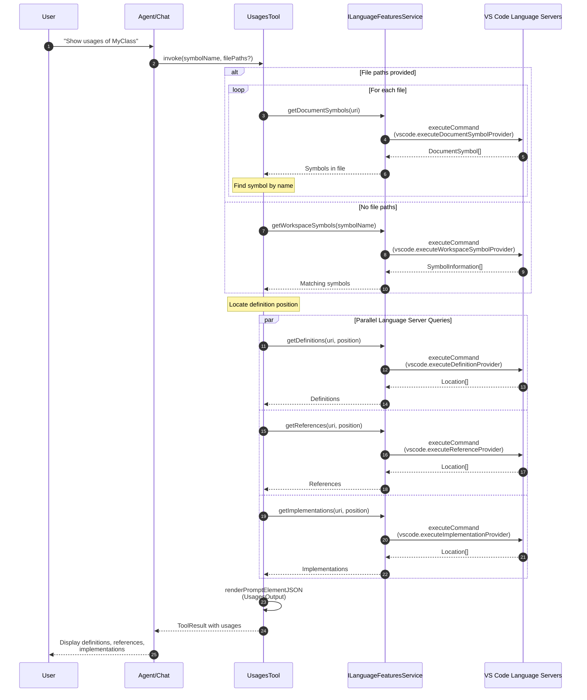
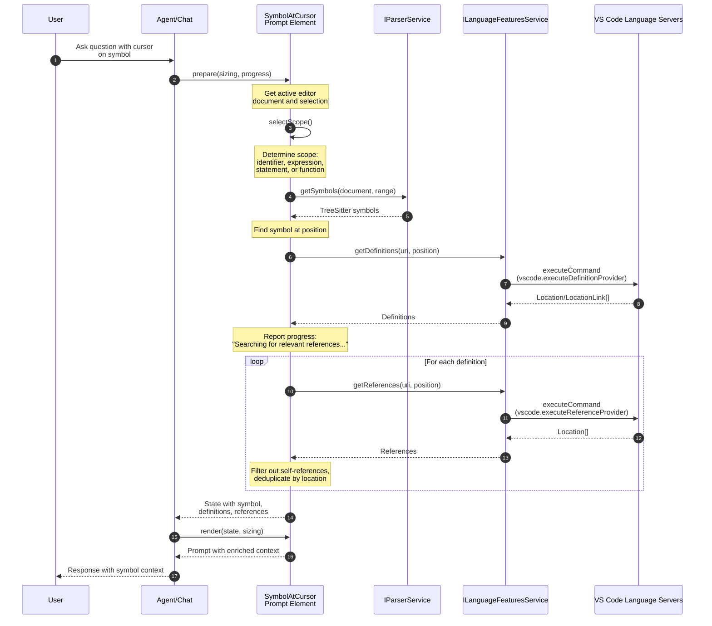
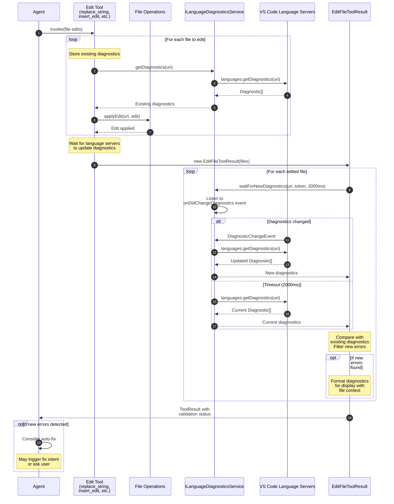
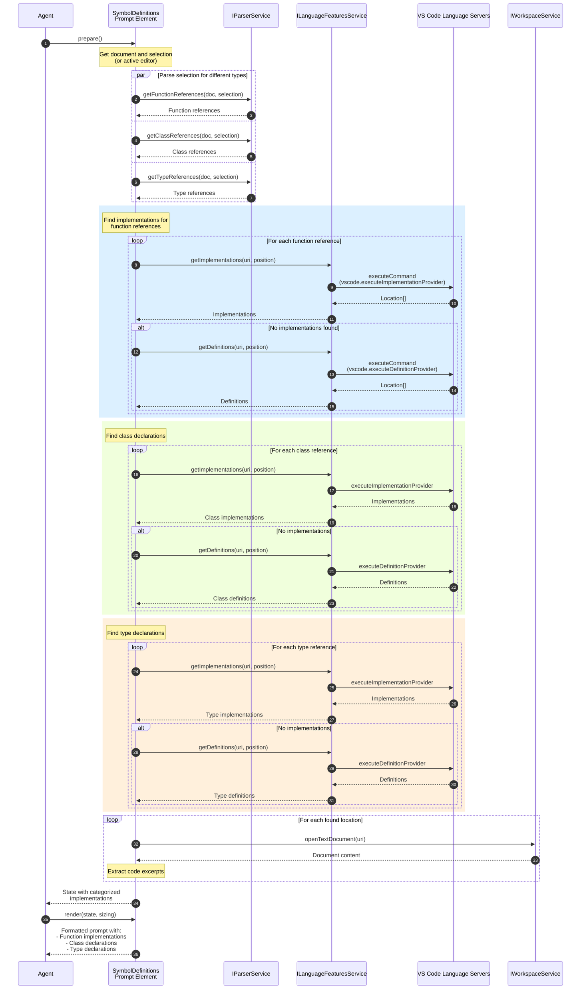
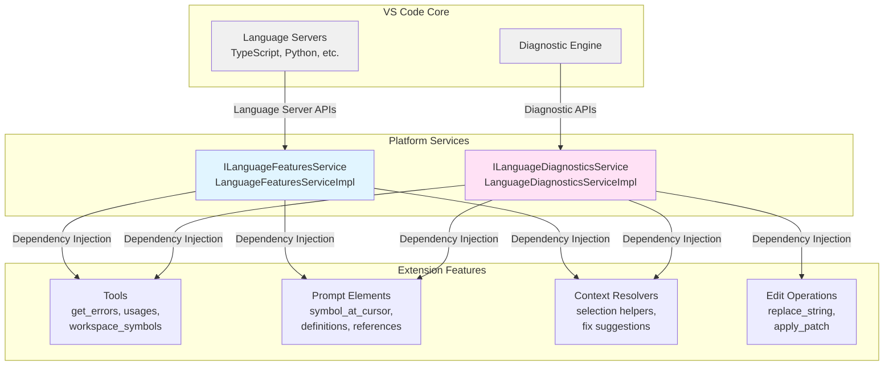

# Language Services Interaction Diagrams

This document illustrates how different components of the VS Code Copilot Chat extension interact with the language services (`ILanguageFeaturesService` and `ILanguageDiagnosticsService`) to provide AI-powered coding assistance.

## Overview

The extension uses two main language services:

1. **ILanguageFeaturesService** - Accesses VS Code's language servers for definitions, implementations, references, symbols, etc.
2. **ILanguageDiagnosticsService** - Accesses VS Code's diagnostics (errors, warnings, hints)

These services are consumed by:
- **Tools** (get_errors, usages, workspace_symbols)
- **Prompt Elements** (symbol context, definitions, references)
- **Context Resolvers** (selection helpers, fix suggestions)
- **Edit Operations** (validation after file changes)

## 1. Get Errors Tool - Diagnostic Retrieval Flow

This diagram shows how the `get_errors` tool retrieves and processes diagnostics from the workspace.

## 2. Usages Tool - Symbol Analysis Flow

This diagram shows how the `usages` tool finds definitions, references, and implementations of a symbol.

## 3. Symbol at Cursor - Context Enhancement Flow

This diagram shows how prompt elements enrich context with symbol information.

## 4. File Edit Validation - Diagnostic Monitoring Flow

This diagram shows how edit operations validate changes using diagnostics.

## 5. Symbol Definitions - Advanced Context Resolution

This diagram shows how complex prompts gather multiple types of symbol information.

## Service Architecture

## Key Patterns

### 1. Service Abstraction
- Extension code depends on `ILanguageFeaturesService` and `ILanguageDiagnosticsService` interfaces
- Implementation details are hidden behind the service layer
- Easy to swap implementations for testing (simulation, mocking)

### 2. Async Language Server Calls
- All language server queries are asynchronous
- Operations can timeout or be cancelled
- Results are processed and formatted for AI consumption

### 3. Parallel Queries
- Multiple language server queries executed in parallel when possible
- Example: Getting definitions, references, and implementations simultaneously
- Improves performance for complex context gathering

### 4. Diagnostic Monitoring
- Edit operations capture diagnostics before changes
- Wait for language servers to update after edits
- Compare new vs. old diagnostics to detect introduced errors
- Enables auto-fix workflows

### 5. Prompt Context Enhancement
- Prompt elements use language services to enrich context
- Symbol information, references, implementations added to prompts
- Helps AI understand code relationships and dependencies

## Usage Statistics

Based on code analysis, here are the primary consumers:

### ILanguageFeaturesService
- **Tools**: 3 tools (usages, workspace_symbols, search)
- **Prompt Elements**: 5 elements (symbol_at_cursor, definitions, references, explain, definition_at_position)
- **Context Resolvers**: 2 resolvers (selection helpers, scope selection)
- **Total Usages**: 37 locations

### ILanguageDiagnosticsService
- **Tools**: 5 tools (get_errors, replace_string, insert_edit, apply_patch, test tools)
- **Prompt Elements**: 3 elements (fix prompts for inline and panel)
- **Context Resolvers**: 2 resolvers (fix selection, user actions)
- **Edit Operations**: 1 result handler (edit validation)
- **Total Usages**: 44 locations

## Related Documentation

- [TECHNICAL-OVERVIEW.md](./TECHNICAL-OVERVIEW.md) - Extension architecture
- [ARCHITECTURE-DIAGRAMS.md](./ARCHITECTURE-DIAGRAMS.md) - High-level diagrams
- [tools.md](./tools.md) - Tool system documentation
