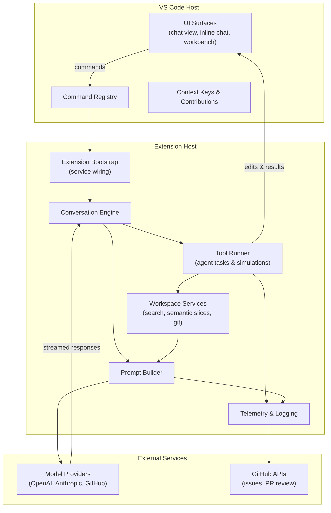
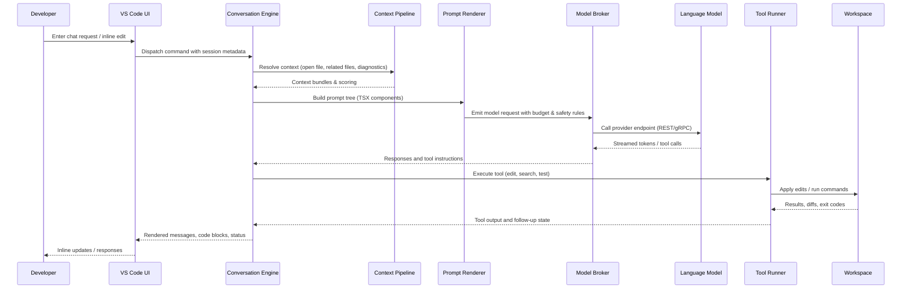

# GitHub Copilot Chat Technical Overview

This document orients contributors to the structure, runtime behavior, and communication flows that power the `vscode-copilot-chat` extension.

## Core Features
- **Conversational Agent** (`src/extension/chat`, `conversation/`): multi-turn chat with participants, slash commands, and custom variables.
- **Inline Assistance** (`inlineChat/`, `inlineEdits/`, `inlineCompletion/`): cursor-aware edits, quick fixes, and completions streamed into the active editor.
- **Agent Mode** (`agents/`, `tools/`, `workspaceRecorder/`): autonomous task runner that executes multi-step plans, applies edits, and monitors build/test output.
- **Context Intelligence** (`context/`, `workspaceSemanticSearch/`, `relatedFiles/`): gathers workspace snippets, semantic search results, and diagnostics to ground prompts.
- **Ecosystem Integrations** (`githubPullRequest.d.ts`, `review/`, `mcp/`): connects to GitHub PRs, Model Context Protocol tools, and external services.

## Major Components
| Component | Location | Responsibility |
| --- | --- | --- |
| Extension Bootstrap | `src/extension/extension/` | Activates services, registers contributions, and wires VS Code lifecycle hooks. |
| Service Container | `src/util/common/`, `src/platform/**` | Dependency injection, serialization helpers, platform services (search, telemetry, embeddings). |
| Conversation Engine | `src/extension/conversation/`, `chatSessions/` | Manages chat sessions, state persistence, participant routing, and message streaming. |
| Prompt System | `src/extension/prompts/`, `prompt/`, `platform/openai/` | Builds TSX prompt trees, performs token budgeting, and dispatches requests to model providers. |
| Tooling & Agents | `src/extension/tools/`, `agents/`, `testing/` | Implements runnable tools (file edits, shell, tests) and orchestrates agent execution plans. |
| UI Surfaces | `src/extension/chat/`, `inlineChat/`, `codeBlocks/`, `getting-started/` | Webview providers, tree views, and experiential surfaces inside VS Code. |
| chat-lib Worker | `chat-lib/` | Headless bundle reused by alternative hosts; generated from `src/` via `npm run extract-chat-lib`. |
| Scripts & Automation | `script/**`, `build/` | Build pipeline, simulation runners, release automation, and environment setup. |
| Tests & Fixtures | `test/**`, `chat-lib/test/` | Unit, integration, simulation, and agent-mode regression suites with large fixtures (Git LFS). |

## Component Interaction

## Data Flow Lifecycle

## Communication Patterns
- **In-process messaging**: Services use the dependency injection container (`createServicesAccessor`) and event emitters (`Emitter<T>`) to propagate state changes without tight coupling.
- **VS Code APIs**: Commands, TreeDataProviders, CodeActions, and proposed chat APIs carry data between the extension host and UI webviews.
- **Model I/O**: HTTP(S) requests via `undici`/`@vscode/copilot-api` handle streaming responses, tool invocations, and retry/backoff logic with telemetry instrumentation.
- **Tool Execution**: Agents invoke workspace operations through the VS Code `WorkspaceEdit`, `Task`, and terminal APIs; long-running tasks report progress through chat participant events.
- **State Persistence**: Conversation transcripts, cached context, and feature flags persist via `Memento`, file-backed stores in `workspaceRecorder`, or semantic caches in `platform/search`.

## Operational Notes
- **Observability**: Structured logs live under `src/extension/log/`; telemetry events funnel through `src/extension/telemetry/` into the VS Code telemetry pipeline with privacy-safe payloads.
- **Configuration & Feature Flags**: User settings are defined in `src/extension/settingsSchema/`, with BYOK credentials handled in `src/extension/byok/` and secrets stored via VS Code’s credential store.
- **Simulations & Regression**: `test/simulation/` hosts deterministic scenario runners; use `npm run simulate-ci` or `npm run simulate-update-baseline` to validate agent changes and refresh golden transcripts.
- **Deployment**: Production artifacts are emitted to `dist/` via `npm run build`; release automation and VSIX packaging scripts live in `build/` and `script/`.
