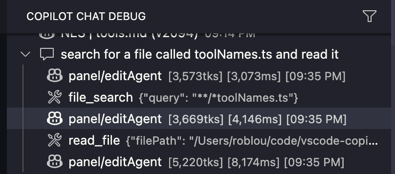
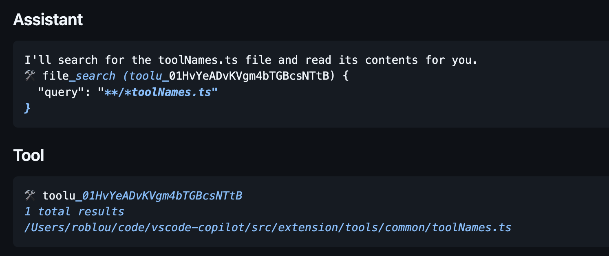

# Authoring Model-Specific Prompts

## Table of Contents

- [Overview](#overview)
- [Creating a Custom Prompt](#creating-a-custom-prompt)

**Development Workflow**
- [Step 1: Start with Defaults](#step-1-start-with-defaults)
- [Step 2: Test Behaviors](#step-2-test-behaviors)
- [Step 3: Make Minimal Adjustments](#step-3-make-minimal-adjustments)

**Validation**
- [Expected Behaviors](#expected-behaviors)
- [Common Pitfalls](#common-pitfalls)
- [Testing & Debugging](#testing--debugging)

## Overview

vscode-copilot-chat uses two complementary systems to configure model behavior:

1. **Model Profiles** ([`modelProfiles.ts`](../src/platform/endpoint/common/modelProfiles.ts)) — a config-driven registry that controls model **capabilities**: which edit tools a model uses, where instructions are placed, image support, notebook format, verbosity, etc. Adding a new model that behaves like an existing archetype is a one-line change here.

2. **Prompt Registry** ([`promptRegistry.ts`](../src/extension/prompts/node/agent/promptRegistry.ts)) — maps models to their **TSX system prompt** components. Only needed when a model requires a genuinely different prompt (different wording, structure, or instructions).

### When to use which

| Scenario | What to change |
|----------|---------------|
| New model behaves like an existing archetype | Add one entry to `MODEL_PROFILES` in `modelProfiles.ts` |
| New model needs a capability tweak (e.g. different edit strategy) | Add one entry to `MODEL_PROFILES` with the override |
| New model needs a custom system prompt | Add a `MODEL_PROFILES` entry **and** create a new TSX prompt + resolver |
| Quick eval of a new model (zero code changes) | Set `github.copilot.chat.advanced.models.profiles` in `settings.json` |

### How Model Profiles Work

The [`MODEL_PROFILES`](../src/platform/endpoint/common/modelProfiles.ts) table uses **inheritance** (`extends`) so models only override what's different from their base archetype:

```typescript
// Base archetype — never matched directly
'_anthropic': {
    editStrategy: 'multi-replace-string',
    imageSupport: { urls: true, mcpResults: false },
    // ...
},

// Concrete model — inherits everything, overrides instruction placement
'claude-3.5-sonnet': {
    extends: '_anthropic',
    instructionPlacement: 'user-message',
},
```

Profile resolution uses **longest-prefix-first** matching against `model.family`, so `gpt-5.1-codex` matches before `gpt-5.1` which matches before `gpt-5` which matches before `gpt`.

The capability functions in [`chatModelCapabilities.ts`](../src/platform/endpoint/common/chatModelCapabilities.ts) (e.g. `modelSupportsApplyPatch()`, `modelNeedsStrongReplaceStringHint()`) are thin wrappers over the profile system. All existing callsites use these functions unchanged.

### BYOK Models

BYOK models get the right profile automatically as long as their model ID starts with a recognized prefix (`claude`, `gpt`, `gemini`, `grok-code`, etc.). Unknown model IDs fall through to the default profile (insert-edit-only, standard settings) — which is the safe behavior. And with the new settings override, users can explicitly map any unknown model to an archetype via `github.copilot.chat.advanced.models.profiles` without rebuilding.

### How the Prompt Registry Works

The [`PromptRegistry`](../src/extension/prompts/node/agent/promptRegistry.ts) matches models to prompts using:
1. **Custom matchers**: `matchesModel()` functions for complex logic
2. **Family prefixes**: Simple string matching on model family names

A single prompt resolver can return **different prompts for different models** within the same provider family. For example, you might want to use one prompt for `gpt-5` and a different optimized prompt for `gpt-5-codex`. The resolver's `resolveSystemPrompt()` method receives the endpoint information (including the model name) and can use conditional logic to return the appropriate prompt class:

```typescript
class MyProviderPromptResolver implements IAgentPrompt {
    static readonly familyPrefixes = ['my-model'];

    resolveSystemPrompt(endpoint: IChatEndpoint): SystemPrompt | undefined {
        if (endpoint.model?.startsWith('my-model-v2')) {
            return MyModelV2Prompt;
        }
        return MyDefaultPrompt;
    }
}
```

### File Locations

**Model capabilities:**
- **[modelProfiles.ts](../src/platform/endpoint/common/modelProfiles.ts)** — Profile registry, inheritance, and resolution
- **[chatModelCapabilities.ts](../src/platform/endpoint/common/chatModelCapabilities.ts)** — Public capability functions (thin wrappers over profiles)

**Prompts** (located in `src/extension/prompts/node/agent/`):
- **[defaultAgentInstructions.tsx](../src/extension/prompts/node/agent/defaultAgentInstructions.tsx)** — Base prompt and shared components
- **[promptRegistry.ts](../src/extension/prompts/node/agent/promptRegistry.ts)** — Prompt matching and resolution
- **[anthropicPrompts.tsx](../src/extension/prompts/node/agent/anthropicPrompts.tsx)** — Claude model prompts
- **[openai/](../src/extension/prompts/node/agent/openai/)** — GPT model prompts (`gpt5Prompt.tsx`, `gpt51Prompt.tsx`, etc.)
- **[geminiPrompts.tsx](../src/extension/prompts/node/agent/geminiPrompts.tsx)** — Gemini model prompts
- **[xAIPrompts.tsx](../src/extension/prompts/node/agent/xAIPrompts.tsx)** — Grok model prompts
- **[vscModelPrompts.tsx](../src/extension/prompts/node/agent/vscModelPrompts.tsx)** — Hidden/unreleased model prompts

---

## Creating a Custom Prompt

### Step 1: Copy Default Prompt Structure

Copy `DefaultAgentPrompt` from `defaultAgentInstructions.tsx` into your custom prompt file:

```tsx
import { PromptElement, PromptSizing } from '@vscode/prompt-tsx';
import { DefaultAgentPromptProps, detectToolCapabilities } from './defaultAgentInstructions';
import { InstructionMessage } from '../base/instructionMessage';

export class MyProviderAgentPrompt extends PromptElement<DefaultAgentPromptProps> {
	async render(state: void, sizing: PromptSizing) {
		const tools = detectToolCapabilities(this.props.availableTools);

		return <InstructionMessage>
			{/* Your customizations here */}
		</InstructionMessage>;
	}
}
```

### Step 2: Create Resolver

Implement `IAgentPrompt` interface:

```typescript
class MyProviderPromptResolver implements IAgentPrompt {
	constructor(
		@IConfigurationService private readonly configurationService: IConfigurationService,
		@IExperimentationService private readonly experimentationService: IExperimentationService,
	) { }

	static readonly familyPrefixes = ['my-model', 'provider-name'];

	resolvePrompt(endpoint: IChatEndpoint): PromptConstructor | undefined {
		// Simple: One prompt for all
		return MyProviderAgentPrompt;

		// Advanced: Conditional logic
		if (endpoint.model?.startsWith('my-model-4')) {
			return MyProviderV4Prompt;
		}
		return MyProviderAgentPrompt;
	}
}
```

### Step 3: Register

Register your prompt at the end of the file:

```typescript
PromptRegistry.registerPrompt(MyProviderPromptResolver);
```

Finally, update the [`allAgentPrompts.ts`](../src/extension/prompts/node/agent/allAgentPrompts.ts) file to include your custom prompt file.

---

## Step 1: Start with Defaults

Begin with `DefaultAgentPrompt` - no customizations. Most models infer correct behavior from tool definitions alone.

The default prompt consists of minimal instructions:
- Basic role definition: "You are a highly sophisticated automated coding agent..."
- Tool availability awareness: Conditional instructions based on available tools
- Response formatting: Markdown rules, file/symbol linkification

When optimizing prompts, follow these principles:
- Start simple and add only when needed
- Remove redundancy to improve token efficiency
- Use conditional sections to include only relevant instructions
- Maintain consistent terminology that matches tool names

---

## Step 2: Test Behaviors

Run the model through test scenarios and evaluate key behaviors:

### 1. Tool Usage Patterns
- Uses edit tools (`replace_string_in_file`, `apply_patch`, `insert_edit_into_file`) instead of code blocks
- Uses code search tools (`read_file`, `semantic_search`, `grep_search`, `file_search`) to gather context
- Uses terminal tool (`run_in_terminal`) instead of bash commands
- **Does NOT use terminal tools to create, edit, or update files** - always uses dedicated edit tools instead
- Uses planning tools (`manage_todo_list`) for complex tasks


### 2. Response Format
- File paths and symbols linkified (wrapped in backticks)
- Structured markdown with headers and sections
- Concise, well-timed progress updates between tool calls

**Common issue**: Some models front-load thinking and only summarize at the end. Sample fix:
```tsx
Provide brief progress updates every 3-5 tool calls to keep the user informed of your progress.<br />
After completing parallel tool calls, provide a brief status update before proceeding to the next step.<br />
```

### 3. Workflow Execution
- Gathers context before acting
- Completes tasks end-to-end without pausing to check with user
- Handles errors and iterates appropriately

---

## Step 3: Make Minimal Adjustments

**Only customize if the model consistently fails Step 2 behaviors.**

Add 1-2 sentences targeting the specific issue:

```tsx
// Fix: Model shows code blocks instead of using edit tools
{tools[ToolName.ReplaceStringInFile] && <>
  NEVER print out a code block with file changes unless the user asked for it.
  Use the appropriate edit tool (replace_string_in_file, apply_patch, or insert_into_file).
</>}

// Fix: Model calls terminal tool in parallel
{tools[ToolName.CoreRunInTerminal] && <>
  Don't call the run_in_terminal tool multiple times in parallel.
  Instead, run one command and wait for the output before running the next command.
</>}

// Fix: Model doesn't use TODO tool for planning
{tools[ToolName.CoreManageTodoList] && <>
  For complex multi-step tasks, use the manage_todo_list tool to track your progress
  and provide visibility to the user.
</>}
```

This approach keeps instructions targeted and avoids over-specification.

## Step 4: Testing

Add your model family to the list at the top of [`agentPrompt.spec.tsx`](../src/extension/prompts/node/agent/test/agentPrompt.spec.tsx). That will render the prompt for your model with some different input scenarios and validate the prompt output against snapshots. This is really useful for checking the final rendered form of your prompt, ensuring any model-specific customizations have been applied correctly, and avoiding regressions. You can add test cases to cover any new dynamic logic in your prompt as needed.

---

## Expected Behaviors

Key behaviors the model should exhibit:

### File/Symbol Linkification
✅ **Correct**: `` The function `calculateTotal` is in `lib/utils/math.ts` ``
❌ **Wrong**: `The function calculateTotal is in lib/utils/math.ts`

### Tool Usage for Code
✅ **Correct**: Calls edit tools (`replace_string_in_file`, `apply_patch`, `insert_into_file`)
❌ **Wrong**: Shows code in markdown blocks (unless explicitly requested)

**Fix**:
```tsx
NEVER print out a code block with file changes unless the user asked for it.
Use the appropriate edit tool (replace_string_in_file, apply_patch, or insert_into_file).
```

### Code Search Tools
✅ **Correct**: Uses `read_file`, `semantic_search`, `grep_search` to gather context before editing
❌ **Wrong**: Makes assumptions about code without reading it first, or uses terminal tools to read files

**Fix**:
```tsx
{tools[ToolName.ReadFile] && <>
  Always read relevant files using read_file before making changes.
  Use semantic_search to find related code across the workspace.
</>}
```

### Terminal Commands
✅ **Correct**: Calls `run_in_terminal` tool
❌ **Wrong**: Shows bash commands in code blocks (unless explicitly requested)

**Fix**:
```tsx
{tools[ToolName.CoreRunInTerminal] && <>
  NEVER print out a code block with a terminal command to run unless the user asked for it.
  Use the run_in_terminal tool instead.
</>}
```

### Response Format Best Practices

**Short Preambles**
✅ `I'll add error handling to the login function.`
❌ `Thank you for your request! I understand you want me to add error handling. This is a great idea...`

**Progress Updates**
✅ Brief updates every 3-5 tool calls
❌ Silent batch processing or constant narration

**Completion Summaries**
✅ Well-structured markdown with headers, bullets, linkified files
❌ Unformatted walls of text

**TODO Management**
✅ Creates, updates, and marks TODOs complete incrementally
❌ No task tracking for complex multi-step work

---

## Common Pitfalls

### Over-Specification
❌ **Bad**: Too many contradictory instructions
```tsx
You should use tools. But also think first. Use tools when needed.
Don't use tools unnecessarily. Use tools effectively.
```

✅ **Good**: Clear and actionable
```tsx
You can call tools repeatedly to gather context and complete tasks.
Don't give up unless you're certain the request cannot be fulfilled.
```

### Missing Tool Checks
❌ **Bad**: Assumes tool exists
```tsx
Use the read_file tool to read files.
```

✅ **Good**: Checks availability
```tsx
{tools[ToolName.ReadFile] && <>Use the read_file tool to read files.</>}
```

### Ignoring prompt-tsx Conventions
❌ **Bad**: Newlines ignored in JSX
```tsx
<Tag name='instructions'>
	Line 1
	Line 2
</Tag>
```

✅ **Good**: Explicit breaks
```tsx
<Tag name='instructions'>
	Line 1<br />
	Line 2<br />
</Tag>
```

---

## Testing & Debugging

Open the Chat Debug View to inspect the actual prompt, tool calls, and tool call results. This is the best way to check the exact prompt being sent to the model.



### Test Scenarios

**Simple Queries**
```
User: what's the square root of 144?
Expected: 12
```

**File Operations**
```
User: Add error handling to auth.ts
Expected:
- Reads the file with read_file
- Uses edit tool (replace_string_in_file, apply_patch, or insert_into_file, not code blocks)
- Provides linkified references
```

**Multi-step Tasks**
```
User: Create a REST API for user management
Expected:
- Creates TODO list
- Gathers context
- Implements incrementally
- Updates TODOs
- Provides summary
```

**Code Search**
```
User: How does authentication work?
Expected:
- Uses code search tools (semantic_search, grep_search, read_file)
- Structured markdown
- Linkified references
- Section headers
```