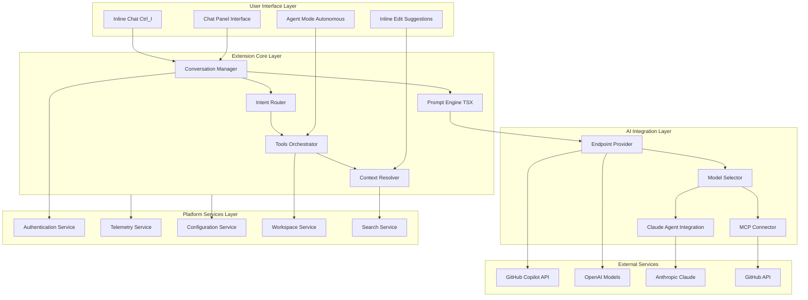
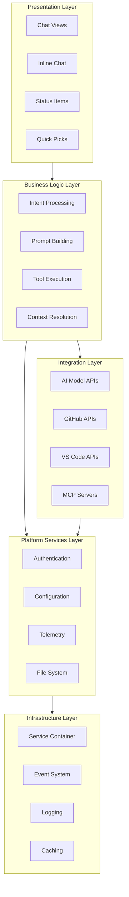
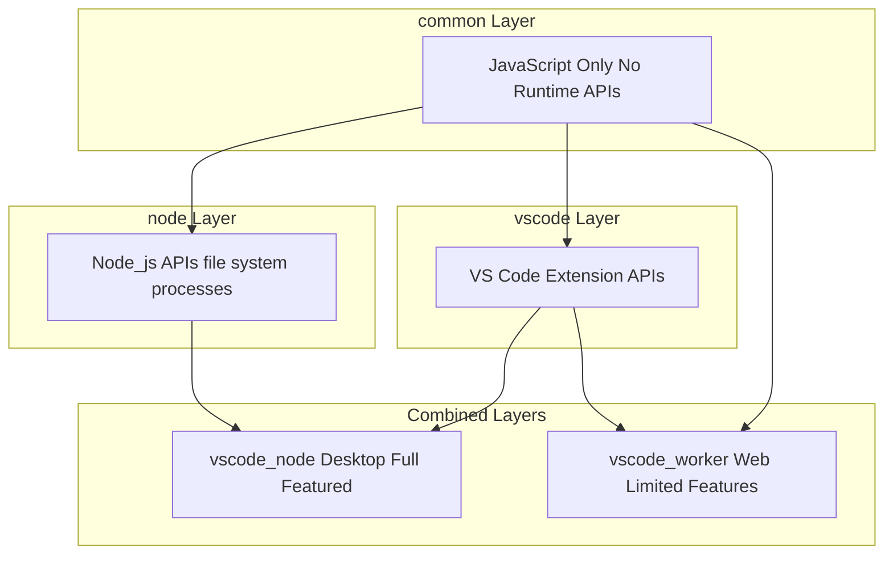
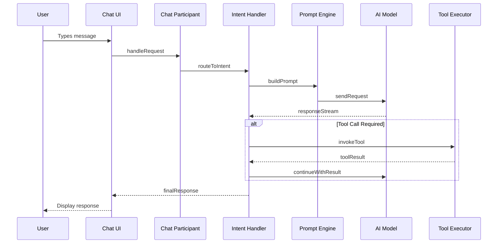
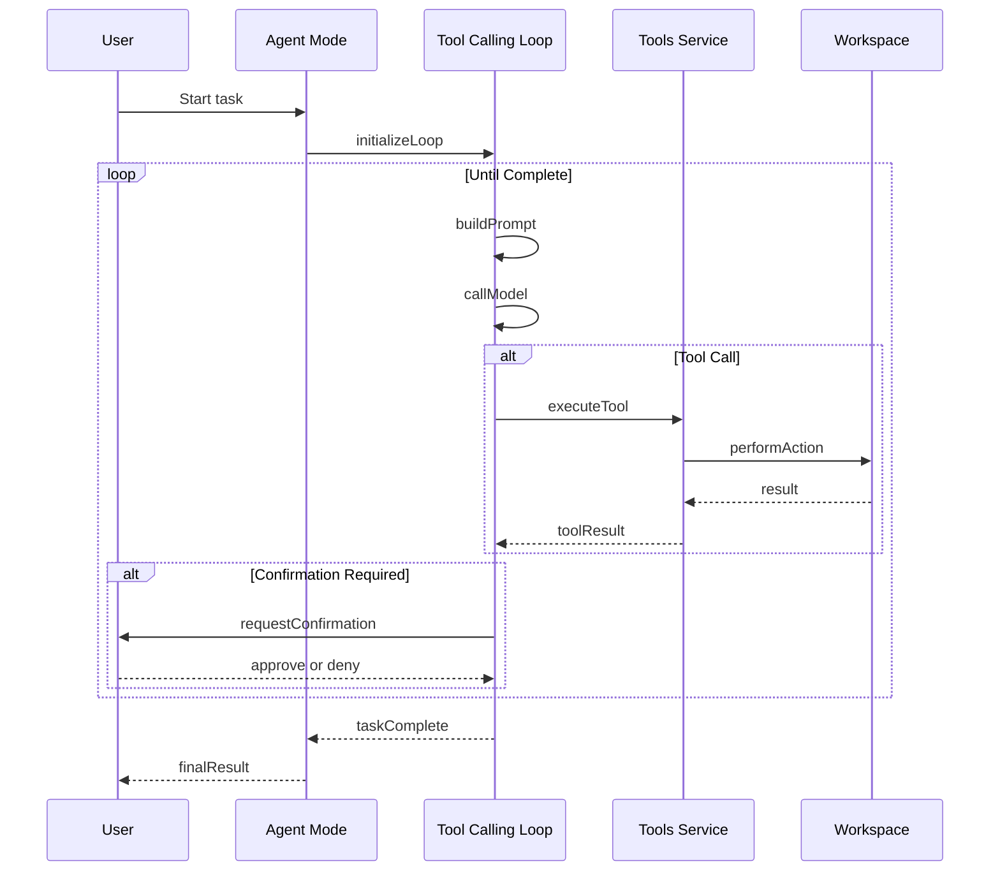
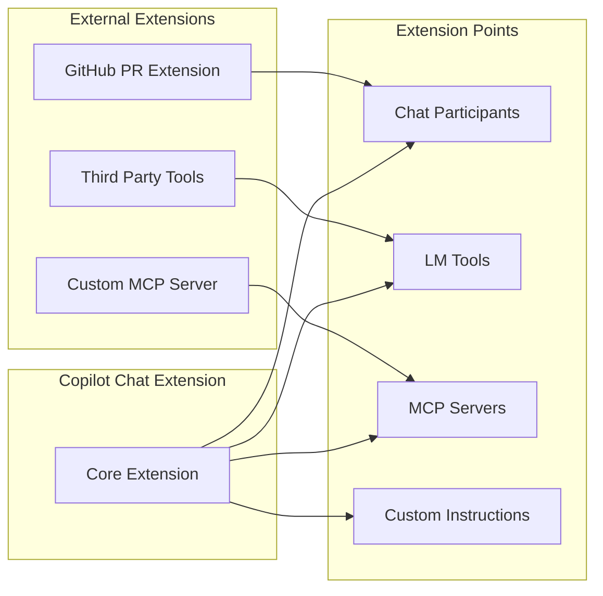

# High-Level Design (HLD)
## GitHub Copilot Chat Extension for VS Code

---

## 1. Executive Summary

### 1.1 Purpose
GitHub Copilot Chat is a Visual Studio Code extension that provides conversational AI assistance for software development. It enables developers to interact with AI models through natural language, receiving help with code generation, explanation, debugging, refactoring, and autonomous task execution.

### 1.2 Key Business Value
- **Increased Developer Productivity**: Automates repetitive coding tasks and provides instant code suggestions
- **Knowledge Accessibility**: Provides context-aware explanations of code and documentation
- **Quality Improvement**: Offers code review, testing suggestions, and best practices
- **Reduced Context Switching**: Integrates AI assistance directly into the development environment

### 1.3 Target Users
- Software developers using Visual Studio Code
- Development teams seeking AI-assisted coding capabilities
- Organizations looking to improve developer efficiency

---

## 2. System Overview

### 2.1 High-Level Architecture Diagram

---

## 3. Core Capabilities

### 3.1 Chat Interface
**Functional Description**: The primary user interaction point where developers can have conversations with AI about their code.

| Feature | Description | User Benefit |
|---------|-------------|--------------|
| Natural Language Input | Type questions or requests in plain English | No learning curve for interaction |
| Code Context Awareness | Automatically includes relevant code in prompts | More accurate, contextual responses |
| Multi-turn Conversations | Maintains conversation history | Natural, iterative problem-solving |
| Participant System | Route requests to specialized agents | Expert responses for specific domains |

### 3.2 Inline Chat
**Functional Description**: AI assistance directly within the code editor without switching contexts.

| Feature | Description | User Benefit |
|---------|-------------|--------------|
| Quick Invocation | Trigger with Ctrl+I keyboard shortcut | Instant access without disruption |
| Selection-based Context | Works with selected code | Focused assistance on specific code |
| Inline Suggestions | Shows suggestions within editor | Seamless editing experience |
| Intent Detection | Automatically identifies user intent | Faster, more relevant responses |

### 3.3 Agent Mode
**Functional Description**: Autonomous AI agent that can perform multi-step tasks without constant user intervention.

| Feature | Description | User Benefit |
|---------|-------------|--------------|
| Multi-step Execution | Chains multiple actions together | Complex tasks completed automatically |
| Tool Calling | Uses tools to read, write, search, and execute | Full development capability |
| Self-correction | Analyzes errors and adjusts approach | Resilient task completion |
| Progress Tracking | Shows todo list and progress | Visibility into agent actions |

### 3.4 Language Model Integration
**Functional Description**: Connects to multiple AI model providers for flexibility and capability.

| Provider | Models Supported | Use Case |
|----------|------------------|----------|
| GitHub Copilot | GPT-4, GPT-4o, GPT-5 | General coding assistance |
| Anthropic | Claude 3, Claude 4 | Complex reasoning, agentic tasks |
| Google | Gemini Pro, Gemini Ultra | Alternative model options |
| BYOK | Custom API keys | Enterprise flexibility |

---

## 4. Technology Stack

### 4.1 Primary Technologies

| Category | Technology | Purpose |
|----------|------------|---------|
| Language | TypeScript | Primary development language |
| Runtime | Node.js | Extension host environment |
| UI Framework | TSX (prompt-tsx) | Prompt composition and rendering |
| Build System | ESBuild | Fast bundling and compilation |
| Testing | Vitest | Unit and integration testing |
| API Protocol | VS Code Extension API | Editor integration |

### 4.2 Key Dependencies

| Dependency | Purpose |
|------------|---------|
| @vscode/prompt-tsx | TSX-based prompt composition |
| @anthropic-ai/claude-agent-sdk | Claude agent integration |
| tree-sitter-wasm | Code parsing and analysis |
| VS Code Proposed APIs | Advanced chat and model features |

---

## 5. System Layers

### 5.1 Layer Architecture

### 5.2 Layer Responsibilities

| Layer | Responsibility | Key Components |
|-------|---------------|----------------|
| **Presentation** | User interaction, UI rendering | Chat panels, inline widgets, status bars |
| **Business Logic** | Core functionality, workflow orchestration | Intents, prompts, tool calling loop |
| **Integration** | External system communication | Model APIs, GitHub, MCP protocol |
| **Platform Services** | Cross-cutting concerns | Auth, config, telemetry, workspace |
| **Infrastructure** | Foundation services | DI container, events, logging |

---

## 6. Runtime Environments

### 6.1 Supported Environments

The extension supports multiple VS Code runtime environments:

| Environment | Description | Limitations |
|-------------|-------------|-------------|
| **Desktop (Node.js)** | Full-featured extension on desktop VS Code | None |
| **Web Worker** | Browser-based VS Code (vscode.dev) | No Node.js APIs, limited file access |
| **Remote** | VS Code with remote development | Network-dependent features |

### 6.2 Environment-Specific Code Organization

---

## 7. Key Workflows

### 7.1 Chat Request Processing

### 7.2 Agent Mode Execution

---

## 8. Security Considerations

### 8.1 Authentication Flow

| Step | Description | Security Measure |
|------|-------------|------------------|
| 1 | GitHub OAuth authentication | OAuth 2.0 with PKCE |
| 2 | Token storage | VS Code Secret Storage API |
| 3 | API requests | Bearer token in headers |
| 4 | Token refresh | Automatic refresh before expiry |

### 8.2 Data Handling

| Data Type | Handling | Retention |
|-----------|----------|-----------|
| Code Context | Sent to AI models | Not persisted |
| Conversation History | Local storage only | User-controlled |
| Telemetry | Anonymized metrics | Per Microsoft policy |
| Credentials | Encrypted storage | Session-based |

---

## 9. Performance Characteristics

### 9.1 Key Metrics

| Metric | Target | Description |
|--------|--------|-------------|
| Time to First Token | < 1 second | How quickly AI starts responding |
| Extension Activation | < 500ms | Time to load extension |
| Memory Usage | < 150MB | Typical memory footprint |
| Tool Execution | < 2 seconds | Average tool call duration |

### 9.2 Optimization Strategies

- **Lazy Loading**: Components loaded on demand
- **Caching**: Token and context caching
- **Streaming**: Response streaming for perceived speed
- **Background Processing**: Non-blocking operations

---

## 10. Extensibility Points

### 10.1 Extension Points

| Extension Point | Purpose | How to Use |
|-----------------|---------|------------|
| Chat Participants | Add custom chat agents | VS Code Chat API |
| Language Model Tools | Add new agent capabilities | VS Code LM Tool API |
| MCP Servers | External tool providers | Model Context Protocol |
| Custom Instructions | User-defined AI behavior | Settings and files |

### 10.2 Integration Capabilities

---

## 11. Deployment and Distribution

### 11.1 Distribution Channels

| Channel | Audience | Update Frequency |
|---------|----------|-----------------|
| VS Code Marketplace | General users | Stable releases |
| Pre-release Channel | Early adopters | Weekly updates |
| Insider Builds | Internal testing | Daily builds |

### 11.2 Version Compatibility

| VS Code Version | Copilot Chat Version | Notes |
|-----------------|---------------------|-------|
| 1.109+ | Latest | Full feature support |
| 1.100-1.108 | Limited | Reduced API support |
| < 1.100 | Not supported | Minimum version required |

---

## 12. Glossary

| Term | Definition |
|------|------------|
| **Agent Mode** | Autonomous AI that executes multi-step tasks using tools |
| **Chat Participant** | A specialized handler for chat requests (e.g., @workspace) |
| **Intent** | The detected purpose of a user's chat message |
| **MCP** | Model Context Protocol - standard for AI tool communication |
| **Prompt-TSX** | TSX-based framework for composing AI prompts |
| **Tool** | A capability the AI can invoke (e.g., read file, run terminal) |
| **BYOK** | Bring Your Own Key - using custom API credentials |

---

*Next Document: [02-LOW-LEVEL-DESIGN.md](./02-LOW-LEVEL-DESIGN.md)*
