# Low-Level Design (LLD)
## GitHub Copilot Chat Extension for VS Code

---

## 1. Introduction

This document provides detailed technical design specifications for the GitHub Copilot Chat extension. It covers component implementations, class structures, data flows, and internal interfaces.

---

## 2. Directory Structure and Code Organization

### 2.1 Source Code Layout

```
src/
├── extension/                    # Main extension implementation
│   ├── agents/                   # AI agent implementations
│   │   ├── claude/              # Claude Agent SDK integration
│   │   └── copilotcli/          # Copilot CLI integration
│   ├── api/                      # Public API interfaces
│   ├── authentication/           # GitHub authentication
│   ├── chat/                     # Chat-related services
│   ├── commands/                 # VS Code command implementations
│   ├── context/                  # Context resolution
│   ├── conversation/             # Conversation management
│   ├── extension/                # Extension entry points
│   │   ├── vscode/              # Common VS Code layer
│   │   ├── vscode-node/         # Desktop-specific
│   │   └── vscode-worker/       # Web-specific
│   ├── inlineChat/              # Inline chat features
│   ├── inlineEdits/             # Inline edit suggestions
│   ├── intents/                  # Intent handlers
│   ├── mcp/                      # Model Context Protocol
│   ├── prompts/                  # Prompt engineering (TSX)
│   ├── tools/                    # LM tool implementations
│   └── workspaceSemanticSearch/ # Semantic search
├── platform/                     # Platform services
│   ├── authentication/          # Auth services
│   ├── chat/                    # Chat infrastructure
│   ├── endpoint/                # AI endpoint management
│   ├── search/                  # Search services
│   ├── telemetry/               # Telemetry
│   └── workspace/               # Workspace services
└── util/                         # Shared utilities
    ├── common/                  # Common utilities
    ├── node/                    # Node.js utilities
    └── vs/                      # VS Code base utilities
```

### 2.2 Layer Dependencies

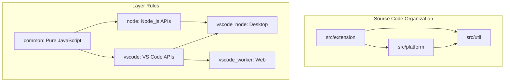
```mermaid
flowchart TB
    subgraph src["Source Code Organization"]
        extension["src/extension"]
        platform["src/platform"]
        util["src/util"]
    end

    extension --> platform
    extension --> util
    platform --> util

    subgraph layers["Layer Rules"]
        common["common: Pure JavaScript"]
        vscode["vscode: VS Code APIs"]
        node["node: Node_js APIs"]
        vscode_node["vscode_node: Desktop"]
        vscode_worker["vscode_worker: Web"]
    end

    common --> vscode
    common --> node
    vscode --> vscode_node
    node --> vscode_node
    vscode --> vscode_worker
```

---

## 3. Core Component Designs

### 3.1 Extension Activation

#### 3.1.1 Class Diagram

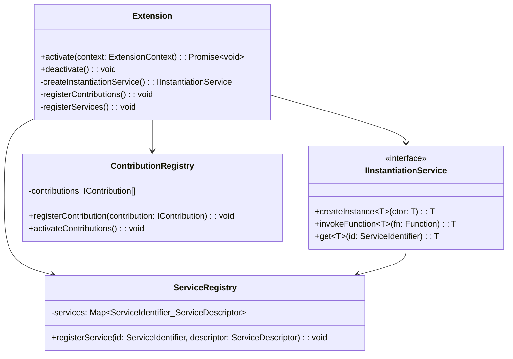
```mermaid
classDiagram
    class Extension {
        +activate(context: ExtensionContext): Promise~void~
        +deactivate(): void
        -createInstantiationService(): IInstantiationService
        -registerContributions(): void
        -registerServices(): void
    }

    class IInstantiationService {
        <<interface>>
        +createInstance~T~(ctor: T): T
        +invokeFunction~T~(fn: Function): T
        +get~T~(id: ServiceIdentifier): T
    }

    class ContributionRegistry {
        -contributions: IContribution[]
        +registerContribution(contribution: IContribution): void
        +activateContributions(): void
    }

    class ServiceRegistry {
        -services: Map~ServiceIdentifier_ServiceDescriptor~
        +registerService(id: ServiceIdentifier, descriptor: ServiceDescriptor): void
    }

    Extension --> IInstantiationService
    Extension --> ContributionRegistry
    Extension --> ServiceRegistry
    IInstantiationService --> ServiceRegistry
```

#### 3.1.2 Activation Sequence

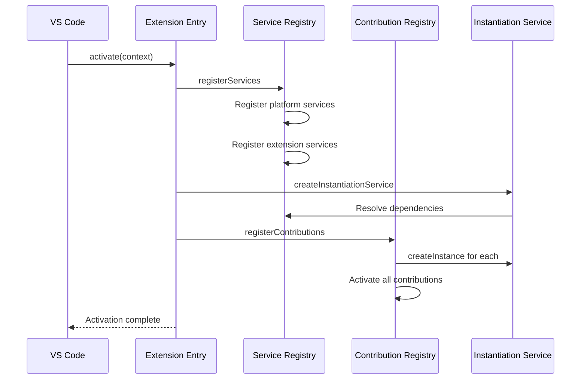
```mermaid
sequenceDiagram
    participant VSCode as VS Code
    participant Extension as Extension Entry
    participant Services as Service Registry
    participant Contributions as Contribution Registry
    participant Instantiation as Instantiation Service

    VSCode->>Extension: activate(context)
    Extension->>Services: registerServices
    Services->>Services: Register platform services
    Services->>Services: Register extension services
    Extension->>Instantiation: createInstantiationService
    Instantiation->>Services: Resolve dependencies
    Extension->>Contributions: registerContributions
    Contributions->>Instantiation: createInstance for each
    Contributions->>Contributions: Activate all contributions
    Extension-->>VSCode: Activation complete
```

#### 3.1.3 Service Registration Pattern

Services are registered in three locations based on runtime:

| File | Runtime | Services |
|------|---------|----------|
| `extension/vscode/services.ts` | All | Common services |
| `extension/vscode-node/services.ts` | Desktop | Node.js services |
| `extension/vscode-worker/services.ts` | Web | Worker services |

---

### 3.2 Chat Participant System

#### 3.2.1 Participant Architecture

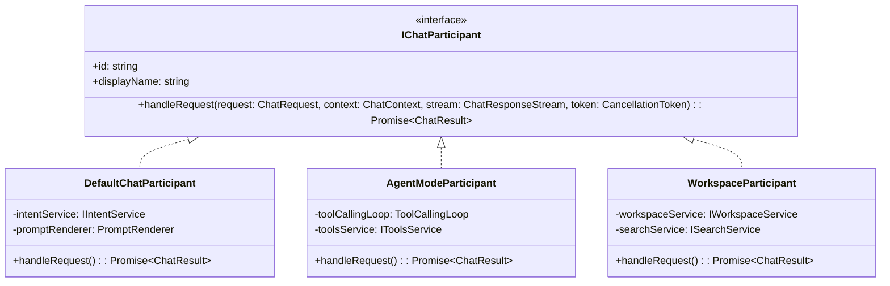
```mermaid
classDiagram
    class IChatParticipant {
        <<interface>>
        +id: string
        +displayName: string
        +handleRequest(request: ChatRequest, context: ChatContext, stream: ChatResponseStream, token: CancellationToken): Promise~ChatResult~
    }

    class DefaultChatParticipant {
        -intentService: IIntentService
        -promptRenderer: PromptRenderer
        +handleRequest(): Promise~ChatResult~
    }

    class AgentModeParticipant {
        -toolCallingLoop: ToolCallingLoop
        -toolsService: IToolsService
        +handleRequest(): Promise~ChatResult~
    }

    class WorkspaceParticipant {
        -workspaceService: IWorkspaceService
        -searchService: ISearchService
        +handleRequest(): Promise~ChatResult~
    }

    IChatParticipant <|.. DefaultChatParticipant
    IChatParticipant <|.. AgentModeParticipant
    IChatParticipant <|.. WorkspaceParticipant
```

#### 3.2.2 Request Processing Flow

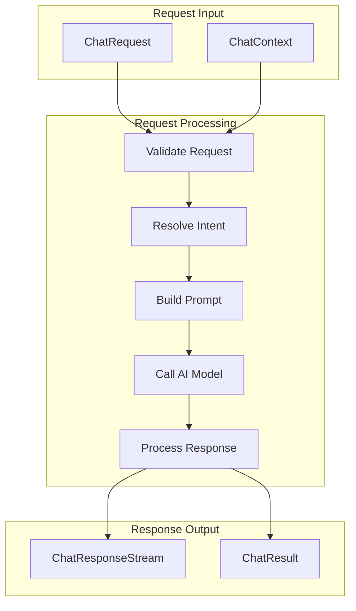
```mermaid
flowchart TB
    subgraph Input["Request Input"]
        Request["ChatRequest"]
        Context["ChatContext"]
    end

    subgraph Processing["Request Processing"]
        Validate["Validate Request"]
        ResolveIntent["Resolve Intent"]
        BuildPrompt["Build Prompt"]
        CallModel["Call AI Model"]
        ProcessResponse["Process Response"]
    end

    subgraph Output["Response Output"]
        Stream["ChatResponseStream"]
        Result["ChatResult"]
    end

    Request --> Validate
    Context --> Validate
    Validate --> ResolveIntent
    ResolveIntent --> BuildPrompt
    BuildPrompt --> CallModel
    CallModel --> ProcessResponse
    ProcessResponse --> Stream
    ProcessResponse --> Result
```

---

### 3.3 Intent System

#### 3.3.1 Intent Class Hierarchy

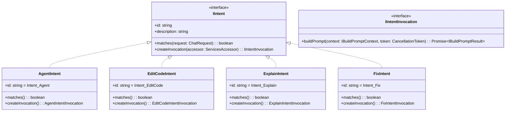
```mermaid
classDiagram
    class IIntent {
        <<interface>>
        +id: string
        +description: string
        +matches(request: ChatRequest): boolean
        +createInvocation(accessor: ServicesAccessor): IIntentInvocation
    }

    class IIntentInvocation {
        <<interface>>
        +buildPrompt(context: IBuildPromptContext, token: CancellationToken): Promise~IBuildPromptResult~
    }

    class AgentIntent {
        +id: string = Intent_Agent
        +matches(): boolean
        +createInvocation(): AgentIntentInvocation
    }

    class EditCodeIntent {
        +id: string = Intent_EditCode
        +matches(): boolean
        +createInvocation(): EditCodeIntentInvocation
    }

    class ExplainIntent {
        +id: string = Intent_Explain
        +matches(): boolean
        +createInvocation(): ExplainIntentInvocation
    }

    class FixIntent {
        +id: string = Intent_Fix
        +matches(): boolean
        +createInvocation(): FixIntentInvocation
    }

    IIntent <|.. AgentIntent
    IIntent <|.. EditCodeIntent
    IIntent <|.. ExplainIntent
    IIntent <|.. FixIntent
```

#### 3.3.2 Intent Resolution Process

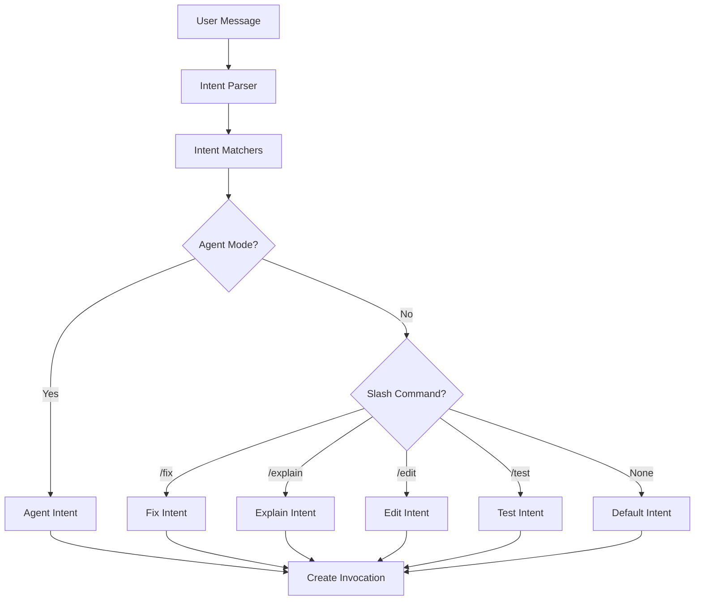
```mermaid
flowchart TB
    Input["User Message"] --> Parser["Intent Parser"]
    Parser --> Matcher["Intent Matchers"]

    Matcher --> Agent{"Agent Mode?"}
    Agent -->|Yes| AgentIntent["Agent Intent"]
    Agent -->|No| SlashCmd{"Slash Command?"}

    SlashCmd -->|/fix| FixIntent["Fix Intent"]
    SlashCmd -->|/explain| ExplainIntent["Explain Intent"]
    SlashCmd -->|/edit| EditIntent["Edit Intent"]
    SlashCmd -->|/test| TestIntent["Test Intent"]
    SlashCmd -->|None| Default["Default Intent"]

    AgentIntent --> Invocation["Create Invocation"]
    FixIntent --> Invocation
    ExplainIntent --> Invocation
    EditIntent --> Invocation
    TestIntent --> Invocation
    Default --> Invocation
```

---

### 3.4 Prompt Engine (TSX)

#### 3.4.1 Prompt-TSX Architecture

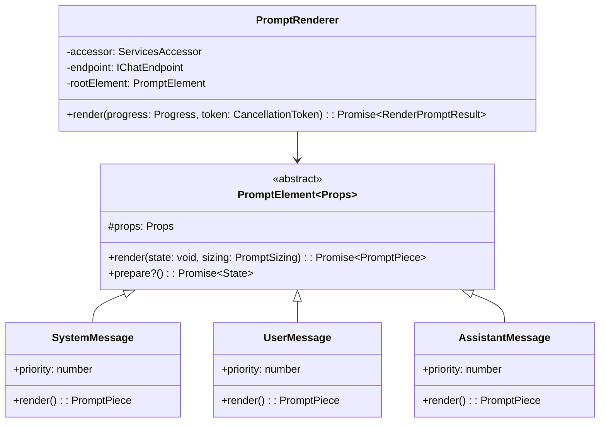
```mermaid
classDiagram
    class PromptElement~Props~ {
        <<abstract>>
        #props: Props
        +render(state: void, sizing: PromptSizing): Promise~PromptPiece~
        +prepare?(): Promise~State~
    }

    class PromptRenderer {
        -accessor: ServicesAccessor
        -endpoint: IChatEndpoint
        -rootElement: PromptElement
        +render(progress: Progress, token: CancellationToken): Promise~RenderPromptResult~
    }

    class SystemMessage {
        +priority: number
        +render(): PromptPiece
    }

    class UserMessage {
        +priority: number
        +render(): PromptPiece
    }

    class AssistantMessage {
        +priority: number
        +render(): PromptPiece
    }

    PromptElement <|-- SystemMessage
    PromptElement <|-- UserMessage
    PromptElement <|-- AssistantMessage
    PromptRenderer --> PromptElement
```

#### 3.4.2 Prompt Rendering Process

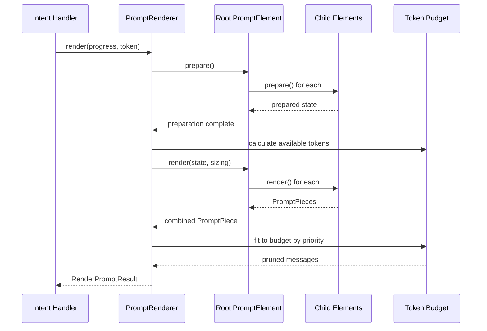
```mermaid
sequenceDiagram
    participant Caller as Intent Handler
    participant Renderer as PromptRenderer
    participant Root as Root PromptElement
    participant Children as Child Elements
    participant Budget as Token Budget

    Caller->>Renderer: render(progress, token)
    Renderer->>Root: prepare()
    Root->>Children: prepare() for each
    Children-->>Root: prepared state
    Root-->>Renderer: preparation complete

    Renderer->>Budget: calculate available tokens
    Renderer->>Root: render(state, sizing)
    Root->>Children: render() for each
    Children-->>Root: PromptPieces
    Root-->>Renderer: combined PromptPiece

    Renderer->>Budget: fit to budget by priority
    Budget-->>Renderer: pruned messages
    Renderer-->>Caller: RenderPromptResult
```

#### 3.4.3 Priority-Based Token Management

| Priority Level | Content Type | Eviction Order |
|---------------|--------------|----------------|
| 100+ | Safety Rules | Never evicted |
| 80-99 | Core Instructions | Last to evict |
| 60-79 | User Context | Medium priority |
| 40-59 | Additional Context | Earlier eviction |
| 0-39 | Optional Content | First to evict |

---

### 3.5 Tool Calling System

#### 3.5.1 Tool Architecture

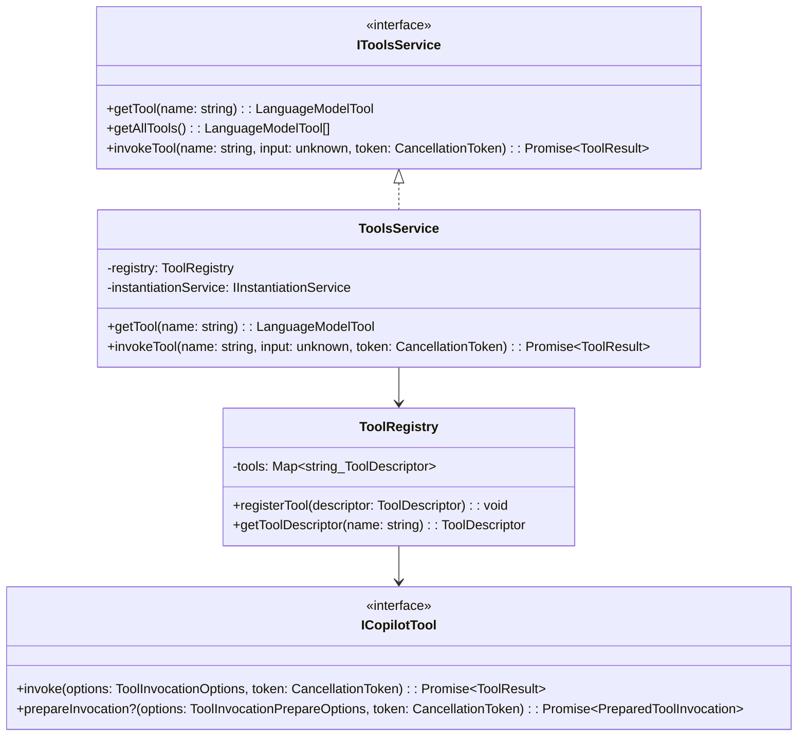
```mermaid
classDiagram
    class IToolsService {
        <<interface>>
        +getTool(name: string): LanguageModelTool
        +getAllTools(): LanguageModelTool[]
        +invokeTool(name: string, input: unknown, token: CancellationToken): Promise~ToolResult~
    }

    class ToolsService {
        -registry: ToolRegistry
        -instantiationService: IInstantiationService
        +getTool(name: string): LanguageModelTool
        +invokeTool(name: string, input: unknown, token: CancellationToken): Promise~ToolResult~
    }

    class ToolRegistry {
        -tools: Map~string_ToolDescriptor~
        +registerTool(descriptor: ToolDescriptor): void
        +getToolDescriptor(name: string): ToolDescriptor
    }

    class ICopilotTool {
        <<interface>>
        +invoke(options: ToolInvocationOptions, token: CancellationToken): Promise~ToolResult~
        +prepareInvocation?(options: ToolInvocationPrepareOptions, token: CancellationToken): Promise~PreparedToolInvocation~
    }

    IToolsService <|.. ToolsService
    ToolsService --> ToolRegistry
    ToolRegistry --> ICopilotTool
```

#### 3.5.2 Tool Categories and Examples

| Category | Tools | Purpose |
|----------|-------|---------|
| **File Operations** | read_file, create_file, replace_string_in_file | File manipulation |
| **Search** | find_files, grep_search, semantic_search | Code discovery |
| **Execution** | run_in_terminal, run_notebook_cell | Code execution |
| **Workspace** | list_dir, get_errors, get_changed_files | Workspace queries |
| **External** | fetch_webpage, github_repo | External resources |

#### 3.5.3 Tool Invocation Flow

```mermaid
sequenceDiagram
    participant Model as AI Model
    participant Loop as Tool Calling Loop
    participant Service as Tools Service
    participant Tool as Tool Implementation
    participant Confirm as Confirmation UI

    Model->>Loop: tool_call request
    Loop->>Service: prepareInvocation
    Service->>Tool: prepareInvocation
    Tool-->>Service: PreparedToolInvocation

    alt Requires Confirmation
        Service->>Confirm: show confirmation
        Confirm-->>Service: user decision
        alt User Denied
            Service-->>Loop: ToolCallCancelledError
            Loop->>Model: tool denied message
        end
    end

    Service->>Tool: invoke
    Tool-->>Service: ToolResult
    Service-->>Loop: formatted result
    Loop->>Model: tool_result message
```

---

### 3.6 Tool Calling Loop

#### 3.6.1 Loop State Machine

```mermaid
stateDiagram_v2
    [*] --> Initializing: Start Loop

    Initializing --> BuildingPrompt: Initialize Complete

    BuildingPrompt --> CallingModel: Prompt Built

    CallingModel --> ProcessingResponse: Response Received

    ProcessingResponse --> CheckingToolCalls: Parse Response

    CheckingToolCalls --> ExecutingTools: Has Tool Calls
    CheckingToolCalls --> Completing: No Tool Calls

    ExecutingTools --> BuildingPrompt: Tools Executed

    ExecutingTools --> WaitingForConfirmation: Needs Confirmation
    WaitingForConfirmation --> ExecutingTools: User Approved
    WaitingForConfirmation --> BuildingPrompt: User Denied

    Completing --> [*]: Return Result

    CallingModel --> ErrorHandling: Error
    ExecutingTools --> ErrorHandling: Error
    ErrorHandling --> BuildingPrompt: Retry
    ErrorHandling --> Completing: Max Retries
```

#### 3.6.2 Loop Configuration

| Parameter | Default | Description |
|-----------|---------|-------------|
| `toolCallLimit` | 25 | Maximum tool calls per request |
| `onHitToolCallLimit` | Stop | Behavior when limit reached |
| `streamParticipants` | [] | Response stream processors |
| `responseProcessor` | Default | Custom response handler |

---

### 3.7 Claude Agent Integration

#### 3.7.1 Claude Agent Architecture

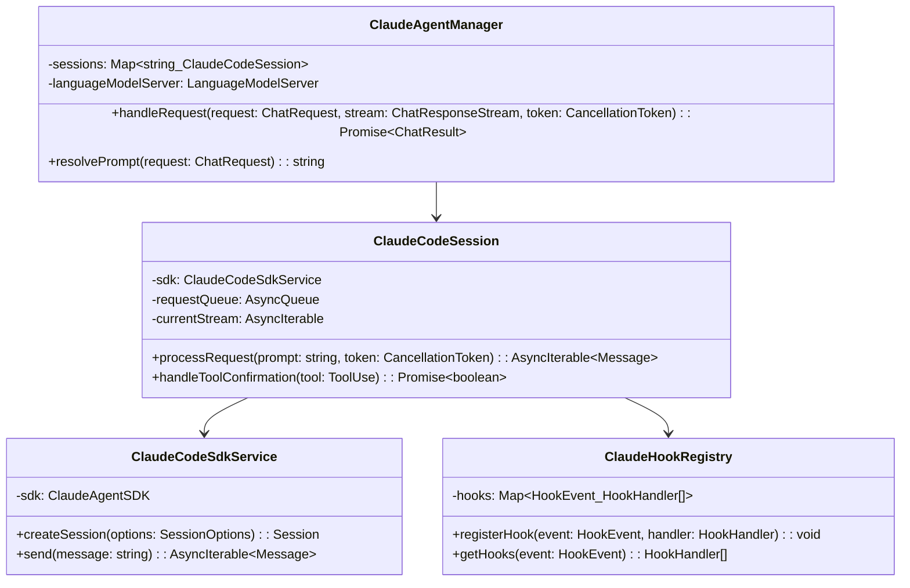
```mermaid
classDiagram
    class ClaudeAgentManager {
        -sessions: Map~string_ClaudeCodeSession~
        -languageModelServer: LanguageModelServer
        +handleRequest(request: ChatRequest, stream: ChatResponseStream, token: CancellationToken): Promise~ChatResult~
        +resolvePrompt(request: ChatRequest): string
    }

    class ClaudeCodeSession {
        -sdk: ClaudeCodeSdkService
        -requestQueue: AsyncQueue
        -currentStream: AsyncIterable
        +processRequest(prompt: string, token: CancellationToken): AsyncIterable~Message~
        +handleToolConfirmation(tool: ToolUse): Promise~boolean~
    }

    class ClaudeCodeSdkService {
        -sdk: ClaudeAgentSDK
        +createSession(options: SessionOptions): Session
        +send(message: string): AsyncIterable~Message~
    }

    class ClaudeHookRegistry {
        -hooks: Map~HookEvent_HookHandler[]~
        +registerHook(event: HookEvent, handler: HookHandler): void
        +getHooks(event: HookEvent): HookHandler[]
    }

    ClaudeAgentManager --> ClaudeCodeSession
    ClaudeCodeSession --> ClaudeCodeSdkService
    ClaudeCodeSession --> ClaudeHookRegistry
```

#### 3.7.2 Claude Tool Processing

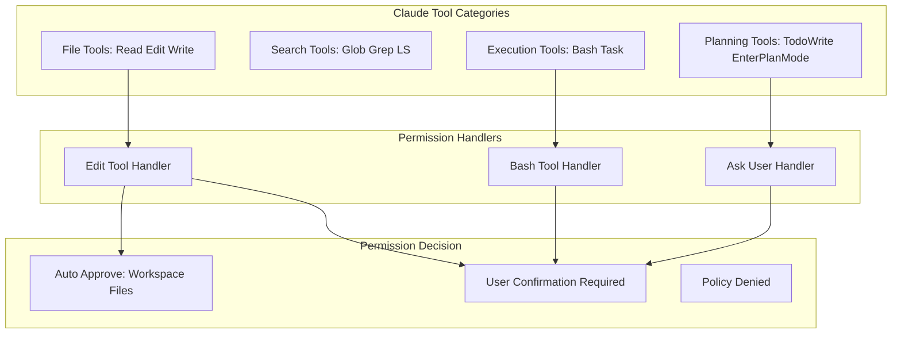
```mermaid
flowchart TB
    subgraph ClaudeTools["Claude Tool Categories"]
        FileTools["File Tools: Read Edit Write"]
        SearchTools["Search Tools: Glob Grep LS"]
        ExecTools["Execution Tools: Bash Task"]
        PlanTools["Planning Tools: TodoWrite EnterPlanMode"]
    end

    subgraph Handlers["Permission Handlers"]
        EditHandler["Edit Tool Handler"]
        BashHandler["Bash Tool Handler"]
        AskHandler["Ask User Handler"]
    end

    subgraph Decision["Permission Decision"]
        AutoApprove["Auto Approve: Workspace Files"]
        UserConfirm["User Confirmation Required"]
        AlwaysDeny["Policy Denied"]
    end

    FileTools --> EditHandler
    ExecTools --> BashHandler
    PlanTools --> AskHandler

    EditHandler --> AutoApprove
    EditHandler --> UserConfirm
    BashHandler --> UserConfirm
    AskHandler --> UserConfirm
```

---

### 3.8 MCP (Model Context Protocol) Integration

#### 3.8.1 MCP Architecture

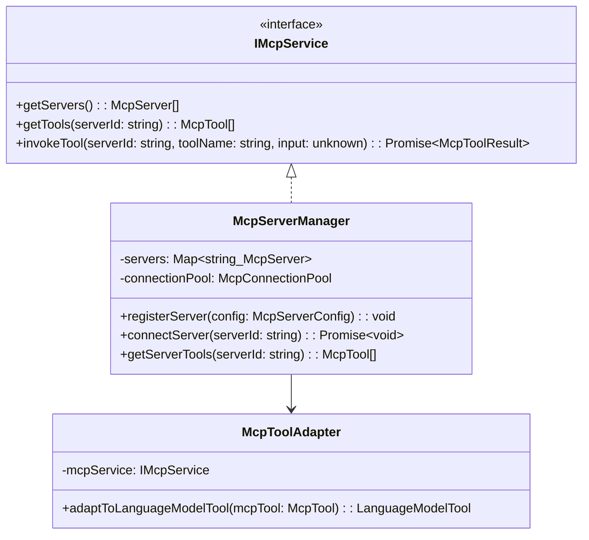
```mermaid
classDiagram
    class IMcpService {
        <<interface>>
        +getServers(): McpServer[]
        +getTools(serverId: string): McpTool[]
        +invokeTool(serverId: string, toolName: string, input: unknown): Promise~McpToolResult~
    }

    class McpServerManager {
        -servers: Map~string_McpServer~
        -connectionPool: McpConnectionPool
        +registerServer(config: McpServerConfig): void
        +connectServer(serverId: string): Promise~void~
        +getServerTools(serverId: string): McpTool[]
    }

    class McpToolAdapter {
        -mcpService: IMcpService
        +adaptToLanguageModelTool(mcpTool: McpTool): LanguageModelTool
    }

    IMcpService <|.. McpServerManager
    McpServerManager --> McpToolAdapter
```

#### 3.8.2 MCP Server Lifecycle

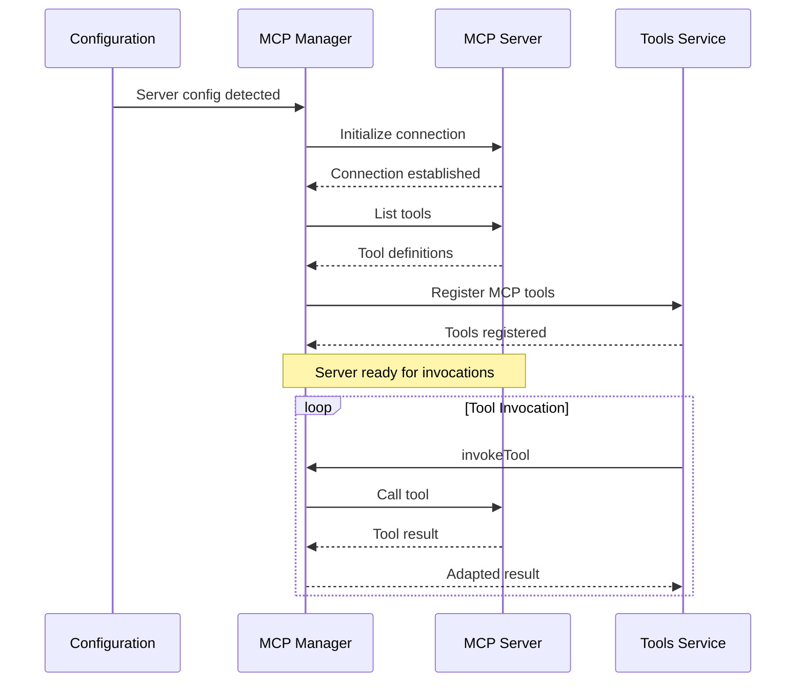
```mermaid
sequenceDiagram
    participant Config as Configuration
    participant Manager as MCP Manager
    participant Server as MCP Server
    participant Tools as Tools Service

    Config->>Manager: Server config detected
    Manager->>Server: Initialize connection
    Server-->>Manager: Connection established
    Manager->>Server: List tools
    Server-->>Manager: Tool definitions
    Manager->>Tools: Register MCP tools
    Tools-->>Manager: Tools registered

    Note over Manager,Server: Server ready for invocations

    loop Tool Invocation
        Tools->>Manager: invokeTool
        Manager->>Server: Call tool
        Server-->>Manager: Tool result
        Manager-->>Tools: Adapted result
    end
```

---

### 3.9 Context Resolution

#### 3.9.1 Context Types

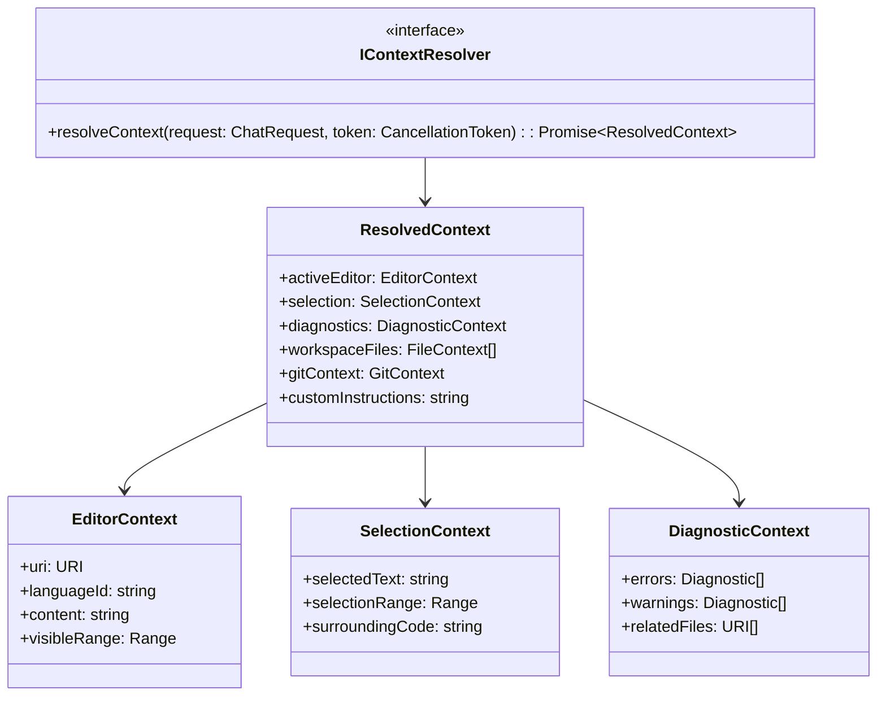
```mermaid
classDiagram
    class IContextResolver {
        <<interface>>
        +resolveContext(request: ChatRequest, token: CancellationToken): Promise~ResolvedContext~
    }

    class ResolvedContext {
        +activeEditor: EditorContext
        +selection: SelectionContext
        +diagnostics: DiagnosticContext
        +workspaceFiles: FileContext[]
        +gitContext: GitContext
        +customInstructions: string
    }

    class EditorContext {
        +uri: URI
        +languageId: string
        +content: string
        +visibleRange: Range
    }

    class SelectionContext {
        +selectedText: string
        +selectionRange: Range
        +surroundingCode: string
    }

    class DiagnosticContext {
        +errors: Diagnostic[]
        +warnings: Diagnostic[]
        +relatedFiles: URI[]
    }

    IContextResolver --> ResolvedContext
    ResolvedContext --> EditorContext
    ResolvedContext --> SelectionContext
    ResolvedContext --> DiagnosticContext
```

#### 3.9.2 Context Resolution Flow

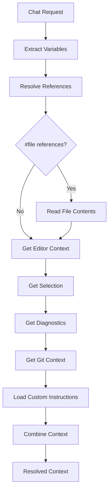
```mermaid
flowchart TB
    Request["Chat Request"] --> Variables["Extract Variables"]
    Variables --> References["Resolve References"]

    References --> FileRef{"#file references?"}
    FileRef -->|Yes| ReadFiles["Read File Contents"]
    FileRef -->|No| EditorCtx["Get Editor Context"]

    ReadFiles --> EditorCtx
    EditorCtx --> Selection["Get Selection"]
    Selection --> Diagnostics["Get Diagnostics"]
    Diagnostics --> Git["Get Git Context"]
    Git --> Instructions["Load Custom Instructions"]
    Instructions --> Combine["Combine Context"]
    Combine --> Result["Resolved Context"]
```

---

### 3.10 Telemetry Service

#### 3.10.1 Telemetry Architecture

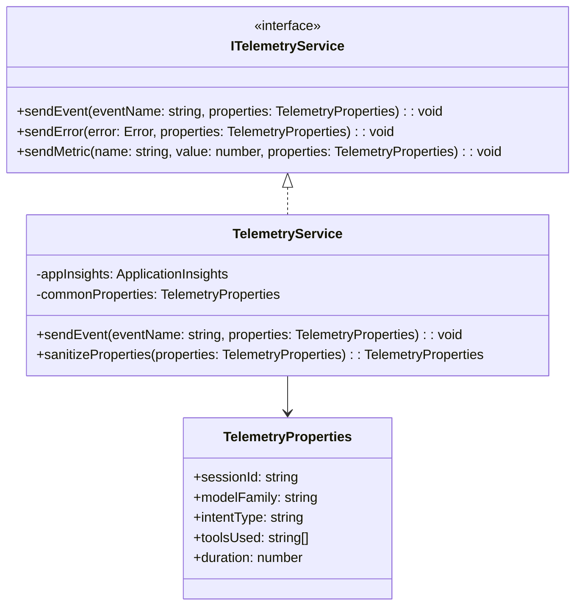
```mermaid
classDiagram
    class ITelemetryService {
        <<interface>>
        +sendEvent(eventName: string, properties: TelemetryProperties): void
        +sendError(error: Error, properties: TelemetryProperties): void
        +sendMetric(name: string, value: number, properties: TelemetryProperties): void
    }

    class TelemetryService {
        -appInsights: ApplicationInsights
        -commonProperties: TelemetryProperties
        +sendEvent(eventName: string, properties: TelemetryProperties): void
        +sanitizeProperties(properties: TelemetryProperties): TelemetryProperties
    }

    class TelemetryProperties {
        +sessionId: string
        +modelFamily: string
        +intentType: string
        +toolsUsed: string[]
        +duration: number
    }

    ITelemetryService <|.. TelemetryService
    TelemetryService --> TelemetryProperties
```

#### 3.10.2 Key Telemetry Events

| Event Category | Event Name | Data Collected |
|----------------|------------|----------------|
| **Request** | chat/request | Intent, model, duration |
| **Tool** | tool/invocation | Tool name, success, duration |
| **Error** | error/occurred | Error type, stack (sanitized) |
| **Performance** | perf/ttft | Time to first token |

---

## 4. Data Models

### 4.1 Conversation Model

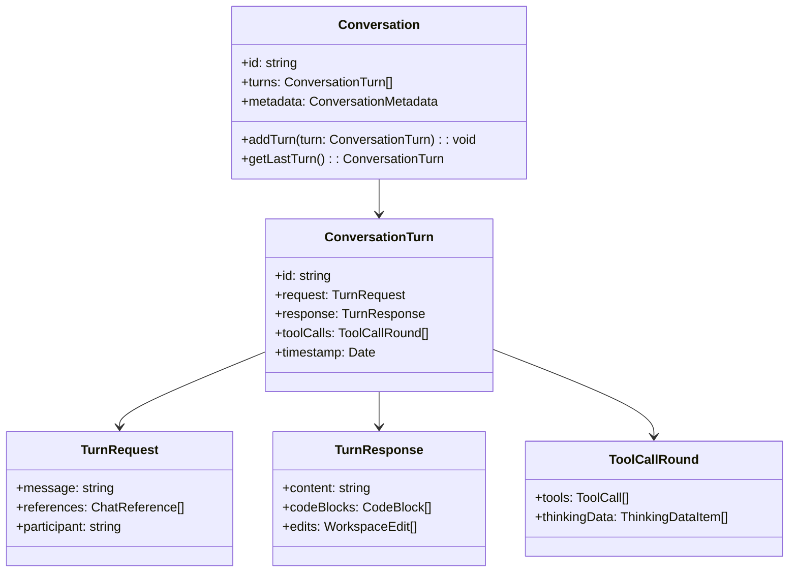
```mermaid
classDiagram
    class Conversation {
        +id: string
        +turns: ConversationTurn[]
        +metadata: ConversationMetadata
        +addTurn(turn: ConversationTurn): void
        +getLastTurn(): ConversationTurn
    }

    class ConversationTurn {
        +id: string
        +request: TurnRequest
        +response: TurnResponse
        +toolCalls: ToolCallRound[]
        +timestamp: Date
    }

    class TurnRequest {
        +message: string
        +references: ChatReference[]
        +participant: string
    }

    class TurnResponse {
        +content: string
        +codeBlocks: CodeBlock[]
        +edits: WorkspaceEdit[]
    }

    class ToolCallRound {
        +tools: ToolCall[]
        +thinkingData: ThinkingDataItem[]
    }

    Conversation --> ConversationTurn
    ConversationTurn --> TurnRequest
    ConversationTurn --> TurnResponse
    ConversationTurn --> ToolCallRound
```

### 4.2 Prompt Message Model

```mermaid
classDiagram
    class ChatMessage {
        +role: MessageRole
        +content: MessageContent
        +name: string
    }

    class MessageRole {
        <<enumeration>>
        System
        User
        Assistant
        Tool
    }

    class MessageContent {
        +type: ContentType
        +text: string
        +imageData: ImageData
        +toolCall: ToolCall
        +toolResult: ToolResult
    }

    ChatMessage --> MessageRole
    ChatMessage --> MessageContent
```

---

## 5. Error Handling Patterns

### 5.1 Error Hierarchy

```mermaid
classDiagram
    class CopilotError {
        +message: string
        +code: ErrorCode
        +cause: Error
    }

    class AuthenticationError {
        +authProvider: string
        +retryable: boolean
    }

    class ModelError {
        +modelId: string
        +statusCode: number
    }

    class ToolError {
        +toolName: string
        +toolInput: unknown
    }

    class CancellationError {
        +reason: CancellationReason
    }

    CopilotError <|-- AuthenticationError
    CopilotError <|-- ModelError
    CopilotError <|-- ToolError
    CopilotError <|-- CancellationError
```

### 5.2 Error Recovery Strategies

| Error Type | Recovery Strategy |
|------------|-------------------|
| Authentication | Prompt re-login, refresh token |
| Rate Limit | Exponential backoff, queue requests |
| Model Unavailable | Fallback to alternative model |
| Tool Failure | Report to model, allow retry |
| Network Error | Retry with backoff |

---

## 6. Performance Optimizations

### 6.1 Caching Strategy

| Cache Type | Location | TTL | Invalidation |
|------------|----------|-----|--------------|
| Token Cache | Memory | Request lifetime | End of request |
| Embedding Cache | Disk | 24 hours | File modification |
| Search Index | Memory | Session | File changes |
| Model Response | None | - | Not cached |

### 6.2 Lazy Loading Pattern

```mermaid
flowchart TB
    Activation["Extension Activation"] --> CoreServices["Load Core Services"]
    CoreServices --> Register["Register Commands_UI"]

    UserAction["User Triggers Feature"] --> CheckLoaded{"Service Loaded?"}
    CheckLoaded -->|No| LoadService["Load Service On-Demand"]
    CheckLoaded -->|Yes| Execute["Execute Feature"]
    LoadService --> Execute
```

---

## 7. Testing Strategy

### 7.1 Test Types

| Test Type | Framework | Location | Purpose |
|-----------|-----------|----------|---------|
| Unit | Vitest | `**/test/*.spec.ts` | Component isolation |
| Integration | VS Code Test | `test/extension/` | API integration |
| Simulation | Custom | `test/simulation/` | LLM behavior |

### 7.2 Mocking Strategy

```mermaid
classDiagram
    class MockInstantiationService {
        -mocks: Map~ServiceIdentifier_unknown~
        +stub~T~(id: ServiceIdentifier, mock: Partial~T~): void
        +get~T~(id: ServiceIdentifier): T
    }

    class MockToolsService {
        -registeredTools: Map~string_MockTool~
        +registerMockTool(name: string, result: ToolResult): void
    }

    class MockChatEndpoint {
        -responses: ChatResponse[]
        +queueResponse(response: ChatResponse): void
    }

    MockInstantiationService --> MockToolsService
    MockInstantiationService --> MockChatEndpoint
```

---

*Next Document: [03-C4-DIAGRAMS.md](./03-C4-DIAGRAMS.md)*
