# C4 Architecture Diagrams
## GitHub Copilot Chat Extension for VS Code

This document contains C4 model architecture diagrams at all four levels: Context, Container, Component, and Code.

---

## 1. Level 1: System Context Diagram

The System Context diagram shows GitHub Copilot Chat in relation to its users and external systems.

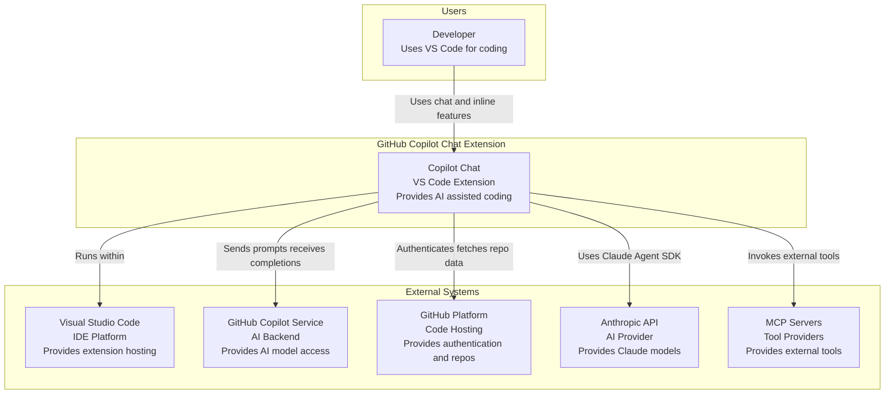

### Context Diagram Description

| Element | Type | Description |
|---------|------|-------------|
| Developer | User | Primary user who interacts with the chat interface |
| Copilot Chat | System | The VS Code extension providing AI assistance |
| VS Code | External System | The IDE that hosts the extension |
| GitHub Copilot Service | External System | Backend AI service for model inference |
| GitHub Platform | External System | Authentication and repository access |
| Anthropic API | External System | Alternative AI provider for Claude models |
| MCP Servers | External System | Model Context Protocol servers for tools |

---

## 2. Level 2: Container Diagram

The Container diagram shows the high-level components within the Copilot Chat extension.

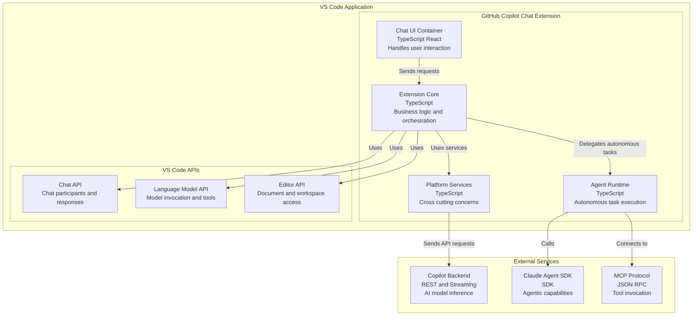

### Container Descriptions

| Container | Technology | Purpose |
|-----------|------------|---------|
| Chat UI Container | TypeScript/TSX | Renders chat interface, handles user input |
| Extension Core | TypeScript | Core business logic, intent routing, prompt building |
| Platform Services | TypeScript | Authentication, telemetry, configuration, search |
| Agent Runtime | TypeScript | Tool calling loop, autonomous task execution |
| Copilot Backend | REST/Streaming | AI model inference and response streaming |
| Claude Agent SDK | SDK | Anthropic's agentic coding assistant |
| MCP Protocol | JSON-RPC | External tool provider communication |

---

## 3. Level 3: Component Diagram

### 3.1 Extension Core Components

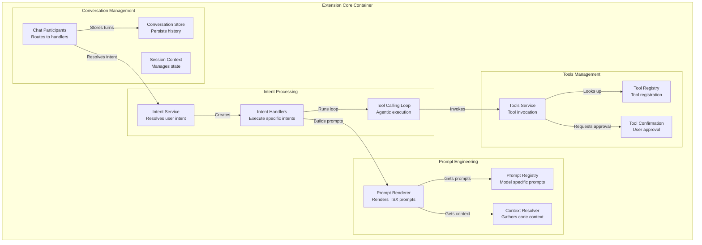

### 3.2 Platform Services Components

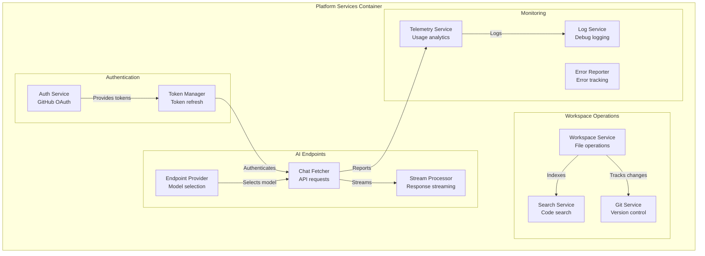

### 3.3 Agent Runtime Components

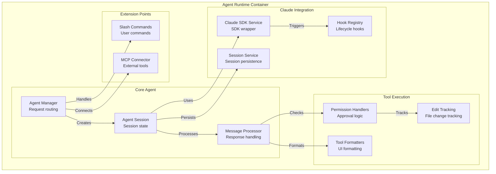

---

## 4. Level 4: Code Diagrams

### 4.1 Chat Request Processing

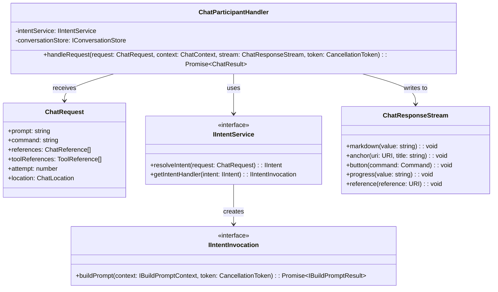

### 4.2 Prompt Rendering

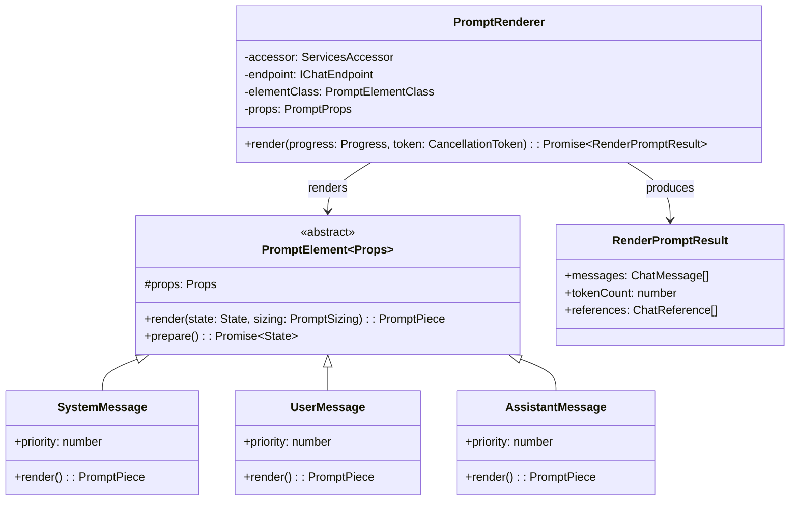

### 4.3 Tool Calling Loop

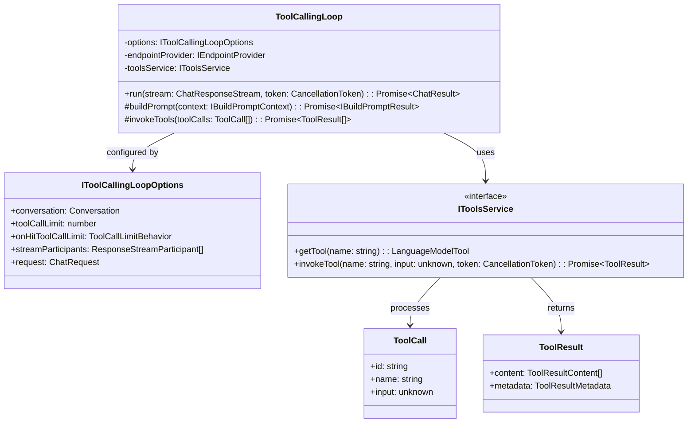

### 4.4 Claude Agent Session

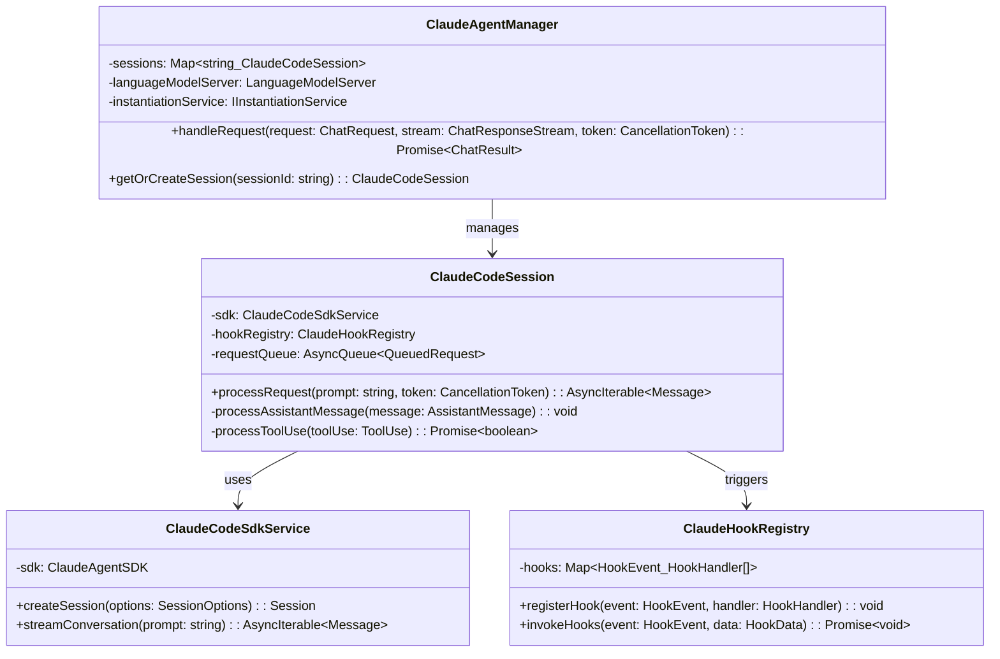

---

## 5. Data Flow Diagrams

### 5.1 Complete Request Flow

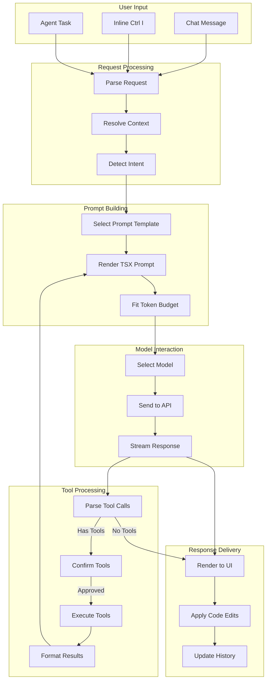

### 5.2 Authentication Flow

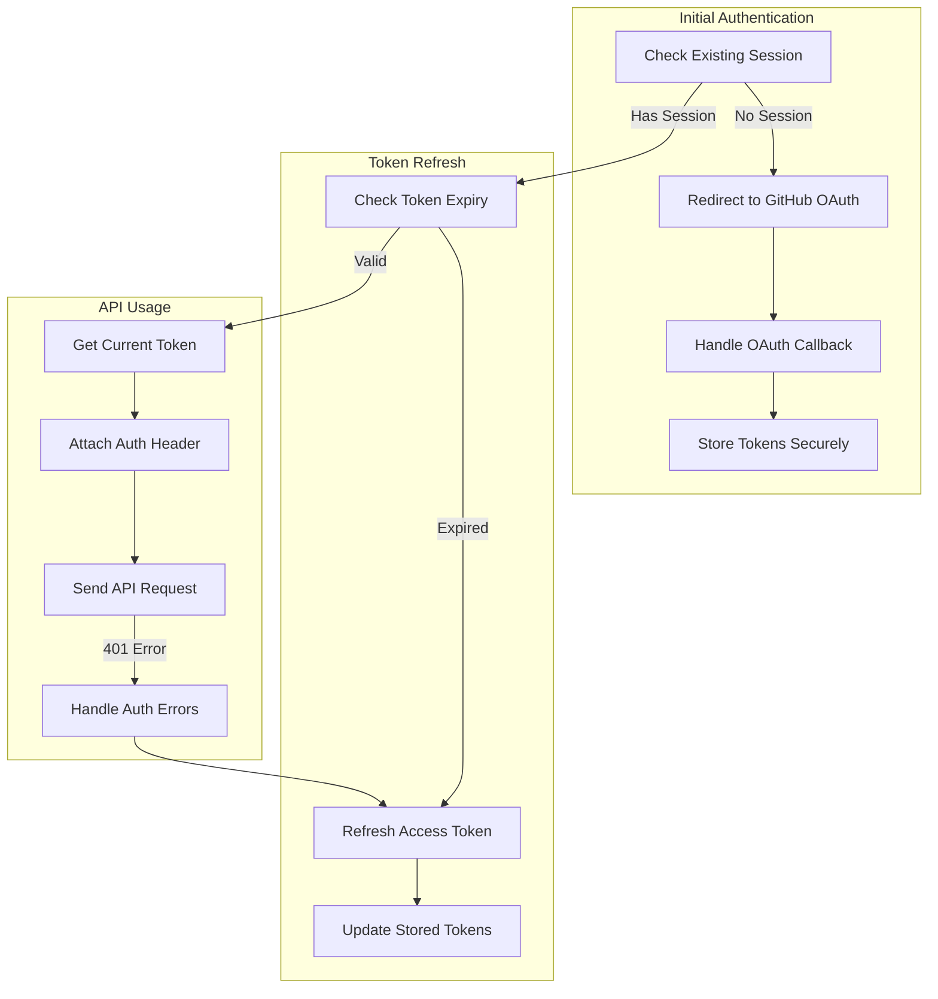

---

## 6. Deployment Architecture

### 6.1 Extension Packaging

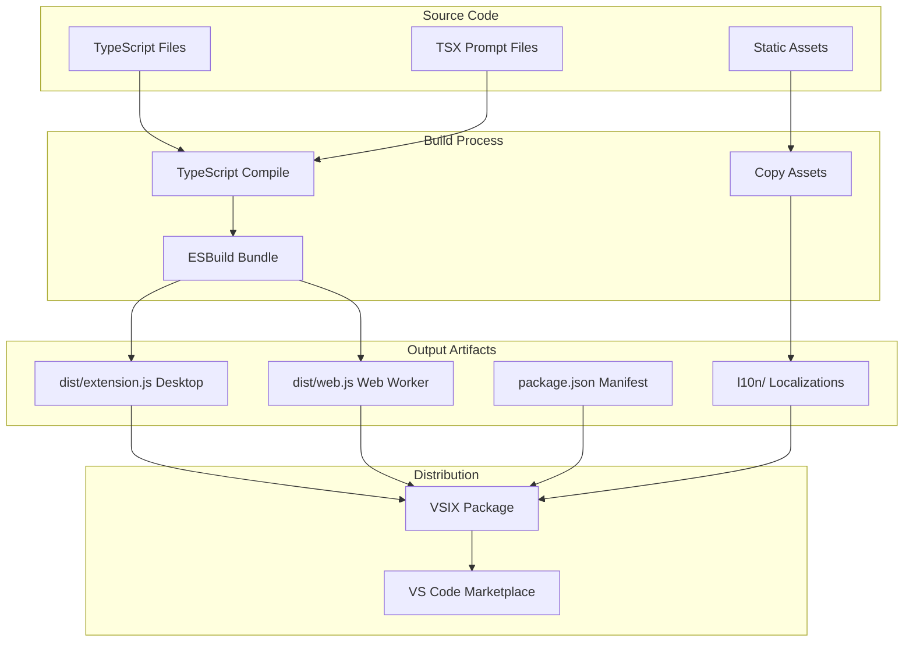

### 6.2 Runtime Environment

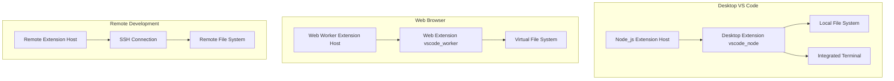

---

## 7. Integration Architecture

### 7.1 External System Integrations

```mermaid
flowchart TB
    subgraph CopilotChat["Copilot Chat Extension"]
        Core["Extension Core"]
    end

    subgraph GitHubIntegration["GitHub Integration"]
        GitHubAuth["GitHub OAuth 2.0"]
        CopilotAPI["Copilot API REST and WebSocket"]
        RepoAPI["Repository API REST"]
        PRAPI["Pull Request API REST"]
    end

    subgraph AnthropicIntegration["Anthropic Integration"]
        ClaudeAPI["Claude API REST"]
        AgentSDK["Agent SDK Library"]
    end

    subgraph MCPIntegration["MCP Integration"]
        MCPServer1["File System MCP"]
        MCPServer2["Database MCP"]
        MCPServerN["Custom MCP Servers"]
    end

    subgraph VSCodeIntegration["VS Code Integration"]
        ExtensionAPI["Extension API"]
        ChatAPI["Chat API Proposed"]
        LMAPI["Language Model API Proposed"]
        WorkspaceAPI["Workspace API"]
    end

    Core <-->|"OAuth HTTPS"| GitHubAuth
    Core <-->|"REST WebSocket"| CopilotAPI
    Core <-->|"REST"| RepoAPI
    Core <-->|"REST"| PRAPI

    Core <-->|"REST Streaming"| ClaudeAPI
    Core <-->|"Library"| AgentSDK

    Core <-->|"JSON RPC"| MCPServer1
    Core <-->|"JSON RPC"| MCPServer2
    Core <-->|"JSON RPC"| MCPServerN

    Core <-->|"API"| ExtensionAPI
    Core <-->|"API"| ChatAPI
    Core <-->|"API"| LMAPI
    Core <-->|"API"| WorkspaceAPI
```

---

## 8. Scaling Considerations

### 8.1 Request Processing Scalability

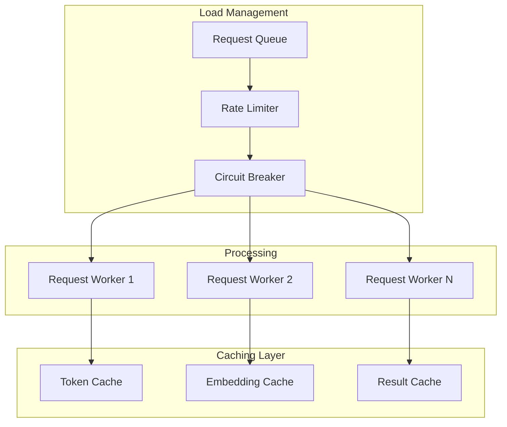

---

*Next Document: [04-ARCHITECTURE-DECISION-RECORDS.md](./04-ARCHITECTURE-DECISION-RECORDS.md)*
