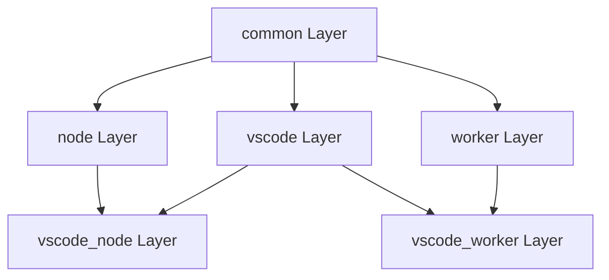

# Architecture Decision Records (ADR)
## GitHub Copilot Chat Extension for VS Code

This document captures key architectural decisions made during the development of the GitHub Copilot Chat extension, including the context, rationale, and implications of each decision.

---

## ADR Index

| ID | Title | Status | Date |
|----|-------|--------|------|
| ADR-001 | TSX-Based Prompt Composition | Accepted | 2024-01 |
| ADR-002 | Service-Oriented Architecture with DI | Accepted | 2023-06 |
| ADR-003 | Multi-Runtime Support (Node.js and Web Worker) | Accepted | 2023-09 |
| ADR-004 | Intent-Based Request Routing | Accepted | 2024-02 |
| ADR-005 | Claude Agent SDK Integration | Accepted | 2025-03 |
| ADR-006 | Tool Calling Loop Architecture | Accepted | 2024-08 |
| ADR-007 | MCP Protocol for External Tools | Accepted | 2025-01 |
| ADR-008 | Model-Specific Prompt Registry | Accepted | 2024-11 |
| ADR-009 | Contribution-Based Feature Registration | Accepted | 2023-06 |
| ADR-010 | Layer-Based Code Organization | Accepted | 2023-06 |

---

## ADR-001: TSX-Based Prompt Composition

### Status
**Accepted** - January 2024

### Context
AI prompts are complex compositions of system instructions, user context, conversation history, and tool definitions. Early implementations used string concatenation, which led to:
- Difficult-to-maintain prompt templates
- No clear priority system for token budget management
- Limited reusability of prompt components
- Hard-to-test prompt logic

### Decision
Adopt a TSX-based prompt composition framework (`@vscode/prompt-tsx`) that treats prompts as a tree of components with priorities.

### Rationale
1. **Declarative Composition**: TSX enables clear, hierarchical prompt structure
2. **Priority-Based Pruning**: Each component has a priority; when token budget is exceeded, lower-priority components are pruned
3. **Component Reusability**: Common elements (safety rules, code context) can be shared across intents
4. **Testability**: Prompt components can be unit tested in isolation
5. **Async Preparation**: Components can fetch data asynchronously before rendering

### Consequences

**Positive:**
- Clear separation of prompt concerns
- Automatic token budget management
- Improved prompt maintainability
- Reusable prompt components

**Negative:**
- Learning curve for TSX syntax
- Additional build step for TSX compilation
- Slightly more complex debugging

### Implementation Details

```
Prompt Structure:
├── SystemMessage (priority: 100)
│   ├── SafetyRules
│   ├── PersonaInstructions
│   └── ToolDefinitions
├── UserMessage (priority: 80)
│   ├── CodeContext
│   └── UserQuery
└── ConversationHistory (priority: 60)
    └── PreviousTurns
```

---

## ADR-002: Service-Oriented Architecture with Dependency Injection

### Status
**Accepted** - June 2023

### Context
The extension has many interconnected components that need to:
- Share state and functionality
- Be testable in isolation
- Support different runtime environments
- Allow for feature toggling and experimentation

### Decision
Implement a service-oriented architecture using dependency injection, modeled after VS Code's internal architecture.

### Rationale
1. **Loose Coupling**: Services depend on interfaces, not implementations
2. **Testability**: Services can be mocked for unit testing
3. **Runtime Flexibility**: Different service implementations for different runtimes
4. **Lifecycle Management**: Centralized service instantiation and disposal
5. **Consistency**: Aligns with VS Code's own architecture patterns

### Consequences

**Positive:**
- Easy to test with mock services
- Clear service boundaries and contracts
- Runtime-specific implementations possible
- Familiar pattern for VS Code developers

**Negative:**
- Boilerplate for service definitions
- Learning curve for dependency injection patterns
- Service registration order matters

### Service Definition Pattern

```
Service Definition:
1. Define interface (IMyService)
2. Create service identifier (IMyService token)
3. Implement service class (MyService)
4. Register in services.ts
5. Inject via constructor
```

---

## ADR-003: Multi-Runtime Support (Node.js and Web Worker)

### Status
**Accepted** - September 2023

### Context
VS Code supports multiple extension host environments:
- Desktop: Node.js runtime with full system access
- Web (vscode.dev): Web Worker runtime with limited APIs
- Remote: Node.js runtime on remote machines

The extension should work across all environments where possible.

### Decision
Organize code into layers that enforce runtime compatibility:
- `common`: Pure JavaScript, no runtime APIs
- `node`: Node.js specific code
- `vscode`: VS Code API only
- `vscode-node`: Combined VS Code + Node.js
- `vscode-worker`: Combined VS Code + Web Worker

### Rationale
1. **Code Sharing**: Maximize shared code between runtimes
2. **Compile-Time Safety**: Layer violations caught at build time
3. **Clear Boundaries**: Developers know what APIs are available
4. **Graceful Degradation**: Features can be unavailable in limited environments

### Consequences

**Positive:**
- Single codebase for multiple platforms
- Clear runtime boundaries
- Reduced duplication
- Web support enables vscode.dev usage

**Negative:**
- Some features unavailable on web
- Additional complexity in code organization
- Need to consider runtime availability for all code

### Layer Hierarchy



---

## ADR-004: Intent-Based Request Routing

### Status
**Accepted** - February 2024

### Context
User chat requests have varying purposes:
- Code explanation
- Bug fixing
- Code generation
- Test writing
- Workspace operations
- Autonomous task execution

Each purpose requires different:
- Prompt templates
- Context gathering
- Response processing
- Tool availability

### Decision
Implement an intent system where each user intent has a dedicated handler that controls the full request lifecycle.

### Rationale
1. **Separation of Concerns**: Each intent is self-contained
2. **Customizable Behavior**: Different prompts and tools per intent
3. **Extensibility**: New intents can be added without modifying existing code
4. **Maintainability**: Intent-specific logic is isolated

### Consequences

**Positive:**
- Clear ownership of intent-specific behavior
- Easy to add new intents
- Intent-specific optimizations possible
- Better testing isolation

**Negative:**
- Some duplication across intents
- Need to maintain intent matching logic
- Complex routing for ambiguous requests

### Intent Types

| Intent | Trigger | Purpose |
|--------|---------|---------|
| Agent | Agent mode | Autonomous multi-step tasks |
| EditCode | /edit command | Code modifications |
| Explain | /explain command | Code explanations |
| Fix | /fix command | Error fixes |
| Test | /test command | Test generation |
| Workspace | @workspace | Workspace-wide operations |

---

## ADR-005: Claude Agent SDK Integration

### Status
**Accepted** - March 2025

### Context
Anthropic's Claude models excel at agentic tasks with their Agent SDK providing:
- Built-in tool definitions for coding tasks
- Session management for long-running conversations
- Hook system for customization
- Specialized handling for code editing

### Decision
Integrate the Claude Agent SDK as an alternative agent implementation alongside the existing tool calling loop, using VS Code as the UI layer while Claude provides the intelligence.

### Rationale
1. **Specialized Agentic Capabilities**: Claude SDK optimized for coding tasks
2. **Maintained Tool Definitions**: Anthropic maintains the tool schemas
3. **Session Persistence**: Built-in session management
4. **Extensibility**: Hook and slash command registries for customization

### Consequences

**Positive:**
- Access to Claude's advanced agentic features
- Reduced tool definition maintenance
- Professional session management
- Future improvements from Anthropic

**Negative:**
- Additional dependency on external SDK
- Need to adapt VS Code UI to Claude message format
- Potential API breaking changes
- Two parallel agent implementations to maintain

### Integration Architecture

```
VS Code UI → Claude Agent Manager → Claude Code Session → Claude SDK
                     ↓
            Tool Permission Handlers
                     ↓
            VS Code Workspace Operations
```

---

## ADR-006: Tool Calling Loop Architecture

### Status
**Accepted** - August 2024

### Context
Agent mode requires iterative execution:
1. Send prompt to model
2. Model requests tool calls
3. Execute tools
4. Send results back to model
5. Repeat until task complete or limit reached

This loop needs to handle:
- Multiple concurrent tool calls
- User confirmation for dangerous operations
- Error recovery
- Progress reporting
- Cancellation

### Decision
Implement a `ToolCallingLoop` class that manages the iterative conversation with tool execution, with configurable limits and confirmation policies.

### Rationale
1. **Encapsulation**: All loop logic in one place
2. **Configurability**: Limits and behaviors are configurable
3. **Safety**: Built-in confirmation for dangerous tools
4. **Observability**: Progress events for UI updates

### Consequences

**Positive:**
- Clean separation of loop logic from intent handling
- Consistent tool execution across intents
- Built-in safety limits
- Testable in isolation

**Negative:**
- Complex state management
- Need to handle many edge cases
- Potential for infinite loops without proper limits

### Loop Configuration

| Parameter | Default | Purpose |
|-----------|---------|---------|
| toolCallLimit | 25 | Maximum tool invocations |
| onHitToolCallLimit | Stop | Behavior when limit hit |
| streamParticipants | [] | Response processors |
| responseProcessor | Default | Custom response handling |

---

## ADR-007: MCP Protocol for External Tools

### Status
**Accepted** - January 2025

### Context
The extension's built-in tools cover VS Code operations, but users need:
- Database access tools
- Cloud service tools
- Custom enterprise tools
- Third-party integrations

### Decision
Support the Model Context Protocol (MCP) as a standard for external tool providers, allowing MCP servers to contribute tools to the agent.

### Rationale
1. **Standard Protocol**: Industry-standard for AI tool communication
2. **Extensibility**: Any MCP server can contribute tools
3. **Isolation**: External tools run in separate processes
4. **Community**: Growing ecosystem of MCP servers

### Consequences

**Positive:**
- Extensible tool ecosystem
- Standard protocol for integrations
- Process isolation for security
- Community-contributed tools

**Negative:**
- Additional complexity in tool resolution
- Network/IPC overhead for tool calls
- Need to manage MCP server lifecycle
- Potential security concerns with external tools

### MCP Integration Flow

```
1. User configures MCP servers in settings
2. Extension connects to MCP servers on startup
3. MCP tools registered with tool service
4. Agent sees MCP tools alongside built-in tools
5. Tool calls routed to appropriate MCP server
6. Results formatted and returned to agent
```

---

## ADR-008: Model-Specific Prompt Registry

### Status
**Accepted** - November 2024

### Context
Different AI models have different:
- Instruction following capabilities
- Token limits and counting
- Tool calling formats
- Response styles

A single prompt template doesn't work optimally for all models.

### Decision
Implement a prompt registry that maps model families to optimized prompt implementations, with inheritance for shared behavior.

### Rationale
1. **Optimization**: Each model gets prompts tuned for its strengths
2. **Flexibility**: New model support without changing core code
3. **Inheritance**: Shared base prompts with model-specific overrides
4. **Experimentation**: Easy A/B testing of prompt variants

### Consequences

**Positive:**
- Better responses from each model
- Easy to add new model support
- Experimentation-friendly architecture
- Clear model-specific customization points

**Negative:**
- More prompts to maintain
- Need to test across all models
- Potential drift between implementations
- Complex resolution logic

### Registry Structure

```
Prompt Registry
├── Default Prompt (fallback)
├── OpenAI Prompts
│   ├── GPT-4 Prompt
│   └── GPT-5 Prompt
├── Anthropic Prompts
│   ├── Claude 3 Prompt
│   └── Claude 4 Prompt
├── Google Prompts
│   └── Gemini Prompt
└── xAI Prompts
    └── Grok Prompt
```

---

## ADR-009: Contribution-Based Feature Registration

### Status
**Accepted** - June 2023

### Context
The extension has many features that need to:
- Register with VS Code (commands, views, providers)
- Initialize on activation
- Clean up on deactivation
- Be conditionally enabled/disabled

### Decision
Use a contribution system where features register themselves via a central registry, similar to VS Code's internal contribution system.

### Rationale
1. **Modularity**: Features are self-contained modules
2. **Lazy Loading**: Contributions can be loaded on demand
3. **Discoverability**: Central registry shows all features
4. **Lifecycle Management**: Automatic disposal on deactivation

### Consequences

**Positive:**
- Clean feature isolation
- Automatic lifecycle management
- Easy to add/remove features
- Conditional feature loading

**Negative:**
- Boilerplate for contribution definition
- Hidden registration order dependencies
- Debugging contribution loading issues

### Contribution Types

| Type | Purpose | Example |
|------|---------|---------|
| Command | Register VS Code commands | Chat commands |
| Provider | Register VS Code providers | Completion providers |
| Service | Register internal services | Authentication |
| UI | Register UI elements | Status bar items |

---

## ADR-010: Layer-Based Code Organization

### Status
**Accepted** - June 2023

### Context
Code organization needs to:
- Enforce module dependencies
- Support different runtimes
- Enable code sharing
- Provide clear boundaries

### Decision
Organize code into three main folders with clear dependency rules:
- `src/util`: Foundation utilities (no extension/platform imports)
- `src/platform`: Platform services (can import util)
- `src/extension`: Feature implementations (can import util and platform)

### Rationale
1. **Clear Dependencies**: Folder structure enforces import rules
2. **Layered Architecture**: Lower layers don't know about higher layers
3. **Testability**: Utils and platform can be tested without extension
4. **Reusability**: Platform services could be reused in other extensions

### Consequences

**Positive:**
- Clear code organization
- Prevented circular dependencies
- Improved testability
- Better code reuse

**Negative:**
- Some artificial boundaries
- Need to move code when dependencies change
- Learning curve for new developers

### Dependency Rules

```
src/extension → src/platform → src/util
     ↓               ↓            ↓
   (can)           (can)       (cannot)
     ↓               ↓            ↓
  import         import       import
     ↓               ↓            ↓
 platform, util    util        nothing
```

---

## ADR Template

For future architectural decisions, use this template:

```markdown
## ADR-XXX: [Title]

### Status
[Proposed | Accepted | Deprecated | Superseded]

### Context
[What is the issue we're addressing?]

### Decision
[What did we decide to do?]

### Rationale
[Why did we make this decision?]

### Consequences
**Positive:**
- [Benefit 1]
- [Benefit 2]

**Negative:**
- [Drawback 1]
- [Drawback 2]
```

---

*Next Document: [05-FUNCTIONAL-SPECIFICATION.md](./05-FUNCTIONAL-SPECIFICATION.md)*
