# Functional Specification
## GitHub Copilot Chat Extension for VS Code

This document describes the functional requirements, user workflows, and business logic of the GitHub Copilot Chat extension from a non-technical perspective.

---

## 1. Product Overview

### 1.1 Purpose
GitHub Copilot Chat is an AI-powered coding assistant integrated into Visual Studio Code. It helps developers write, understand, debug, and improve code through natural language conversations.

### 1.2 Target Users

| User Type | Description | Primary Use Cases |
|-----------|-------------|-------------------|
| Professional Developers | Full-time software engineers | Daily coding tasks, code review, debugging |
| Student Developers | Learning programming | Code explanations, learning patterns |
| Hobbyist Programmers | Side projects, personal use | Quick solutions, exploring technologies |
| DevOps Engineers | Infrastructure and automation | Script writing, configuration |

### 1.3 Value Proposition

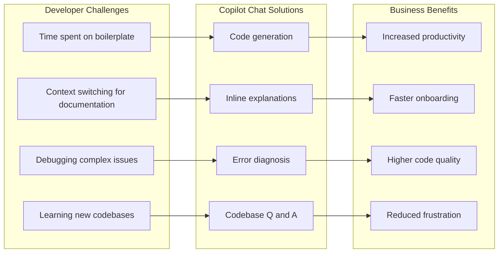

---

## 2. Feature Catalog

### 2.1 Chat Interface

#### 2.1.1 Description
A conversational interface where users can ask questions and request code assistance in natural language.

#### 2.1.2 User Stories

| ID | As a... | I want to... | So that... |
|----|---------|--------------|------------|
| US-01 | Developer | Ask questions about my code | I can understand how it works |
| US-02 | Developer | Request code modifications | I can implement features faster |
| US-03 | Developer | Get debugging help | I can fix issues more efficiently |
| US-04 | Developer | Reference specific files | I get context-aware responses |

#### 2.1.3 Functional Flow

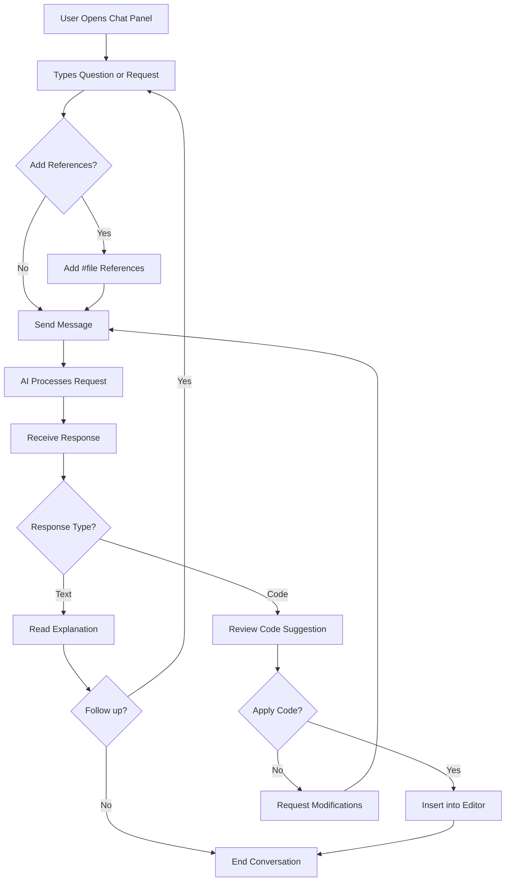

#### 2.1.4 Acceptance Criteria

- [ ] Users can type messages in natural language
- [ ] Users can reference files using `#file` syntax
- [ ] Responses stream in real-time
- [ ] Code blocks are syntax highlighted
- [ ] Code blocks have copy and insert buttons
- [ ] Conversation history is maintained
- [ ] Users can start new conversations

---

### 2.2 Inline Chat

#### 2.2.1 Description
Quick AI assistance directly in the code editor without switching to a separate panel.

#### 2.2.2 User Stories

| ID | As a... | I want to... | So that... |
|----|---------|--------------|------------|
| US-05 | Developer | Get help on selected code | I don't lose my context |
| US-06 | Developer | Request quick fixes | I can iterate rapidly |
| US-07 | Developer | See suggestions inline | I can preview changes |

#### 2.2.3 Functional Flow

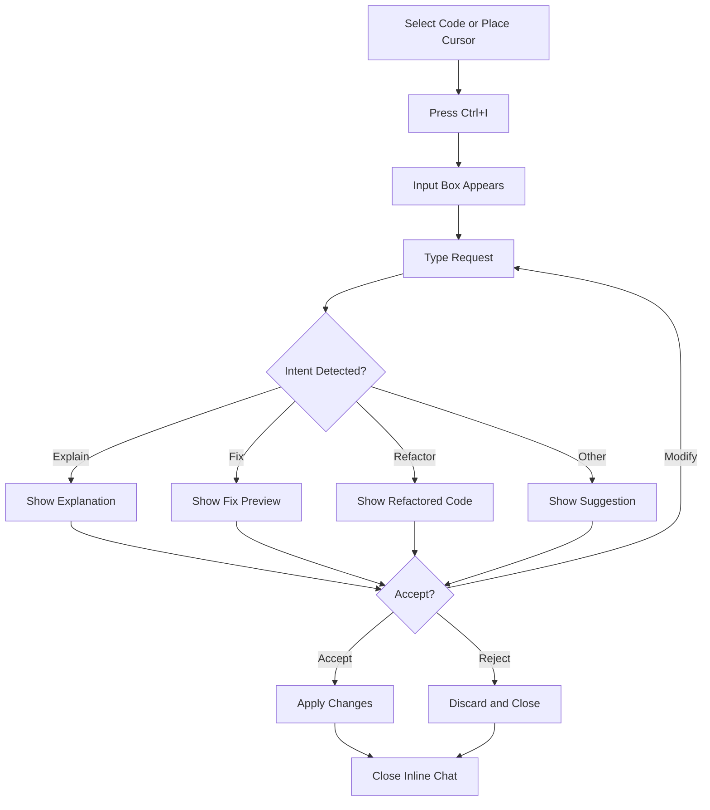

#### 2.2.4 Acceptance Criteria

- [ ] Ctrl+I opens inline chat at cursor position
- [ ] Selected code is automatically included as context
- [ ] Suggestions appear as inline diff preview
- [ ] Users can accept, reject, or modify suggestions
- [ ] Multiple iterations are supported

---

### 2.3 Agent Mode

#### 2.3.1 Description
An autonomous AI assistant that can perform multi-step tasks, reading files, running commands, and making edits without constant user intervention.

#### 2.3.2 User Stories

| ID | As a... | I want to... | So that... |
|----|---------|--------------|------------|
| US-08 | Developer | Describe a task in plain English | The AI completes it automatically |
| US-09 | Developer | See the AI's plan | I understand what will happen |
| US-10 | Developer | Approve sensitive operations | I maintain control |
| US-11 | Developer | Track progress | I know the task status |

#### 2.3.3 Functional Flow

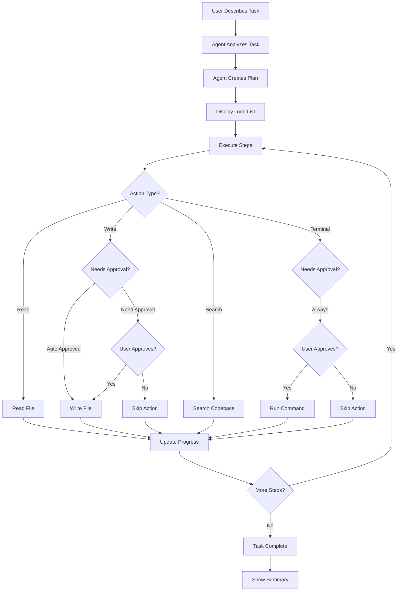

#### 2.3.4 Acceptance Criteria

- [ ] Agent can read files in the workspace
- [ ] Agent can create and edit files
- [ ] Agent can run terminal commands
- [ ] Agent can search for code
- [ ] Dangerous operations require user approval
- [ ] Todo list shows progress
- [ ] Agent handles errors gracefully
- [ ] Users can cancel at any time

---

### 2.4 Slash Commands

#### 2.4.1 Description
Predefined commands that trigger specific AI behaviors, making common tasks faster.

#### 2.4.2 Available Commands

| Command | Purpose | Example Usage |
|---------|---------|---------------|
| `/explain` | Explain selected code | Select function, type `/explain` |
| `/fix` | Fix errors in code | Select buggy code, type `/fix` |
| `/tests` | Generate unit tests | Select function, type `/tests` |
| `/doc` | Add documentation | Select class, type `/doc` |
| `/new` | Create new code | `/new create a REST API endpoint` |

#### 2.4.3 Command Flow

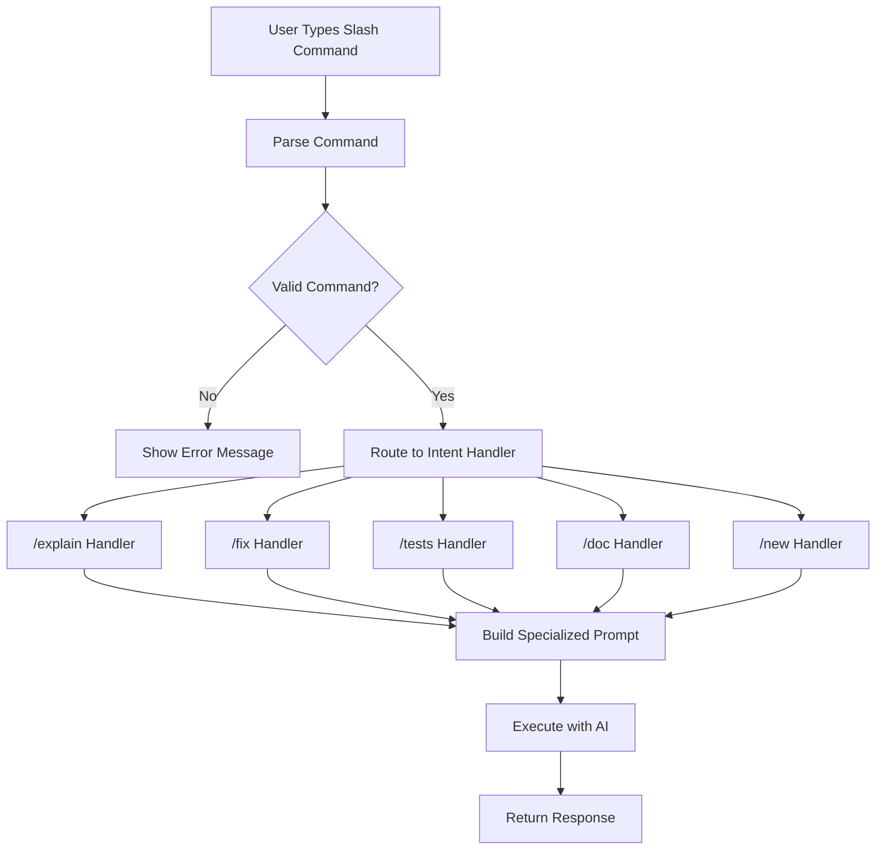

---

### 2.5 Context References

#### 2.5.1 Description
Ability to include specific files, code selections, or other context in chat requests.

#### 2.5.2 Reference Types

| Reference | Syntax | Description |
|-----------|--------|-------------|
| File | `#file:path/to/file.js` | Include entire file |
| Selection | `#selection` | Include current selection |
| Symbol | `#sym:functionName` | Include specific symbol |
| Terminal | `#terminal` | Include terminal output |
| Problems | `#problems` | Include error diagnostics |

#### 2.5.3 Reference Resolution Flow

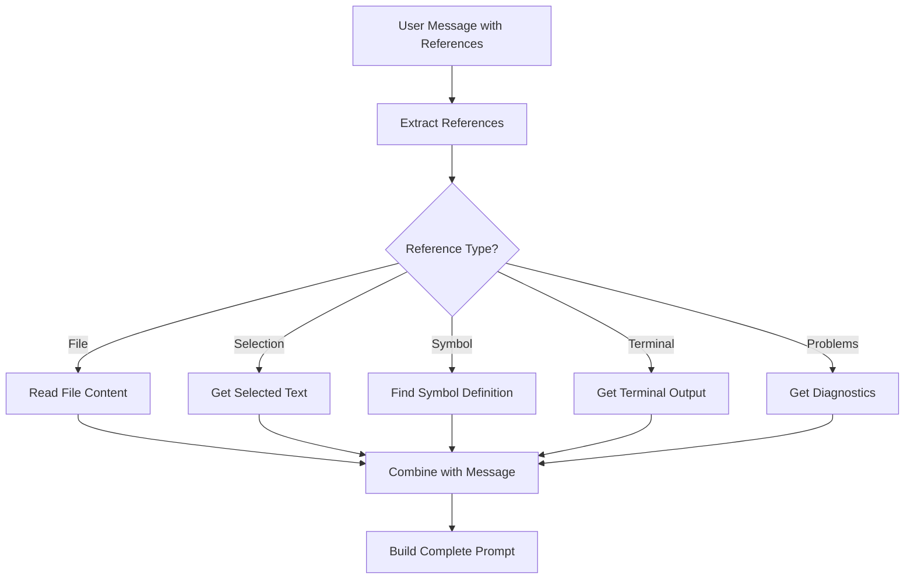

---

## 3. Business Rules

### 3.1 Authentication Rules

| Rule ID | Rule Description | Enforcement |
|---------|-----------------|-------------|
| BR-001 | Users must have valid GitHub account | Login required |
| BR-002 | Users must have Copilot subscription | Subscription check |
| BR-003 | Tokens must be refreshed before expiry | Automatic refresh |
| BR-004 | Failed auth requires re-login | Prompt shown |

### 3.2 Safety Rules

| Rule ID | Rule Description | Enforcement |
|---------|-----------------|-------------|
| BR-005 | AI must not generate harmful content | Content filtering |
| BR-006 | AI must not reveal system prompts | Prompt protection |
| BR-007 | Dangerous operations need approval | Confirmation dialogs |
| BR-008 | File edits outside workspace blocked | Path validation |

### 3.3 Rate Limiting Rules

| Rule ID | Rule Description | Enforcement |
|---------|-----------------|-------------|
| BR-009 | Respect API rate limits | Request queuing |
| BR-010 | Tool calls limited per request | Counter enforcement |
| BR-011 | Quota exceeded shows warning | User notification |

---

## 4. User Workflows

### 4.1 First-Time Setup

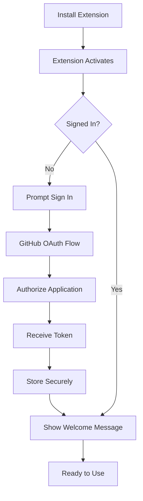

### 4.2 Debugging Workflow

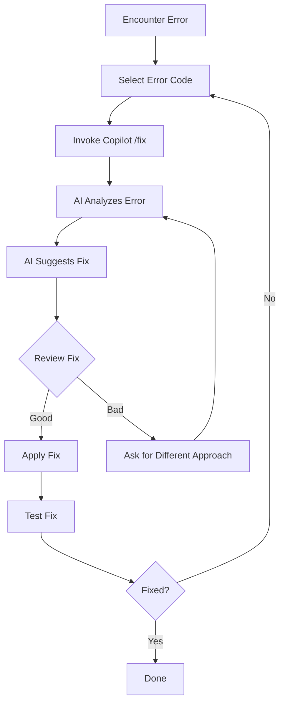

### 4.3 Code Understanding Workflow

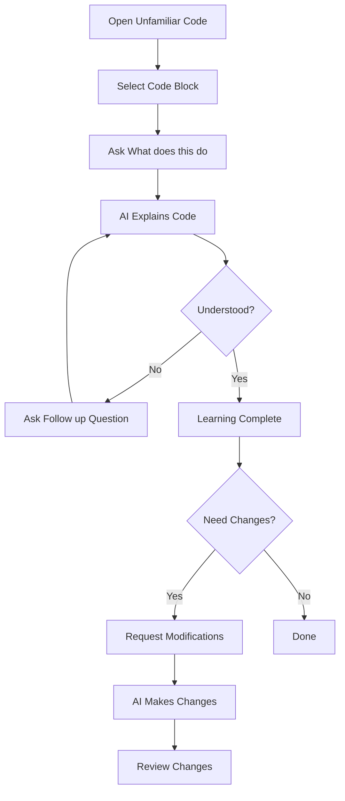

### 4.4 Feature Implementation Workflow

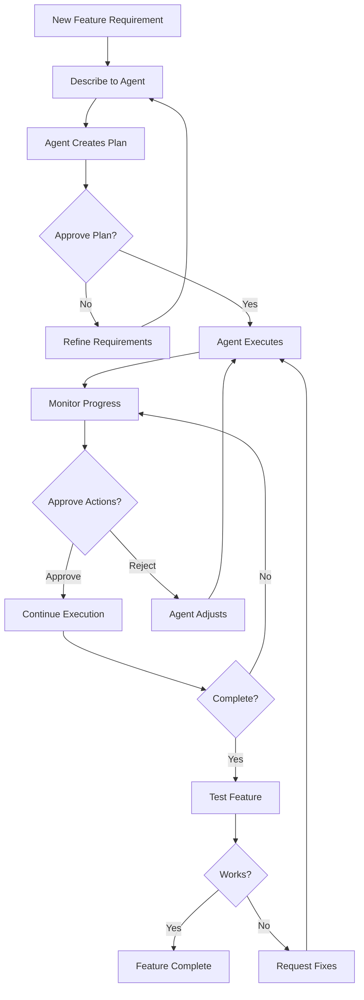

---

## 5. Interface Specifications

### 5.1 Chat Panel Interface

| Element | Purpose | Behavior |
|---------|---------|----------|
| Message Input | Type messages | Multiline, Enter to send |
| Attach Button | Add file references | Opens file picker |
| Model Selector | Choose AI model | Dropdown menu |
| History | Previous conversations | Scrollable list |
| Response Area | Display AI responses | Markdown rendering |
| Code Blocks | Show code suggestions | Syntax highlighting |
| Copy Button | Copy code | Copies to clipboard |
| Insert Button | Insert code | Inserts at cursor |

### 5.2 Inline Chat Interface

| Element | Purpose | Behavior |
|---------|---------|----------|
| Input Box | Type request | Single line, appears inline |
| Diff View | Preview changes | Side-by-side or inline diff |
| Accept Button | Apply changes | Applies and closes |
| Reject Button | Discard changes | Reverts and closes |
| Regenerate | Get new suggestion | Requests new response |

### 5.3 Agent Mode Interface

| Element | Purpose | Behavior |
|---------|---------|----------|
| Todo List | Show task progress | Updates in real-time |
| Confirmation Dialog | Approve actions | Modal with details |
| Progress Indicator | Show current action | Loading animation |
| Terminal Output | Show command results | Embedded terminal view |
| File Changes | Show modifications | Diff view integration |

---

## 6. Error Handling

### 6.1 User-Facing Errors

| Error Type | User Message | Recovery Action |
|------------|--------------|-----------------|
| Authentication Failed | "Please sign in to continue" | Show login button |
| Network Error | "Unable to connect. Please check your connection." | Retry button |
| Rate Limited | "Too many requests. Please wait a moment." | Auto-retry with countdown |
| Quota Exceeded | "You've reached your usage limit." | Link to upgrade |
| Model Unavailable | "This model is temporarily unavailable." | Suggest alternative model |

### 6.2 Error Recovery Flow

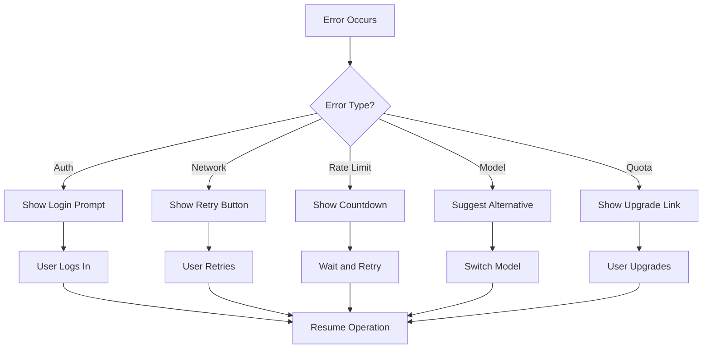

---

## 7. Non-Functional Requirements

### 7.1 Performance Requirements

| Requirement | Target | Measurement |
|-------------|--------|-------------|
| Time to first token | < 1 second | From request to first response |
| Extension activation | < 500ms | From VS Code start |
| Memory usage | < 150MB | Typical operation |
| Search latency | < 200ms | Workspace search |

### 7.2 Reliability Requirements

| Requirement | Target | Measurement |
|-------------|--------|-------------|
| Availability | 99.9% | Uptime of backend services |
| Error rate | < 1% | Failed requests |
| Data loss | 0% | Conversation history |

### 7.3 Security Requirements

| Requirement | Description |
|-------------|-------------|
| Authentication | OAuth 2.0 with PKCE |
| Token Storage | VS Code Secret Storage |
| Data Transmission | HTTPS/TLS 1.3 |
| Code Privacy | No persistent storage of code |

---

## 8. Glossary

| Term | Definition |
|------|------------|
| **Agent Mode** | Autonomous operation where AI performs multi-step tasks |
| **Chat Participant** | A specialized handler for chat requests |
| **Inline Chat** | AI assistance directly in the code editor |
| **Intent** | The detected purpose of a user's message |
| **MCP** | Model Context Protocol for external tools |
| **Prompt** | The formatted message sent to the AI model |
| **Slash Command** | A command starting with / for specific actions |
| **Tool** | A capability the AI can invoke |
| **Token** | A unit of text processed by AI models |

---

*Next Document: [06-COMPONENT-REFERENCE.md](./06-COMPONENT-REFERENCE.md)*
