# Component Reference
## GitHub Copilot Chat Extension for VS Code

This document provides detailed documentation for each major component in the extension, including responsibilities, dependencies, interfaces, and usage patterns.

---

## 1. Extension Core Components

### 1.1 Extension Entry Point

**Location:** `src/extension/extension/vscode/extension.ts`

#### Purpose
The main entry point for the VS Code extension, responsible for:
- Checking VS Code version compatibility
- Initializing the dependency injection container
- Registering all services and contributions
- Managing extension lifecycle

#### Dependencies

| Dependency | Type | Purpose |
|------------|------|---------|
| VS Code Extension API | External | Extension lifecycle |
| IInstantiationService | Internal | Dependency injection |
| ContributionRegistry | Internal | Feature registration |
| ServiceRegistry | Internal | Service registration |

#### Lifecycle Flow

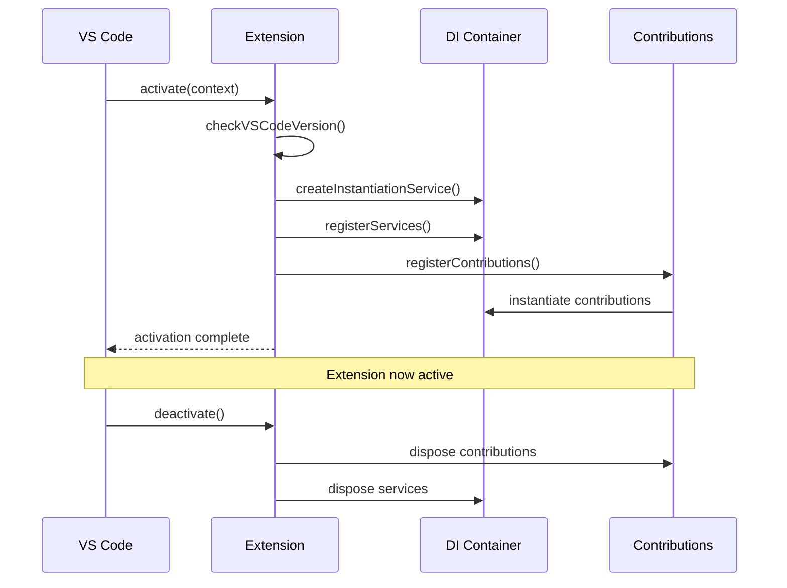

---

### 1.2 Chat Participants

**Location:** `src/extension/conversation/vscode-node/chatParticipants.ts`

#### Purpose
Registers and manages chat participants with VS Code's Chat API:
- Default chat participant for general conversations
- Agent mode participant for autonomous tasks
- Workspace participant for workspace-wide queries
- Setup participant for first-time configuration

#### Participant Types

| Participant | ID | Description |
|-------------|-----|-------------|
| Default | `copilot` | General coding assistance |
| Agent | `copilot-agent` | Multi-step autonomous tasks |
| Workspace | `copilot-workspace` | Workspace-wide operations |
| Setup | `copilot-setup` | Initial configuration |

#### Request Handling Flow

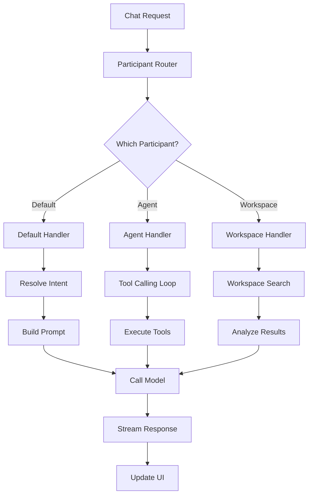

#### Key Interface

```typescript
interface IChatParticipantHandler {
    id: string;
    displayName: string;
    handleRequest(
        request: ChatRequest,
        context: ChatContext,
        stream: ChatResponseStream,
        token: CancellationToken
    ): Promise<ChatResult>;
}
```

---

### 1.3 Intent Service

**Location:** `src/extension/intents/node/intentService.ts`

#### Purpose
Detects and routes user intents to appropriate handlers:
- Parses slash commands
- Analyzes message content
- Matches to registered intents
- Creates intent invocations

#### Registered Intents

| Intent | Trigger | Handler |
|--------|---------|---------|
| Agent | Agent mode context | `AgentIntentInvocation` |
| EditCode | `/edit` command | `EditCodeIntentInvocation` |
| Explain | `/explain` command | `ExplainIntentInvocation` |
| Fix | `/fix` command | `FixIntentInvocation` |
| Test | `/tests` command | `TestIntentInvocation` |
| Doc | `/doc` command | `DocIntentInvocation` |
| New | `/new` command | `NewIntentInvocation` |
| Search | `/search` command | `SearchIntentInvocation` |

#### Intent Resolution

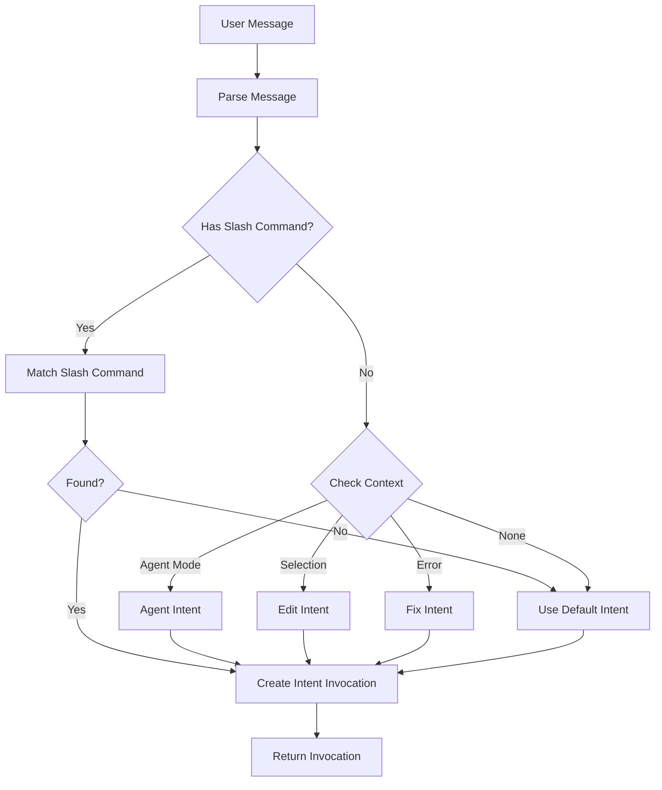

---

### 1.4 Tool Calling Loop

**Location:** `src/extension/intents/node/toolCallingLoop.ts`

#### Purpose
Manages the iterative conversation loop with tool execution:
- Sends prompts to the AI model
- Parses tool call requests
- Executes tools with confirmation
- Feeds results back to the model
- Enforces limits and policies

#### Configuration Options

| Option | Type | Default | Description |
|--------|------|---------|-------------|
| `conversation` | `Conversation` | Required | Conversation state |
| `toolCallLimit` | `number` | 25 | Max tool calls |
| `onHitToolCallLimit` | `ToolCallLimitBehavior` | `Stop` | Limit behavior |
| `streamParticipants` | `ResponseStreamParticipant[]` | `[]` | Stream processors |
| `request` | `ChatRequest` | Required | Current request |

#### Loop State Machine

```mermaid
stateDiagram_v2
    [*] --> Initializing

    Initializing --> BuildingPrompt: initialized

    BuildingPrompt --> SendingRequest: prompt_built

    SendingRequest --> ProcessingResponse: response_started

    ProcessingResponse --> ParsingToolCalls: response_complete

    ParsingToolCalls --> ExecutingTools: has_tools
    ParsingToolCalls --> Finalizing: no_tools

    ExecutingTools --> AwaitingConfirmation: needs_confirmation
    AwaitingConfirmation --> ExecutingTools: confirmed
    AwaitingConfirmation --> BuildingPrompt: denied

    ExecutingTools --> BuildingPrompt: tools_complete

    Finalizing --> [*]: complete

    BuildingPrompt --> Error: error
    SendingRequest --> Error: error
    ExecutingTools --> Error: error
    Error --> BuildingPrompt: retry
    Error --> Finalizing: max_retries
```

---

### 1.5 Prompt Renderer

**Location:** `src/extension/prompts/node/base/promptRenderer.ts`

#### Purpose
Renders TSX prompt components into API-compatible messages:
- Traverses prompt element tree
- Calls prepare() for async data
- Renders elements to messages
- Manages token budget
- Prunes by priority when over budget

#### Rendering Process

| Step | Action | Output |
|------|--------|--------|
| 1 | Instantiate root element | `PromptElement` instance |
| 2 | Call `prepare()` recursively | Prepared state |
| 3 | Call `render()` recursively | `PromptPiece` tree |
| 4 | Flatten to messages | `ChatMessage[]` |
| 5 | Calculate token usage | Token counts |
| 6 | Prune if over budget | Final messages |

#### Token Budget Management

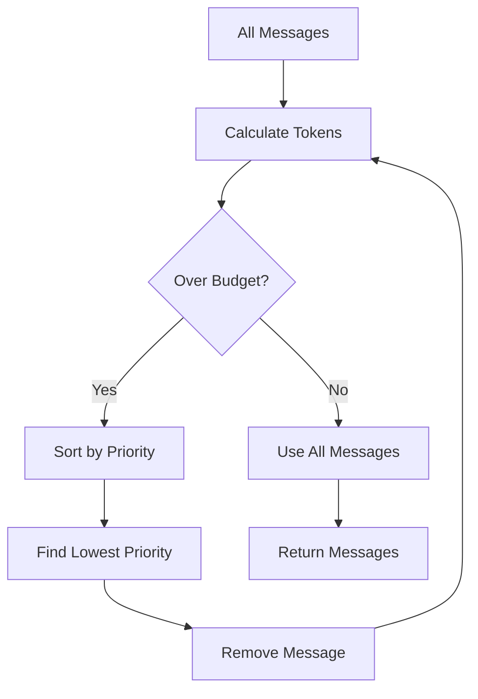

---

## 2. Platform Services

### 2.1 Authentication Service

**Location:** `src/platform/authentication/`

#### Purpose
Manages GitHub authentication for the extension:
- OAuth 2.0 flow with PKCE
- Token storage and retrieval
- Token refresh before expiry
- Multi-account support

#### Authentication States

| State | Description | Next Action |
|-------|-------------|-------------|
| `NotAuthenticated` | No session exists | Prompt login |
| `Authenticating` | OAuth flow in progress | Wait |
| `Authenticated` | Valid session active | Use token |
| `TokenExpiring` | Token near expiry | Refresh |
| `RefreshFailed` | Refresh unsuccessful | Re-authenticate |

#### Authentication Flow

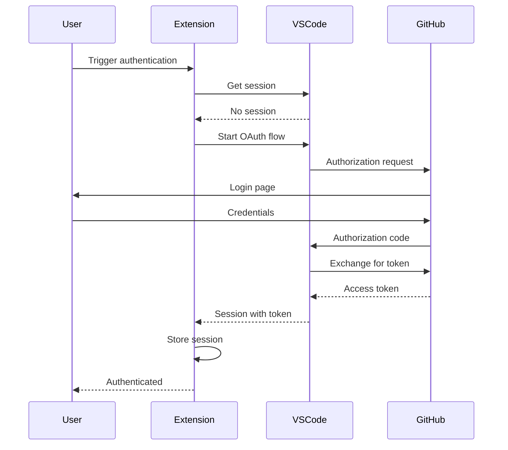

---

### 2.2 Endpoint Provider

**Location:** `src/platform/endpoint/`

#### Purpose
Manages AI model endpoint selection and configuration:
- Model capability detection
- Endpoint URL resolution
- Token limit management
- Model-specific settings

#### Model Capabilities

| Capability | Description | Examples |
|------------|-------------|----------|
| Tool Calling | Can invoke tools | GPT-4, Claude 3 |
| Streaming | Supports streaming | All models |
| Vision | Can process images | GPT-4V |
| Thinking | Extended reasoning | Claude 4 |

#### Endpoint Selection

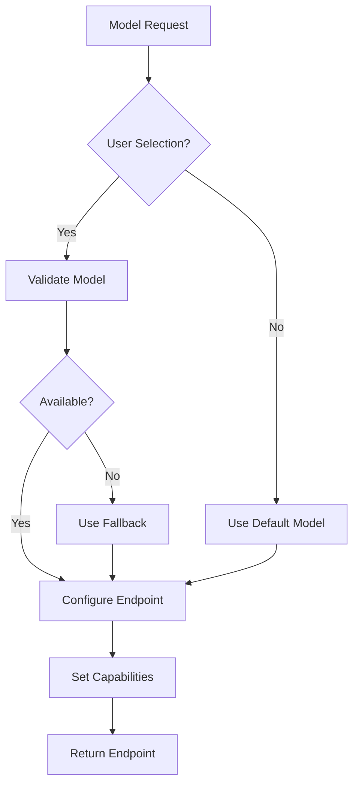

---

### 2.3 Tools Service

**Location:** `src/extension/tools/common/toolsService.ts`

#### Purpose
Central service for tool registration and invocation:
- Registers built-in tools
- Integrates MCP tools
- Handles tool invocation
- Manages confirmations

#### Tool Categories

| Category | Tools | Description |
|----------|-------|-------------|
| File Operations | `read_file`, `create_file`, `replace_string_in_file` | File manipulation |
| Search | `find_files`, `grep_search`, `semantic_search` | Code discovery |
| Execution | `run_in_terminal`, `run_notebook_cell` | Code execution |
| Workspace | `list_dir`, `get_errors`, `get_changed_files` | Workspace queries |
| External | `fetch_webpage`, `github_repo` | External resources |

#### Tool Invocation Flow

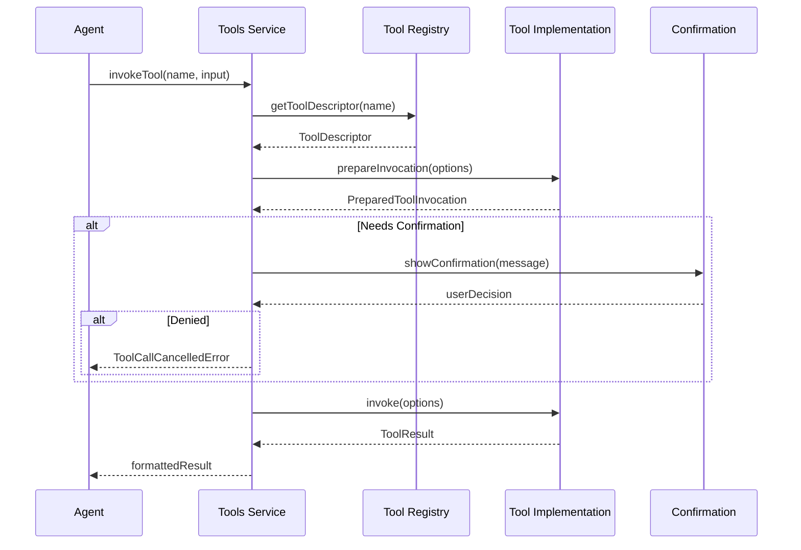

---

### 2.4 Workspace Service

**Location:** `src/platform/workspace/`

#### Purpose
Provides workspace-related functionality:
- File system operations
- Workspace folder management
- File watching
- URI resolution

#### Key Operations

| Operation | Method | Description |
|-----------|--------|-------------|
| Read File | `readFile(uri)` | Read file contents |
| Write File | `writeFile(uri, content)` | Write file contents |
| List Directory | `listDirectory(uri)` | List directory entries |
| Find Files | `findFiles(pattern)` | Glob-based file search |
| Watch Files | `watchFiles(pattern)` | File change notifications |

---

### 2.5 Search Service

**Location:** `src/platform/search/`

#### Purpose
Provides code search capabilities:
- Text search with regex support
- Semantic search with embeddings
- Symbol search
- Workspace indexing

#### Search Types

| Type | Method | Use Case |
|------|--------|----------|
| Text | `searchText(query)` | Find exact text matches |
| Regex | `searchRegex(pattern)` | Pattern-based search |
| Semantic | `searchSemantic(query)` | Natural language search |
| Symbol | `searchSymbols(query)` | Find code symbols |

#### Search Flow

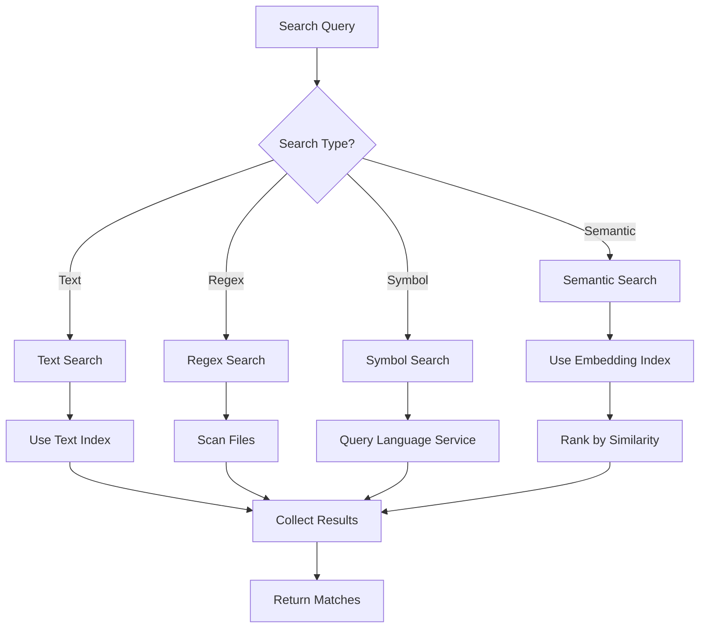

---

## 3. Agent Components

### 3.1 Claude Agent Manager

**Location:** `src/extension/agents/claude/node/claudeCodeAgent.ts`

#### Purpose
Manages Claude Code agent sessions:
- Routes requests to sessions
- Creates new sessions
- Resolves file references
- Handles session lifecycle

#### Session Management

| Operation | Description |
|-----------|-------------|
| `getOrCreateSession` | Get existing or create new session |
| `handleRequest` | Process chat request |
| `resolvePrompt` | Resolve file references |
| `disposeSession` | Clean up session |

#### Architecture

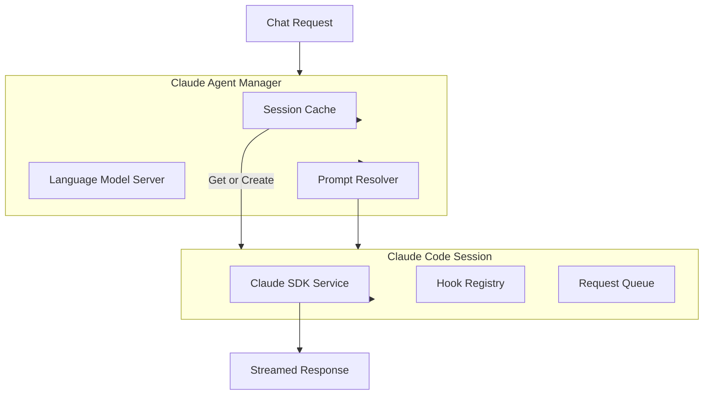

---

### 3.2 Claude Code Session

**Location:** `src/extension/agents/claude/node/claudeCodeAgent.ts`

#### Purpose
Represents a single Claude Code conversation:
- Maintains conversation state
- Processes message stream
- Handles tool confirmations
- Tracks file edits

#### Message Types

| Type | Description | Processing |
|------|-------------|------------|
| Assistant | Text response | Stream to UI |
| Tool Use | Tool request | Execute with confirmation |
| Tool Result | Tool output | Send back to model |
| Result | Session end | Complete request |

#### Session Flow

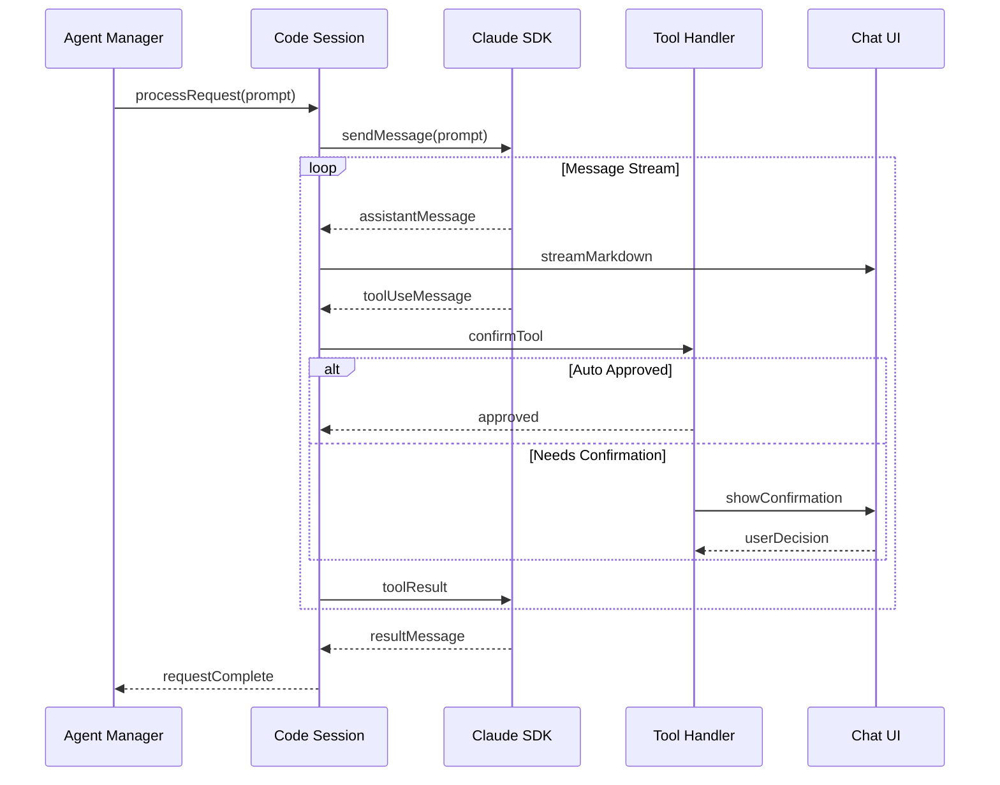

---

### 3.3 Claude Hook Registry

**Location:** `src/extension/agents/claude/node/hooks/claudeHookRegistry.ts`

#### Purpose
Manages lifecycle hooks for Claude sessions:
- Registers hook handlers
- Invokes hooks at lifecycle points
- Supports multiple handlers per event

#### Hook Events

| Event | Timing | Use Case |
|-------|--------|----------|
| `PreToolUse` | Before tool execution | Logging, validation |
| `PostToolUse` | After tool execution | Result processing |
| `SessionStart` | Session begins | Initialization |
| `SessionEnd` | Session ends | Cleanup |
| `SubagentStart` | Subagent begins | Tracking |
| `SubagentEnd` | Subagent ends | Aggregation |

---

### 3.4 Tool Permission Handlers

**Location:** `src/extension/agents/claude/node/toolPermissionHandlers/`

#### Purpose
Controls tool execution permissions:
- Auto-approves safe operations
- Requests user confirmation
- Enforces security policies

#### Permission Rules

| Tool Type | Rule | Confirmation |
|-----------|------|--------------|
| File Read | Always allowed | No |
| File Write (workspace) | Auto-approve | No |
| File Write (external) | Blocked | N/A |
| Terminal Command | User approval | Yes |
| Network Request | User approval | Yes |

---

## 4. Prompt Components

### 4.1 Agent Prompt

**Location:** `src/extension/prompts/node/agent/agentPrompt.tsx`

#### Purpose
Main prompt for agent mode:
- Composes system instructions
- Includes tool definitions
- Manages conversation history
- Adds context information

#### Component Structure

```
AgentPrompt
├── SystemMessage
│   ├── AgentInstructions
│   ├── SafetyRules
│   └── ToolInstructions
├── ContextMessages
│   ├── WorkspaceContext
│   ├── FileReferences
│   └── CustomInstructions
├── ConversationHistory
│   └── PreviousTurns
└── UserMessage
    └── CurrentRequest
```

---

### 4.2 Prompt Registry

**Location:** `src/extension/prompts/node/agent/promptRegistry.ts`

#### Purpose
Maps models to optimized prompts:
- Registers model-specific prompts
- Resolves prompt for model
- Supports inheritance

#### Registered Prompts

| Model Family | Prompt Class | Customizations |
|--------------|--------------|----------------|
| OpenAI | `OpenAIAgentPrompt` | Function calling format |
| Anthropic | `AnthropicAgentPrompt` | Claude-specific features |
| Google | `GeminiAgentPrompt` | Gemini optimizations |
| xAI | `XAIAgentPrompt` | Grok-specific format |
| Default | `DefaultAgentPrompt` | Generic fallback |

---

## 5. Service Dependencies

### 5.1 Dependency Graph

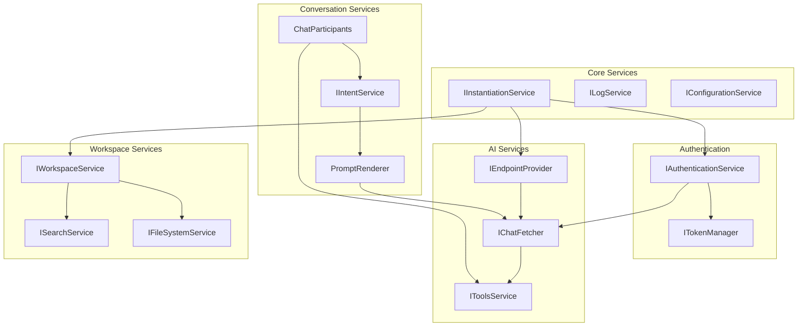

---

## 6. Configuration Reference

### 6.1 User Settings

| Setting | Type | Default | Description |
|---------|------|---------|-------------|
| `github.copilot.enable` | `boolean` | `true` | Enable extension |
| `github.copilot.advanced.debug.enabled` | `boolean` | `false` | Enable debug logging |
| `github.copilot.chat.localeOverride` | `string` | `auto` | Response language |
| `github.copilot.chat.codeGeneration.instructions` | `array` | `[]` | Custom instructions |

### 6.2 Contribution Points

| Contribution | Location | Description |
|--------------|----------|-------------|
| `commands` | `package.json` | VS Code commands |
| `languageModelTools` | `package.json` | LM tools |
| `chatParticipants` | `package.json` | Chat participants |
| `configuration` | `package.json` | Settings schema |

---

*Next Document: [07-INTEGRATION-GUIDE.md](./07-INTEGRATION-GUIDE.md)*
