# Integration Guide
## GitHub Copilot Chat Extension for VS Code

This document describes the external integrations used by the GitHub Copilot Chat extension, including APIs, protocols, and third-party services.

---

## 1. Integration Overview

### 1.1 Integration Landscape

```mermaid
flowchart TB
    subgraph Extension["Copilot Chat Extension"]
        Core["Extension Core"]
    end

    subgraph GitHub["GitHub Services"]
        OAuth["GitHub OAuth"]
        CopilotAPI["Copilot API"]
        ReposAPI["Repositories API"]
        PRAPI["Pull Requests API"]
    end

    subgraph AIProviders["AI Model Providers"]
        OpenAI["OpenAI API"]
        Anthropic["Anthropic API"]
        Google["Google AI API"]
    end

    subgraph VSCodeAPIs["VS Code APIs"]
        ChatAPI["Chat API"]
        LMAPI["Language Model API"]
        WorkspaceAPI["Workspace API"]
        ExtAPI["Extension API"]
    end

    subgraph ExternalTools["External Tool Providers"]
        MCPServers["MCP Servers"]
        Extensions["Other Extensions"]
    end

    Core <-->|OAuth 2.0| OAuth
    Core <-->|REST WebSocket| CopilotAPI
    Core <-->|REST| ReposAPI
    Core <-->|REST| PRAPI

    Core <-->|REST Streaming| OpenAI
    Core <-->|REST Streaming SDK| Anthropic
    Core <-->|REST| Google

    Core <-->|API| ChatAPI
    Core <-->|API| LMAPI
    Core <-->|API| WorkspaceAPI
    Core <-->|API| ExtAPI

    Core <-->|JSON RPC| MCPServers
    Core <-->|API| Extensions
```

---

## 2. GitHub Integration

### 2.1 GitHub OAuth Authentication

#### 2.1.1 Overview
The extension uses GitHub OAuth 2.0 with PKCE for secure authentication.

#### 2.1.2 OAuth Configuration

| Parameter | Value |
|-----------|-------|
| Authorization Endpoint | `https://github.com/login/oauth/authorize` |
| Token Endpoint | `https://github.com/login/oauth/access_token` |
| Scopes | `user:email`, `read:user` |
| Grant Type | Authorization Code with PKCE |

#### 2.1.3 Authentication Flow

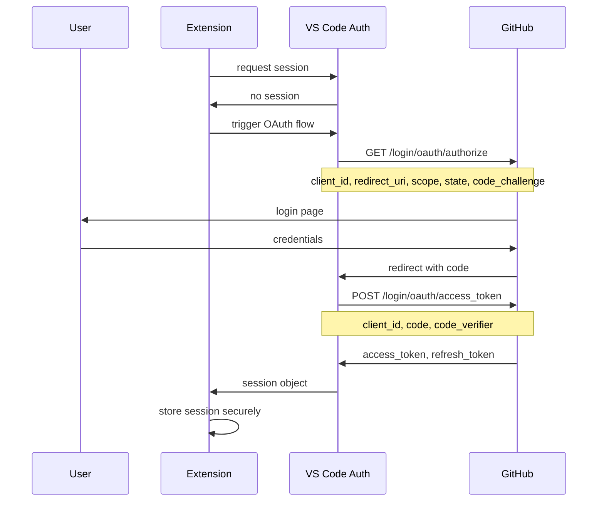

#### 2.1.4 Token Management

| Operation | Trigger | Action |
|-----------|---------|--------|
| Store Token | After OAuth | Save to VS Code Secret Storage |
| Retrieve Token | Before API call | Read from Secret Storage |
| Refresh Token | Before expiry | Exchange refresh token |
| Revoke Token | User logout | Clear from storage |

---

### 2.2 GitHub Copilot API

#### 2.2.1 Overview
The Copilot API provides AI model access and completions.

#### 2.2.2 Endpoints

| Endpoint | Method | Purpose |
|----------|--------|---------|
| `/v1/chat/completions` | POST | Chat completions |
| `/v1/completions` | POST | Code completions |
| `/copilot_internal/user` | GET | User entitlement check |

#### 2.2.3 Request Format

```
Headers:
  Authorization: Bearer <github_token>
  Content-Type: application/json
  Copilot-Integration-Id: vscode-copilot-chat
  VSCode-MachineId: <machine_id>
  VSCode-SessionId: <session_id>

Body:
{
  "model": "gpt-4",
  "messages": [
    {"role": "system", "content": "..."},
    {"role": "user", "content": "..."}
  ],
  "stream": true,
  "tools": [...]
}
```

#### 2.2.4 Response Streaming

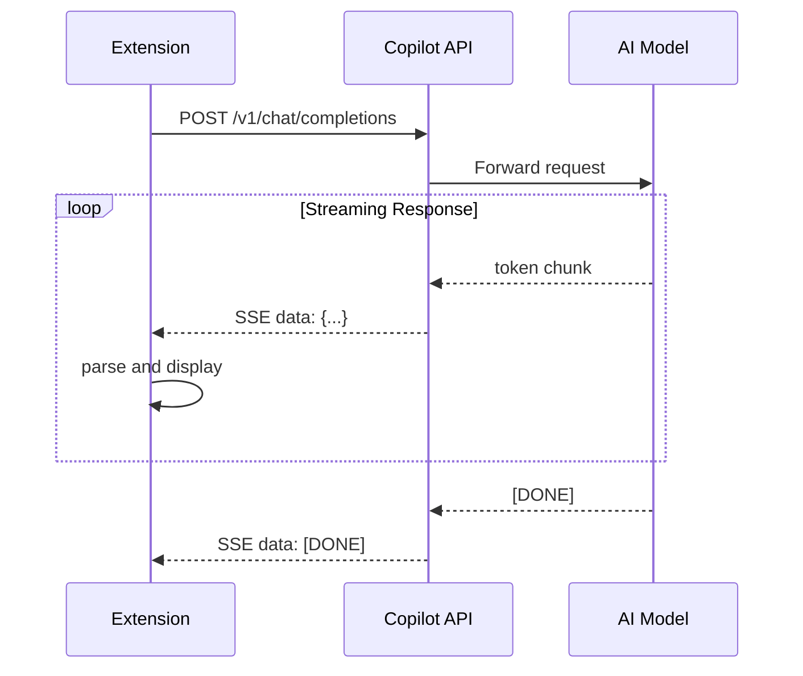

---

### 2.3 GitHub Repository API

#### 2.3.1 Overview
Access to repository information for context and search.

#### 2.3.2 Key Endpoints

| Endpoint | Method | Purpose |
|----------|--------|---------|
| `/repos/{owner}/{repo}` | GET | Repository info |
| `/repos/{owner}/{repo}/contents/{path}` | GET | File contents |
| `/search/code` | GET | Code search |
| `/repos/{owner}/{repo}/pulls` | GET | Pull requests |

#### 2.3.3 Integration Flow

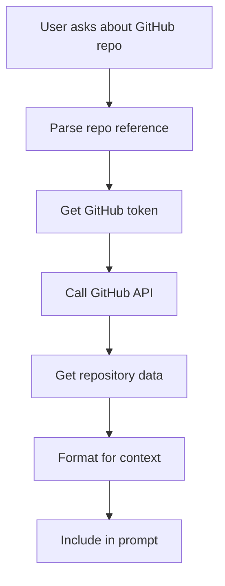

---

## 3. AI Provider Integrations

### 3.1 OpenAI API Integration

#### 3.1.1 Overview
Direct integration with OpenAI's API for model access.

#### 3.1.2 Supported Models

| Model | Capabilities | Use Case |
|-------|--------------|----------|
| GPT-4 | Chat, Tools | General assistance |
| GPT-4o | Chat, Tools, Vision | Multimodal tasks |
| GPT-4o-mini | Chat, Tools | Fast responses |

#### 3.1.3 Request Flow

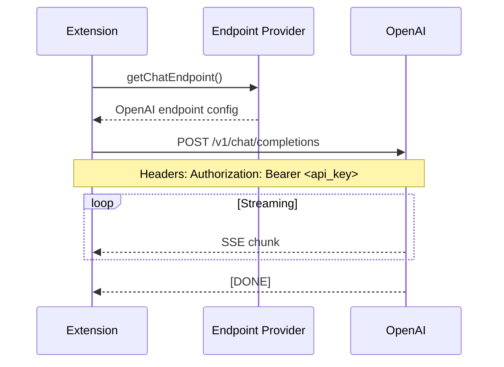

---

### 3.2 Anthropic Claude Integration

#### 3.2.1 Overview
Integration with Anthropic's Claude models via both REST API and Agent SDK.

#### 3.2.2 Integration Methods

| Method | Use Case | Features |
|--------|----------|----------|
| REST API | Direct model calls | Standard completions |
| Agent SDK | Agentic tasks | Built-in tools, sessions |

#### 3.2.3 Agent SDK Integration

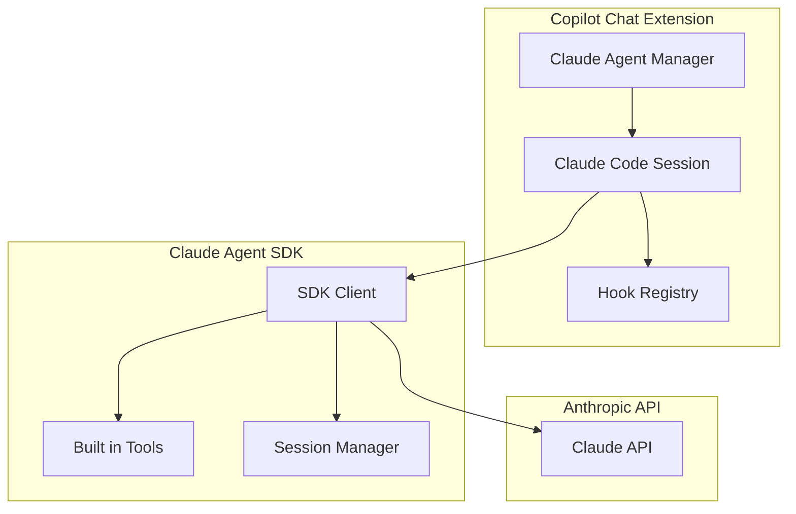

#### 3.2.4 Claude Tools

| Tool | Description | Permission |
|------|-------------|------------|
| Bash | Execute shell commands | User confirmation |
| Read | Read file contents | Auto-approve |
| Edit | Modify files | Auto-approve (workspace) |
| Write | Create files | Auto-approve (workspace) |
| Glob | Find files | Auto-approve |
| Grep | Search in files | Auto-approve |

#### 3.2.5 Hook System

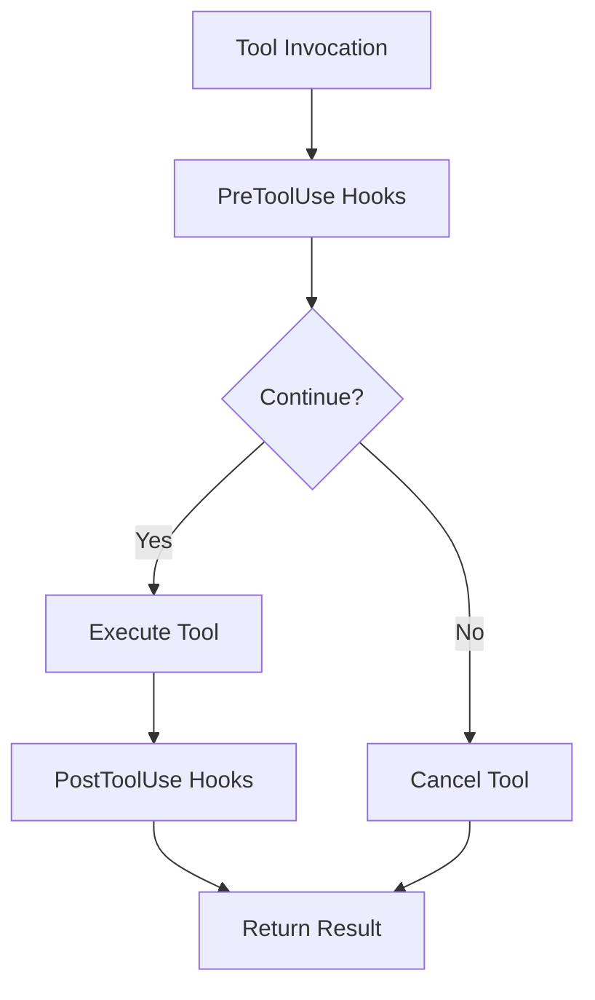

---

### 3.3 Google Gemini Integration

#### 3.3.1 Overview
Integration with Google's Gemini models.

#### 3.3.2 Supported Models

| Model | Capabilities |
|-------|--------------|
| Gemini Pro | Text generation |
| Gemini Ultra | Advanced reasoning |

#### 3.3.3 API Differences

| Feature | OpenAI Format | Gemini Format |
|---------|--------------|---------------|
| Messages | `messages` array | `contents` array |
| Role Names | `system`, `user`, `assistant` | `model`, `user` |
| Tool Calls | `tool_calls` | `functionCall` |

---

## 4. VS Code API Integration

### 4.1 Chat API

#### 4.1.1 Overview
VS Code's Chat API for building conversational interfaces.

#### 4.1.2 Key Interfaces

| Interface | Purpose |
|-----------|---------|
| `ChatParticipant` | Register chat handlers |
| `ChatRequest` | Incoming user message |
| `ChatResponseStream` | Stream responses to UI |
| `ChatResult` | Final response metadata |

#### 4.1.3 Participant Registration

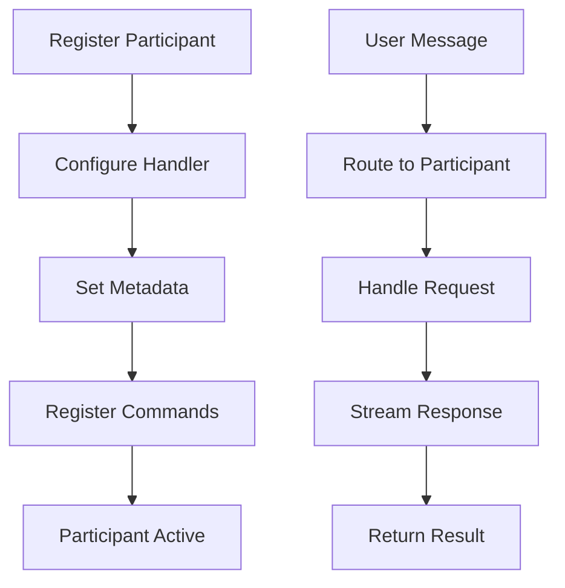

---

### 4.2 Language Model API

#### 4.2.1 Overview
VS Code's API for language model interactions and tools.

#### 4.2.2 Key Features

| Feature | API | Purpose |
|---------|-----|---------|
| Model Access | `lm.selectChatModels()` | Get available models |
| Tool Definition | `lm.tools` | Access registered tools |
| Tool Invocation | `lm.invokeTool()` | Execute tools |
| Embeddings | `lm.computeEmbeddings()` | Vector embeddings |

#### 4.2.3 Tool Registration

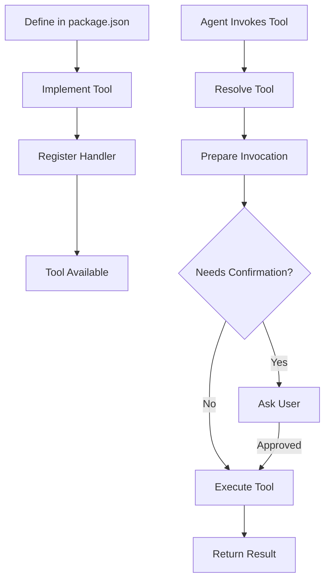

---

### 4.3 Workspace API

#### 4.3.1 Overview
Access to workspace files and folders.

#### 4.3.2 Key Operations

| Operation | API Method |
|-----------|------------|
| Read File | `workspace.fs.readFile()` |
| Write File | `workspace.fs.writeFile()` |
| Find Files | `workspace.findFiles()` |
| Watch Files | `workspace.createFileSystemWatcher()` |
| Get Configuration | `workspace.getConfiguration()` |

---

## 5. MCP Integration

### 5.1 Model Context Protocol Overview

#### 5.1.1 What is MCP
Model Context Protocol (MCP) is a standard for AI models to communicate with external tools and data sources.

#### 5.1.2 MCP Architecture

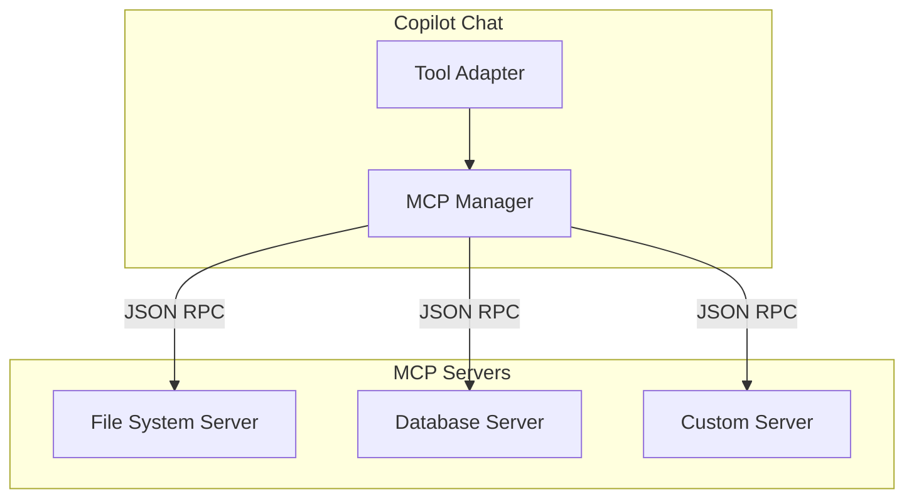

### 5.2 MCP Server Configuration

#### 5.2.1 Configuration Format

```json
{
  "github.copilot.mcp.servers": {
    "filesystem": {
      "command": "node",
      "args": ["path/to/server.js"],
      "env": {}
    },
    "database": {
      "command": "python",
      "args": ["-m", "mcp_database"],
      "env": {
        "DB_URL": "..."
      }
    }
  }
}
```

#### 5.2.2 Server Lifecycle

```mermaid
stateDiagram_v2
    [*] --> Configured: User adds config

    Configured --> Starting: Extension activates
    Starting --> Connected: Connection success
    Starting --> Failed: Connection failed

    Connected --> Ready: Tools registered
    Ready --> Invoking: Tool called
    Invoking --> Ready: Tool complete

    Ready --> Disconnected: Server crash
    Disconnected --> Starting: Reconnect

    Ready --> Stopped: Extension deactivates
    Stopped --> [*]
```

### 5.3 MCP Tool Integration

#### 5.3.1 Tool Discovery

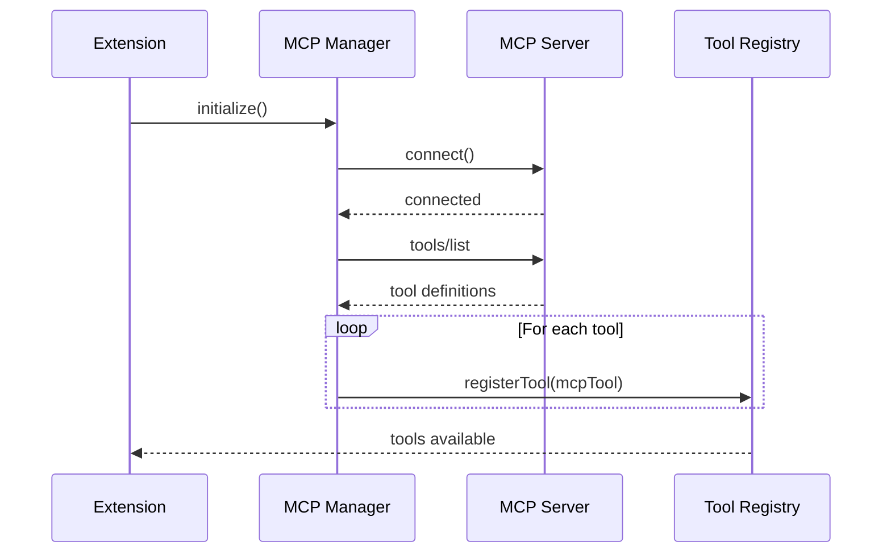

#### 5.3.2 Tool Invocation

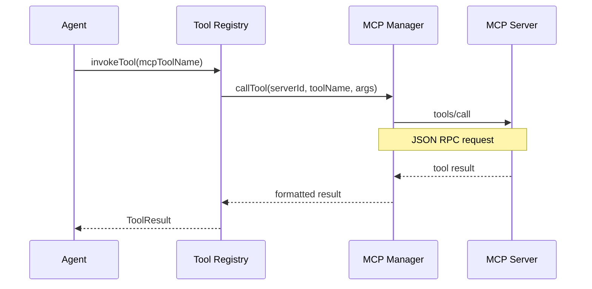

---

## 6. Extension Integration

### 6.1 Third-Party Extension Tools

#### 6.1.1 Overview
Other VS Code extensions can contribute tools to Copilot Chat.

#### 6.1.2 Tool Contribution Pattern

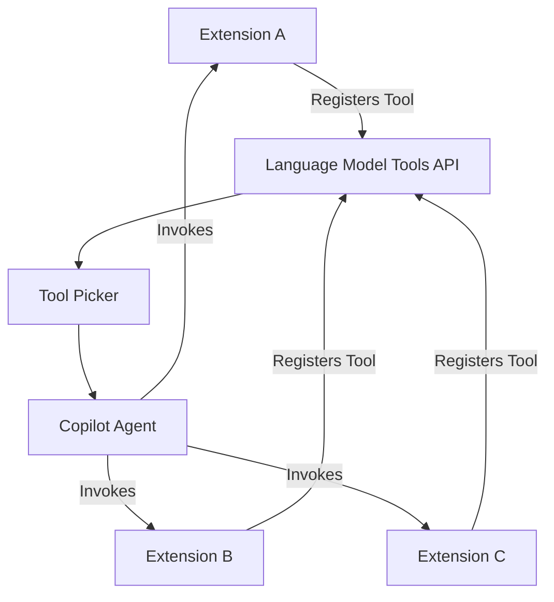

### 6.2 GitHub PR Extension Integration

#### 6.2.1 Overview
Integration with GitHub Pull Request extension for PR-related features.

#### 6.2.2 Shared Capabilities

| Capability | Source | Usage |
|------------|--------|-------|
| PR Context | GitHub PR Extension | Include PR info in prompts |
| Review Comments | GitHub PR Extension | Access review threads |
| File Changes | GitHub PR Extension | Get changed files |

---

## 7. Security Considerations

### 7.1 Authentication Security

| Measure | Implementation |
|---------|----------------|
| OAuth PKCE | Prevents authorization code interception |
| Secure Storage | VS Code Secret Storage API |
| Token Rotation | Automatic refresh before expiry |
| Scope Limitation | Minimal required scopes |

### 7.2 Data Security

| Data Type | Protection |
|-----------|------------|
| Source Code | Sent only during requests, not persisted |
| Conversations | Stored locally only |
| Tokens | Encrypted in secret storage |
| Telemetry | Anonymized before transmission |

### 7.3 MCP Security

| Risk | Mitigation |
|------|------------|
| Malicious Servers | User configuration required |
| Data Exposure | Tool confirmation for sensitive ops |
| Process Isolation | Servers run in separate processes |

---

## 8. Error Handling

### 8.1 Integration Errors

| Error Type | Cause | Recovery |
|------------|-------|----------|
| Auth Failure | Invalid/expired token | Re-authenticate |
| Rate Limit | Too many requests | Backoff and retry |
| Network Error | Connection issues | Retry with backoff |
| Server Error | Backend issues | Show error, retry later |
| Tool Error | Tool execution failed | Report to model |

### 8.2 Error Recovery Flow

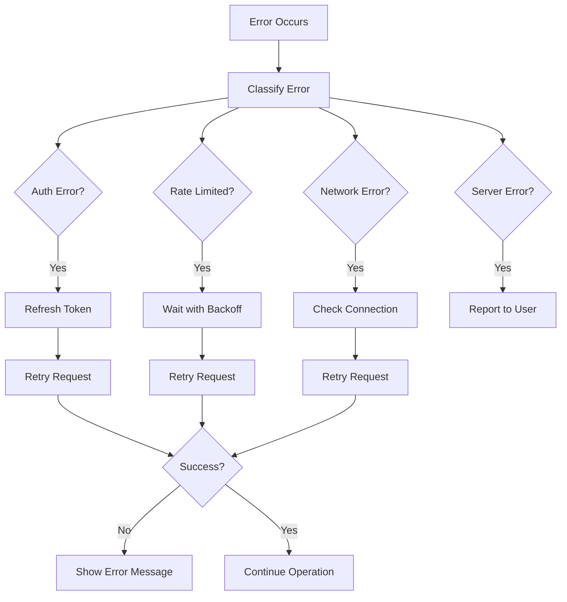

---

## 9. Monitoring and Observability

### 9.1 Telemetry Events

| Event | Data Collected | Purpose |
|-------|----------------|---------|
| `request/start` | Model, intent | Request tracking |
| `request/complete` | Duration, tokens | Performance |
| `tool/invoke` | Tool name, success | Tool usage |
| `error/occurred` | Error type | Error tracking |

### 9.2 Logging

| Log Level | Content |
|-----------|---------|
| Error | Failures and exceptions |
| Warning | Recoverable issues |
| Info | Major operations |
| Debug | Detailed flow (dev only) |
| Trace | Full request/response (dev only) |

---

## 10. Future Considerations

### 10.1 Planned Integrations

| Integration | Status | Description |
|-------------|--------|-------------|
| Azure AI | Planned | Azure-hosted models |
| Local Models | Planned | On-device inference |
| Custom Endpoints | Planned | User-provided APIs |

### 10.2 Extension Points

| Extension Point | Purpose |
|-----------------|---------|
| Custom MCP Servers | User-defined tools |
| Custom Participants | Domain-specific agents |
| Custom Prompts | Specialized instructions |

---

*End of Integration Guide*
